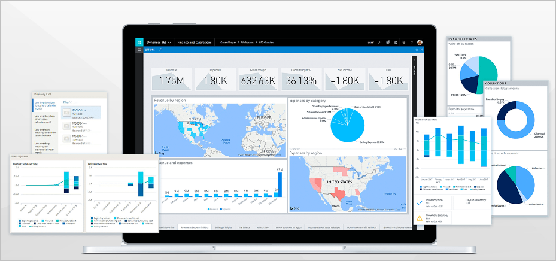
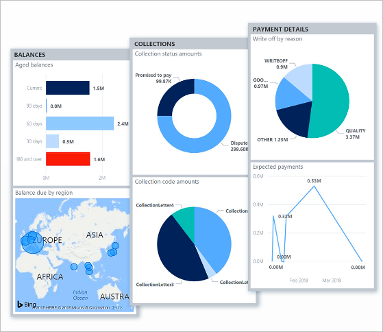
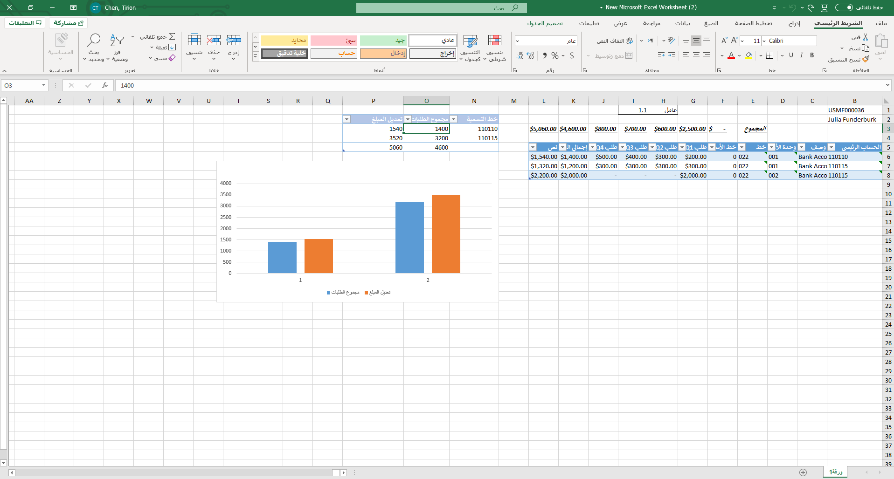

يساعد Finance الشركات على تسريع نمو أعمالها ورفع مستوى أدائها المالي.

## تسريع نمو أعمالك

يساعد Finance الشركات على التكيف بسرعة مع متطلبات السوق المتغيرة ودفع نمو الأعمال السريع من خلال توفير ميزات مالية وعملياتية عالمية موحدة لتمكين الأشخاص من اتخاذ قرارات سريعة ومستنيرة.

باستخدام عناصر التحكم المضمنة، يمكن للقادة الماليين اكتساب نظرة ثاقبة لبياناتهم المالية، والحصول على رؤية بزاوية 360 درجة عبر جميع وحدات التشغيل، مثل الأقسام ومراكز التكلفة، واتخاذ قرارات ذكية للبقاء في المنافسة في السوق العالمية السريعة والمتغيرة باستمرار.

## رفع مستوى الأداء المالي

يساعد Finance الشركات على زيادة نمو الإيرادات الهامشية من خلال حل إدارة مالية عالمي مركزي يوفر معلومات مالية قوية وتحليلات مضمنة في الوقت الفعلي للمساعدة في زيادة الربحية.

يستخدم Finance تصميم واجهة حديث وسهل الاستخدام يتسم بالمرونة الكافية للتشغيل على أي جهاز ونظام أساسي بدعم تقنية Microsoft. أصبحت الأجهزة المحمولة الآن جزءاً من حياة الأشخاص اليومية، ويمكن للموظفين استخدام أجهزتهم للوصول إلى الخدمات المالية واستخدامها في أي وقت وفي أي مكان في بيئة آمنة.

يمكّن Finance الموظفين بواسطة مساحات عمل قائمة على الأدوار توفر الأتمتة الذكية، وتحديد أولويات المهام، والتكامل مع تطبيقات Microsoft 365 لزيادة الكفاءة إلى أقصى حد لتحقيق نتائج أعمال إيجابية.

تُعد Microsoft Excel الأداة الأكثر شيوعاً بين مستخدمي التمويل.
يمكن للموظفين فتح البيانات من أي صفحة في Finance في Excel، ومعالجة البيانات، ونشر البيانات مرة أخرى إلى Finance.

بإمكان الشركات تقليل النفقات التشغيلية عن طريق تقليل التكاليف التشغيلية عبر المناطق الجغرافية للأعمال التجارية من خلال أتمتة العمليات المالية والالتزام وتخطيط الموازنة ورقابة الموازنة والمطابقة الثلاثية.

تتطلب السوق المتغيرة باستمرار أن تتمكن الشركات من التكيف بسرعة مع تغييرات المتطلبات القائمة على السوق مع الحفاظ على قدرتها على المنافسة وتحقيق الأرباح.

يمكنك التكيف مع المتطلبات المالية المتغيرة باستخدام دليل حسابات مرن وموجه وقائم على القواعد بالإضافة إلى الأبعاد وGlobal Tax Engine في Finance.

يوفر Finance للشركات وظائف لتبسيط إدارة الأصول، وتتبع القيم بكفاءة، وتقليل الإبلاغ عن الأخطاء من خلال العمليات المركزية والتلقائية لإدارة الأصول المرسملة من الاستحواذ وحتى التخلص.

