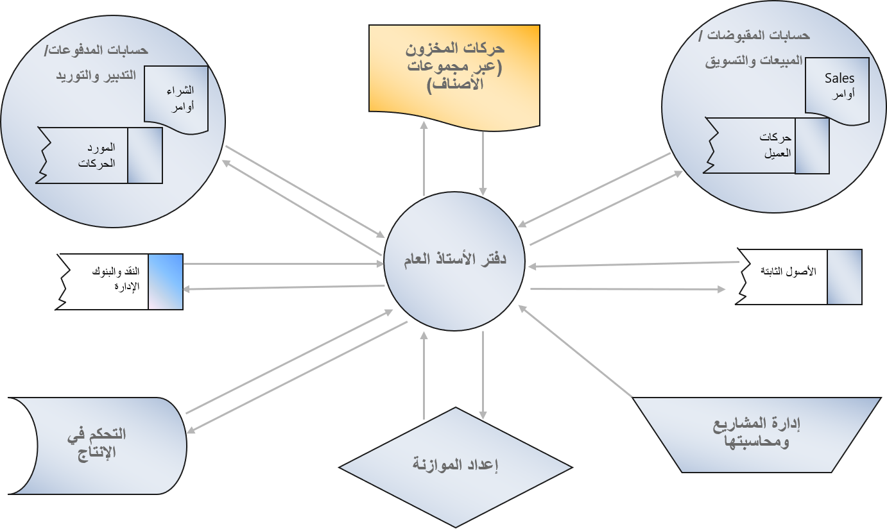
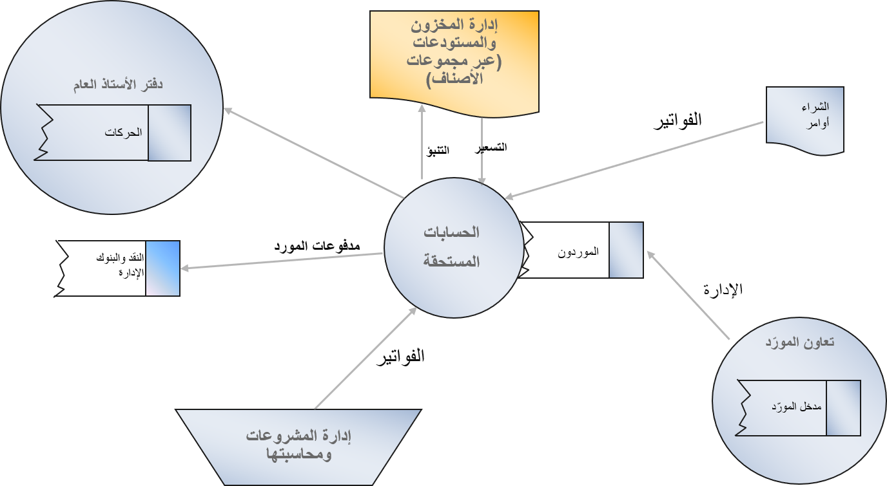
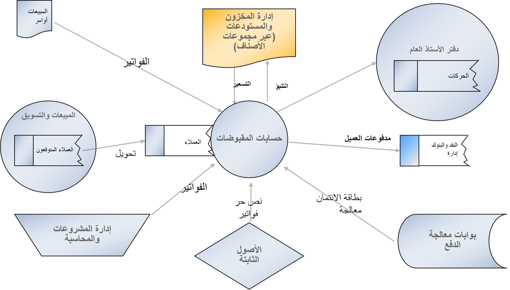

يوجد هدفان لنظام إدارة مالية نموذجي في أي شركة هما:

-   **زيادة الربح** - محاولة تحقيق أقصى قدر من الأرباح للشركة على المدى القصير والمدى الطويل. يحتفظ Finance بجميع الحركات المالية في دفتر الأستاذ، كما يوفر أدوات وميزات لتوفير نظرة ثاقبة للتكاليف المتكبدة والإيرادات المتوقعة حتى يتمكن القادة الماليون من اتخاذ القرارات المناسبة.

    -   وحدة دفتر الأستاذ العام هي جوهر المالية وهي متكاملة مع دفاتر الأستاذ الفرعية الأخرى في Finance.

    -   تسمح وحدة إدارة النقد والبنوك للشركات بإدارة بنوكها وأرصدتها، وتسوية بيانات البنك مع وحدة دفتر الأستاذ العام.

-   **زيادة الثروة** - كسب أقصى ثروة لمساهمي الشركة من خلال زيادة القيمة السوقية للأسهم والتي ترتبط مباشرة بأداء الشركة.
    يجب أن تتمتع الشركة بتدفق نقدي جيد لدفع النفقات اليومية مثل شراء المواد الخام والأجور والإيجار وفواتير الكهرباء والمزيد. إذا كان لدى الشركة تدفق نقدي جيد، فيمكنها الاستفادة من العديد من الفرص مثل الحصول على خصومات نقدية على المشتريات، وإجراء عمليات شراء على نطاق واسع، ومنح ائتمان للعملاء، والمزيد. يعمل التدفق النقدي الصحي على تحسين فرص الشركة في البقاء والنجاح.

    يقدم Finance أدوات وميزات، مع عناصر تحكم ذكية مدمجة مثل المخططات ومؤشرات الأداء الرئيسية (مؤشرات الأداء الرئيسية) ومساحات العمل، لإعطاء نظرة ثاقبة على التدفق النقدي للشركة وعرض المشروع والطلب. يمكنه تحليل الخصائص السكانية للعملاء وتكاليف البضائع حتى تتمكن الشركة من التفاوض بشكل أفضل على اتفاقيات أكثر فائدة مع الموردين والعملاء.

    -   تقدم وحدات الحسابات الدائنة وحسابات المقبوضات ما تحتاجه الشركة لإدارة العمليات اليومية للموردين والعملاء مثل إعداد الفواتير وإنشاء المدفوعات أو تحصيلها.

    -   تسمح وحدة الموازنة للشركة بتقدير إجمالي المتطلبات المالية بشكل صحيح عن طريق تحديد مقدار التمويل الضروري للتشغيل وما هي المتطلبات لرأس المال الثابت والعامل.

    -   تساهم وحدات المبيعات والتسويق وإدارة المخزون والمشتريات والتوريد وإدارة التكلفة والتحكم في التكلفة في Dynamics 365 Supply Chain Management جميعها في اتخاذ القرارات المناسبة لتعظيم الثروة في الشركة.

    

كما يوضح الشكل، تتفاعل وحدة دفتر الأستاذ العام مع الوحدات الأخرى في السيناريوهات التالية:

-   **إدارة النقد والبنوك** - سيتم تسجيل جميع الأموال الواردة والصادرة في دفتر الأستاذ العام، ولكل بنك حساب مقابل في مخطط دفتر الأستاذ العام للحسابات. لذلك، تبسط هذه الوحدة قدرتك على التوفيق بين البيانات المصرفية وحركات الإدارة المالية في المعالجة الدورية.

-   **الحسابات الدائنة** - يتم تسجيل جميع الفواتير وحركات الدفع في دفتر الأستاذ العام. يقوم كاتب الحسابات الدائنة بمطابقة أمر الشراء مع الفاتورة المسجلة لتحديد ما إذا كانت فاتورة المورد مؤهلة للدفع، وعند تاريخ الاستحقاق، يقوم بإنشاء مدفوعات، والتي ستؤثر من خلال دفتر الأستاذ العام على النقد وإدارة البنك.

    

-   **إدارة المشاريع ومحاسبتها** - بناءً على الوقت والمواد أو مشروع بسعر ثابت، غالباً ما يلزم إجراء عمليات شراء. في هذه الحالة، يمكن للوحدة إدارة المشاريع ومحاسبتها أن تتفاعل مع وحدة التدبير والتوريد في Supply Chain Management لإنشاء أوامر الشراء، والتي ستتم تسويتها بعد ذلك في وحدة الحسابات الدائنة في Finance.

    أثناء تنفيذ المشروع، يمكنك إنشاء فواتير للعملاء، وبعد ذلك سيواصل قسم المبيعات والتسويق إدارة عروض الأسعار وتحويلها إلى فواتير للمشاريع الجارية، إلى جانب دورهم المعتاد المتمثل في تسويق البضائع وإدارة المبيعات. بعد ذلك، ستدير وحدة الحسابات الدائنة مدفوعات العملاء، وربما المبالغ المستردة.

    

ستغطي الوحدات التالية كل وحدة في Finance.
