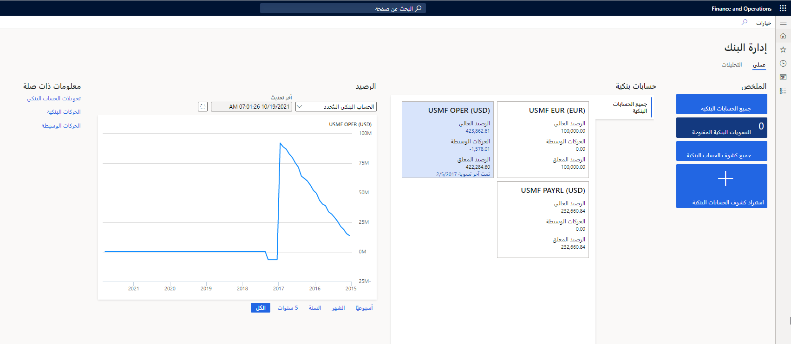

يمكنك استخدام الوحدة النمطية لإدارة النقد والبنوك في المالية للاحتفاظ بالحسابات البنكية الخاصة بالشركة والمستندات المالية المقترنة بتلك الحسابات البنكية. وتشمل هذه المستندات إيصالات الإيداع والشيكات والكمبيالات والسندات الإذنية. كما يُمكنك تسوية كشوف الحسابات البنكية‬ وطباعة البيانات البنكية في التقارير القياسية.

فيما يلي أمثلة على المهام التي يمكنك تنفيذها في الوحدة النمطية لإدارة النقد والبنوك:

-   إدارة خطابات الاعتماد ومجموعات الاستيراد لشراء البضائع وبيعها عبر الحدود الدولية.

-   إدارة خطابات الضمان لإدارة الاتفاقية بواسطة بنك (الضامن) لدفع مبلغ مالي معين إلى شخص ما (المستفيد).

-   يمكنك إجراء تسوية بنكية من خلال استيراد كشوف الحسابات البنكية وباستخدام معايير قاعدة المطابقة لتحديد الحركات الخاصة بالتسوية، والتي توفر وقتاً طويلاً للمحاسبين، تلقائياً.

-   إيداع الأرصدة البنكية وتحويلها.

-   إلغاء عمليات الإيداع غير الصحيحة.

-   تحديث الأرصدة البنكية وصيانتها.

-   تحديد تنسيقات الشيكات.

-   استخدام أدوات تقدير التدفقات النقدية لتحليل متطلبات التدفقات النقدية والعملات القادمة، حتى يمكنك تقدير احتياجات الشركة المستقبلية من النقد.
