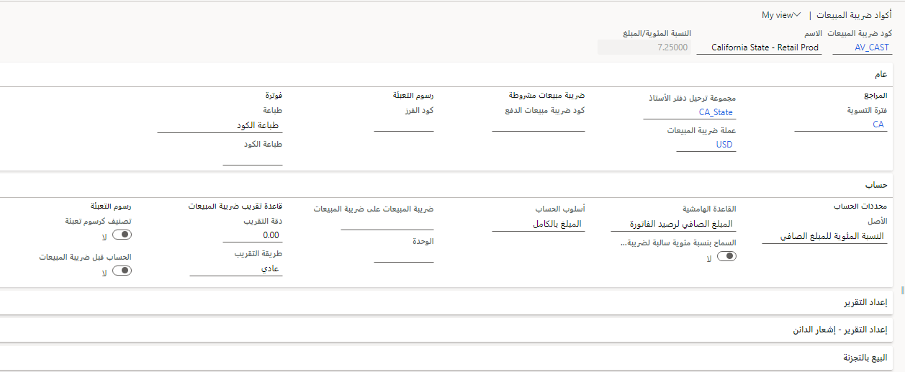

يجب أن تقوم كل شركة بجمع الضرائب ودفعها للعديد من هيئات الضرائب.
تختلف القواعد والمعدلات حسب البلد أو المنطقة والولاية والمقاطعة والمدينة.

أيضاً، يجب تحديث القواعد دورياً عندما تقوم هيئات الضرائب بتغيير المتطلبات الخاصة بها.

تحتوي أكواد ضريبة المبيعات على المعلومات الأساسية حول المبالغ التي تجمعها وتدفعها للهيئات. عند إعداد أكواد ضريبة المبيعات، فإنك تحدد المبالغ أو النسب المئوية التي يجب جمعها. يمكنك أيضاً تحديد الأساليب المختلفة التي يتم من خلالها تطبيق هذه المبالغ أو النسب المئوية على مبالغ الحركات.

يدعم إطار عمل ضريبة المبيعات العديد من أنواع الضرائب غير المباشرة، مثل ضريبة المبيعات وضريبة القيمة المضافة (VAT) والضريبة على البضائع والخدمات (GST) والرسوم المستندة إلى الوحدة وضريبة الخصم. يتم حساب هذه الضرائب وتوثيقها أثناء حركات البيع والشراء. وبشكل دوري، يجب الإبلاغ عنها ودفعها لهيئات الضرائب.
