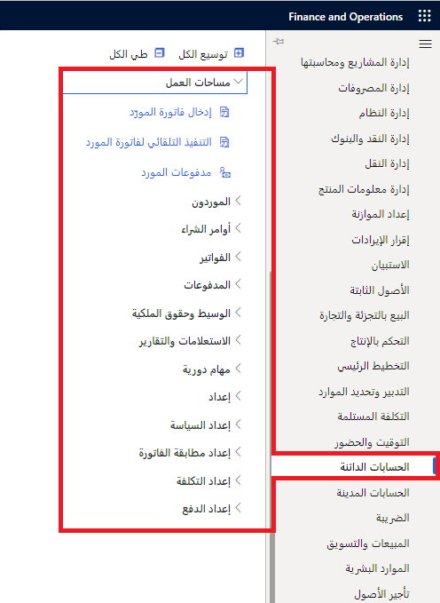

تتيح لك الوحدة النمطية الخاصة بالحسابات الدائنة في Finance إعداد مجموعات المورِّدين والمورِّدين وملفات تعريف الترحيل وخيارات الدفع المختلفة والمعلمات المتعلقة بالمورِّدين والرسوم وعمليات التسليم والوجهات والسندات الإذنية وأنواع أخرى من معلومات الحسابات الدائنة.

كما يمكنك أيضاً إعداد الحسابات الدائنة لتسجيل فواتير المورّد، وإنشاء مدفوعات المورد وترحيلها وإجراء التسويات.

فيما يلي أمثلة على المهام التي يمكنك تنفيذها في الوحدة النمطية الخاصة بالحسابات الدائنة:

-   أدخل فواتير المورّد يدوياً أو استلمها إلكترونياً من خلال كيان بيانات. بعد إدخال الفاتورة أو استلامها، يمكنك مراجعة والفواتير والموافقة عليها باستخدام دفتر يومية الموافقة على الفاتورة أو صفحة **فاتورة المورد**.
-   استخدم مطابقة الفواتير وسياسات فواتير المورّدين وسير العمل لأتمتة عملية المراجعة بحيث تتم الموافقة تلقائياً على الفواتير التي تفي بمعايير معينة، ويتم وضع علامات على الفواتير المتبقية كي تتم مراجعتها بواسطة مستخدم مخول.
-   حل الاختلافات أثناء مطابقة إجماليات الفواتير.
-   قم بإعداد حسابات المقابلة الافتراضية لدفاتر يومية فواتير المورّد ودفاتر يومية الموافقة على الفواتير.
-   إدارة المهام اليومية باستخدام مساحات العمل.
-   تحديد شروط دفع المورّد‬ والرسوم.
-   إعداد ملفات الدفع الإيجابي وإنشائها.
-   إنشاء دفعات المورد باستخدام مقترح دفع.
-   وضع دفعات المورد لمبلغ جزئي كمبلغ دائن في الحساب.
-   الحصول على خصم نقدي خارج فترة الخصم النقدي.
-   إلغاء دفعة مورد​.
-   إعداد نظرة عامة على فواتير الدفعات المقدمة والدفعات المقدمة.
-   تسوية دفعة المورد الجزئية قبل تاريخ الخصم.
