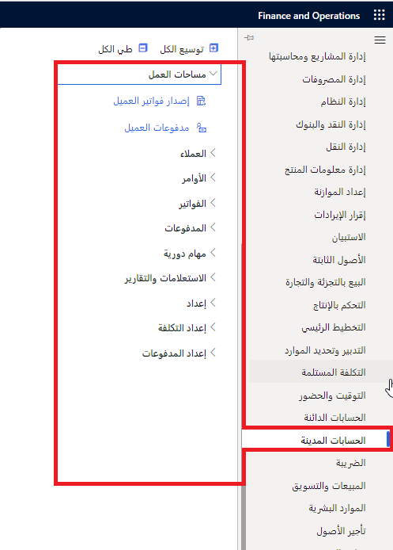

استخدم الوحدة النمطية للحسابات المدينة في Finance لتعقب فواتير العملاء والمدفوعات الواردة.
 

فيما يلي أمثلة على المهام التي يمكنك تنفيذها في الوحدة النمطية الخاصة بالحسابات المدينة:

-   قم بإنشاء فواتير العملاء التي تعتمد على أوامر المبيعات أو إيصالات التعبئة.
-   قم بإنشاء فواتير بنص حر لا تتعلق بأوامر المبيعات.
-   استلام المدفوعات باستخدام العديد من أنواع الدفع المختلفة، بما في ذلك الكمبيالات والنقد والشيكات وبطاقات الائتمان والمدفوعات الإلكترونية.
-   استخدم المدفوعات المركزية لتسجيل المدفوعات في كيان قانوني واحد نيابة عن الكيانات القانونية الأخرى، إذا كانت مؤسستك تتضمن كيانات قانونية متعددة.
-   وزع مبالغ الحركات واستخدم إدخالات دفتر اليومية في دفتر الأستاذ الفرعي للفواتير ذات النص الحر.
-   احتفظ بملفات تعريف ترحيل العميل.
-   قم بتكوين بطاقات الائتمان، للحصول على تخويل، ثم قم بتسجيل المدفوعات.
-   قم بإنشاء فاتورة العميل.
-   قم بإعداد الفواتير المتكررة ومعالجتها.
-   قم بتصحيح فاتورة ذات نص حر.
-   قم بإعداد الكمبيالات.
-   قم بإعداد معدلات الفائدة لكود فائدة.
-   تنازل عن رسوم الفائدة أو أعد المطالبة بها أو عكسها.
-   قم بإعداد تفويض الخصم المباشر لمنطقة منطقة التداول باليورو (SEPA).
-   أغلق الحسابات المدينة.
-   استخدم دفعة العميل لتسوية فواتير متعددة تمتد عبر عدة فترات خصم.
-   قم بتعويض العملاء.
-   تعامل مع مدفوعات العميل لمبلغ جزئي.
-   أعطي الأولوية للمدفوعات التي يتم استلامها من العميل وتسويتها من خلال القاعدة التي تم تكوينها.
