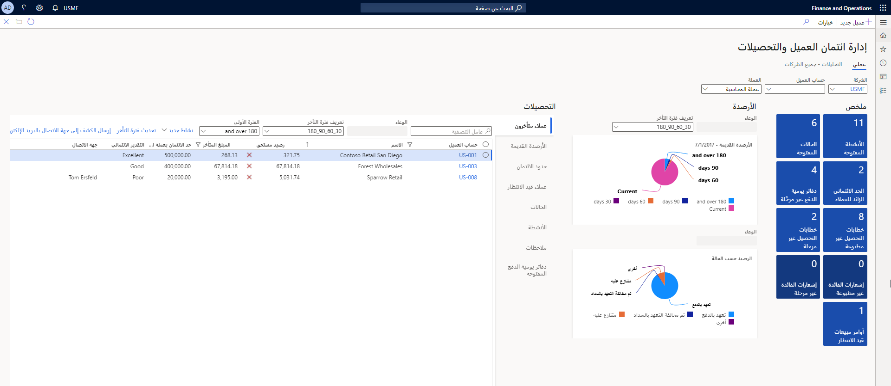

تتم إدارة معلومات تحصيلات الحسابات المدينة في طريقة عرض مركزية واحدة، صفحة **التحصيلات** في Finance.

وبإمكان مندوبي التحصيل بدء عملية التحصيل من قوائم العملاء التي تم إنشاؤها باستخدام معايير التحصيل المحددة مسبقاً، أو من صفحة **العملاء**.

قبل أن تبدأ في إعداد التحصيلات أو العمل باستخدامها، يجب أن تفهم المفاهيم التالية:

-   تحتوي لقطات تأخر العميل على معلومات الرصيد القديم في نقطة زمنية معينة.
-   تساعدك تحصيلات أوعية العملاء على تنظيم العمل.
-   يمكن لمندوبي التحصيل أن يكون لديهم أوعية العملاء الخاصة بهم.
-   تنظم صفحات القائمة تحصيلات العملاء والأنشطة والحالات.
-   تكون كافة التحصيلات الخاصة بالعميل موجودة في صفحة واحدة ويمكنك اتخاذ اجراء من تلك الصفحة.
-   يمكن التنازل عن الفوائد والرسوم أو ردها أو عكسها في خطوة واحدة.
-   يمكنك إدارة العملاء المتخلِّفين عن السداد.
-   يمكنك إنشاء حركات الشطب في خطوة واحدة.
-   يمكن معالجة مدفوعات الأرصدة غير الكافية (NSF) في خطوة واحدة.

