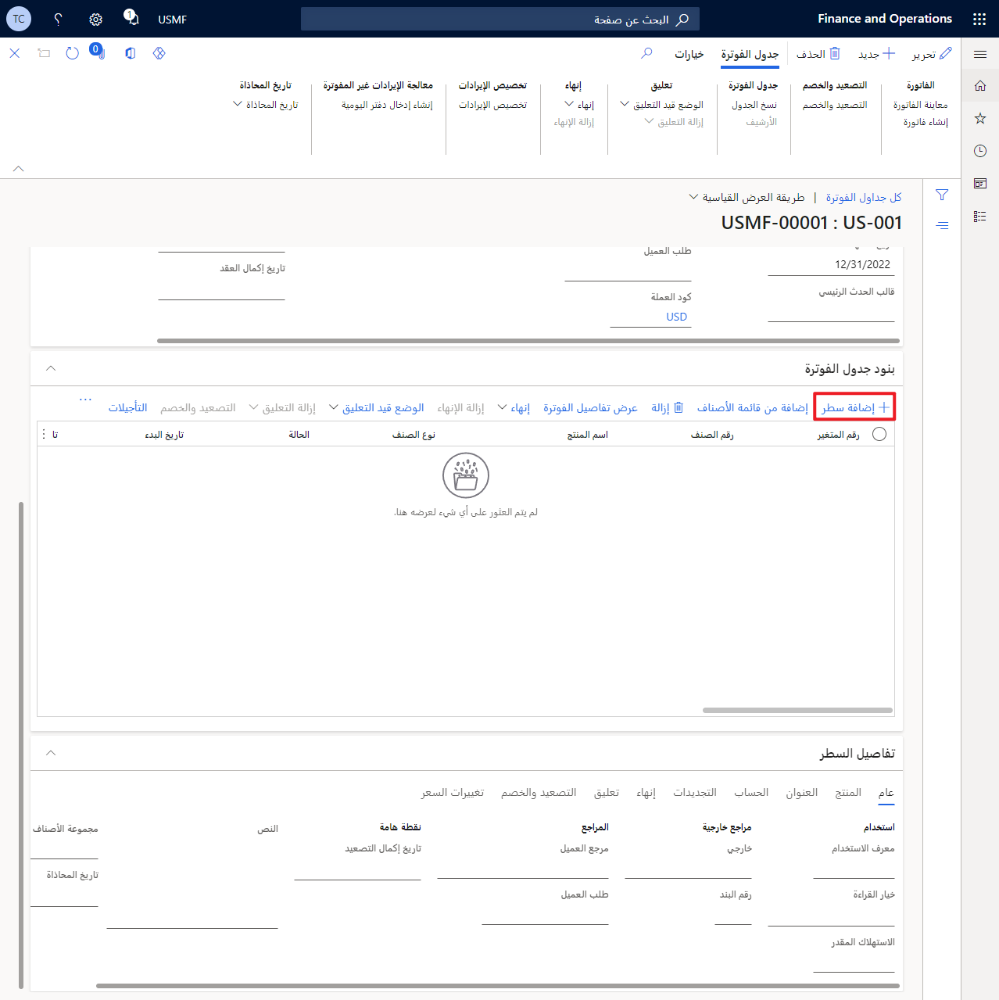

يمنحك Finance الفرصة لفصل فوترة العقود المتكررة إلى مجموعات، والتي تطبق القيم الافتراضية للمجموعة تلقائياً. تساعد هذه الميزة في تسهيل عملية إعداد جدولة فوترة جديد، ويمكنك ضبط القيم الافتراضية إذا رغبت في ذلك.

لإنشاء مجموعة جدولة الفوترة، اتبع الخطوات.

1.  انتقل إلى **فوترة الاشتراك > فوترة العقود المتكررة > الإعداد > مجموعة جدول الفوترة**.

1.  لإنشاء مجموعة جدول الفوترة، حدد **جديد**، الموجود في الزاوية العلوية اليمنى من الشاشة.

1.  بعد إنشاء مجموعة جدول الفوترة، أدخل معرّفاً يقع ضمن حقل **مجموعة جدول الفوترة**. أدخل وصفاً يقع ضمن الحقل **وصف**.

1.  في حقل **معدل تكرار الفاتورة**، حدد جدولة الفوترة التي تريدها. تتكون الخيارات من **مرة واحدة** أو **يومي** أو **شهري** أو **ربع سنوي** أو **نصف سنوي** أو **سنوي**.

1.  بعد تحديد **جدولة الفوترة** الذي تريده، أدخل الفاصل الزمني للفوترة، الموجود ضمن الفاصل الزمني **الفاصل الزمني للفوترة**.

1.  حدد **طريقة التسعير**. تتكون الخيارات من **قياسي** و **موحد** و **مستوى** و **مستوى ثابت**.

1.  حدد **نوع العنصر**. تشمل الخيارات **قياسي** و **استخدام** و **مرحلة رئيسية** و **استهلاك**.

1.  اضبط **الفوترة بشكل منفصل** و **التجديد تلقائياً** و **التصعيد** إلى **نعم** أو **لا**، وفقاً لاحتياجات مؤسستك.

1.  يحتوي حقل **طريقة التسعير** على أربع طرق تسعير افتراضية مختلفة لتختار من بينها لتشغيل العناصر الخاصة بك في **جدول الفوترة**.

    -   **قياسي -** احسب سعر الوحدة الذي يستند إلى إجمالي الكمية التي تدخلها.
    
    -   **ثابت -** سعر ثابت.
    
    -   **موحد -** احسب سعر الوحدة باستخدام الكمية الثابتة الخاصة بك في أقواس الأسعار المختلفة.
    
    -   **مستوى ثابت -** احسب سعر الوحدة باستخدام الكمية الثابتة ومبالغ الأسعار المفصلة في أقواس الأسعار المختلفة الخاصة بك.

1.  يحتوي حقل **نوع العنصر** على أربعة أنواع افتراضية مختلفة من العناصر لتختار من بينها لمجموعة **الفواتير الخاصة بك**.

    -   **قياسي -** إحصاءات الكمية.
    
    -   **الاستخدام** قيمة للأصناف التي تم قياسها أو أصناف الاستهلاك.
    
    -   **الرئيسية -** قيمة وظيفة **الفوترة الرئيسية**. تأكد من تحديد **قالب الحدث الرئيسي** إذا كنت ترغب في استخدام هذا النوع من الأصناف.

## إنشاء جدولة الفوترة

**جدولة الفوترة** هو أحد المكونات التي تسمح لك بتنفيذ **‏‫الفوترة المتكررة‬**. على سبيل المثال، قد تحتاج إلى إعداد فاتورة شهرية متكررة للعميل ليتم فوترتها كل أسبوعين لمدة ستة أشهر.

لإنشاء جدولة فوترة جديدة، اتبع الخطوات التالية:

1.  انتقل إلى **فوترة الاشتراك > فوترة العقود المتكررة > جداول الفوترة > جميع جدول الفوترة**.

1.  في الزاوية العلوية اليمنى من الشاشة، حدد **جديد**.

1.  حدد حساب **العميل المقابل** الذي تريد ربطه **بجدولة الفوترة**.

1.  أدخل **تاريخ بدء الفوترة** المطلوب و **عدد الفترات الزمنية** التي تريد أن تتم محاسبة العميل عليها. سيتم تحديث **تاريخ انتهاء الفوترة** تلقائياً عندما تقوم بإدخال **عدد الفترات**. بعد التأكد من إدخال المعلومات بشكل صحيح، حدد **موافق**.

    > [!NOTE]
    > تأكد من تحديد تسلسل رقمي للتسلسل الرقمي لجدول الفوترة في صفحة معلمات **فاتورة العقد المتكررة**. يمكنك تحديد هذا التسلسل الرقمي بالانتقال إلى **فوترة الاشتراك > فوترة العقود المتكررة > إعداد > معلمات فوترة العقود المتكررة**.

1.  بعد إنشاء **جدولة الفوترة**، انقر نقراً مزدوجاً فوق **رقم جدولة الفوترة**، ثم أضف وصفاً في حقل **الوصف**.

1.  في حقل **قالب الحدث الرئيسي**، حدد قالب الحدث الرئيسي المطلوب لـ **فوترة الحدث الرئيسي**.

    > [!NOTE]
    > تم تحديث **حساب الفاتورة** و **كود العملة** بمعلومات من العميل. يتم تحديث حقول **معدل تكرار الفاتورة** و **فترة الفوترة** تلقائياً، اعتماداً على **مجموعة جدولة الفوترة** المطلوبة.

    -   إذا كنت ترغب في الحصول علي فواتير منفصلة، فحدد **نعم** في **الفاتورة بشكل منفصل**.
    
    -   إذا كنت ترغب في تجديد جدول الفوترة تلقائياً بعد فترة الفوترة النهائية، فحدد **نعم** عند **التجديد تلقائياً**.
    
    -   يتيح لك حقل **الدفع** عرض معلومات الدفع الخاصة بالعميل. على الرغم من ذلك، يمكنك فقط تغيير معلومات **الدفع** إذا كان صنف البند نشطاً.

1.  ضمن عنوان **جدولة الفوترة**، يمكنك مراجعة **العنوان** و **معلومات الاتصال** وتحديثها. وفي حاله الرغبة في ذلك، يمكنك ربط حساب مستخدم **بجدولة الفوترة**. كما يمكنك الوصول إلى عرض الإجماليات المتعددة ضمن علامة التبويب **الإجمالي** وتدقيق المعلومات ضمن علامة التبويب **قيد الانتظار** وعرض سجل الإنهاءات التي تم تطبيقها أو إزالتها ضمن **الإنهاء**.

1.  حدد **حفظ** إذا قمت بإجراء التغييرات المطلوبة.

1.  إذا قمت بالتمرير لأسفل إلى **بند جدولة الفوترة**، يمكنك تحديد **إضافة بند** وتحديد **رقم الصنف** و **نوع الصنف**. حدد **أسلوب التسعير** وحقل **الوحدة**. قم بتحديث **معدل تكرار الفاتورة** و **تاريخ البدء** و **تاريخ الانتهاء** إذا لزم الأمر.

> [!NOTE]
> إذا كان العنصر الذي حددته عنصراً رئيسياً في تقسيم الإيرادات، فسيتم تحديث العنصر الفرعي تلقائياً. يمكنك فقط تحديث العنصر الرئيسي في تقسيم الإيرادات. أيضاً، ستحتاج إلى تحديث **معدل تكرار الفوترة** قبل إرسال الفاتورة الأولى.

> [!div class="mx-imgBorder"]
> 
