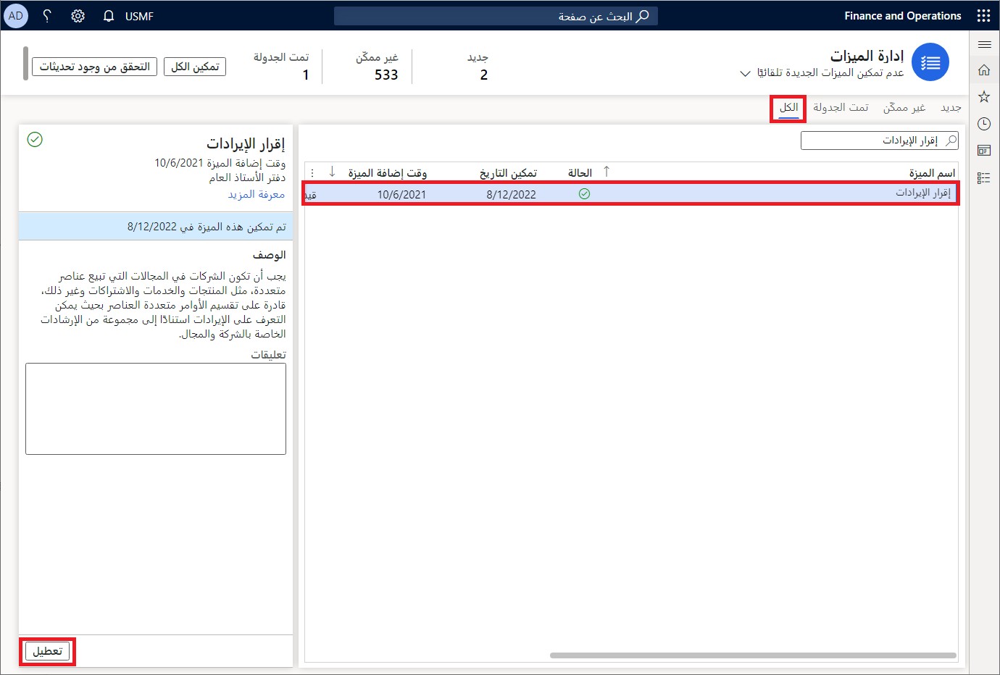
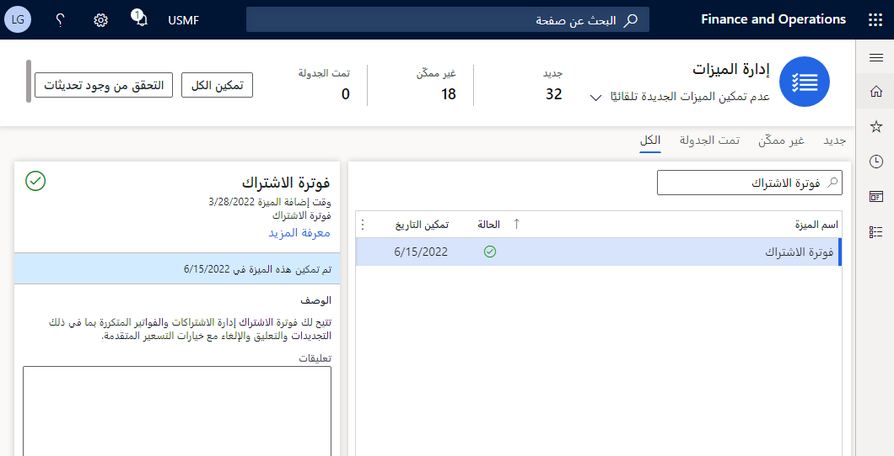
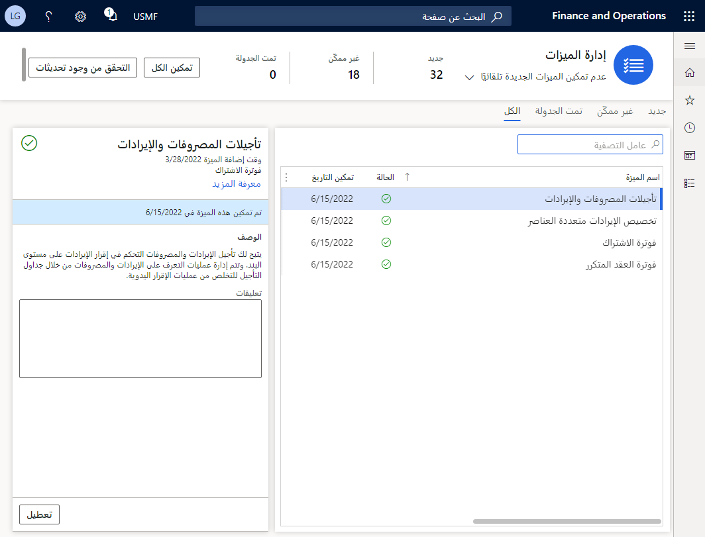

لاستخدام وظيفة فوترة الاشتراك، ستحتاج إلى التأكد من تعطيل ميزة **الإقرار بالإيرادات**. لن تتمكن من تمكين فوترة الاشتراك إذا تم تمكين الإقرار بالإيرادات.

لتمكين فوترة الاشتراك، اتبع الخطوات التالية:

1.  في Dynamics 365 Finance، انتقل إلى مساحة عمل **إدارة الميزات**.

1.  في مساحة عمل **إدارة الميزات**، حدد علامة تبويب **الكل** لعرض كافة الميزات الموجودة.

1.  في حقل البحث، أدخل **‏‫الإقرار بالإيرادات.**

1.  حدد ميزة **الإقرار بالإيرادات** ثم حدد **تعطيل** في الجزء الأيسر.

    > [!div class="mx-imgBorder"]
    > 

1.  في عامل تصفية **اسم الميزة**، أدخل **فوترة الاشتراك**.

    > [!div class="mx-imgBorder"]
    > 

1.  وفي حالة الرغبة في ذلك، يمكنك تمكين **فوترة العقد المتكرر** و **تأجيل الإيرادات والمصروفات** و **تخصيص الإيرادات متعددة العناصر** حسب الحاجة. كل ميزة منفصلة في التطبيق.

    > [!div class="mx-imgBorder"]
    > 

> [!NOTE]
> ستحتاج إلى تمكين ميزة **فوترة الاشتراك** قبل تمكين الوحدات النمطية الثلاثة الأخرى.

> [!VIDEO https://www.microsoft.com/videoplayer/embed/RE51nuc]
