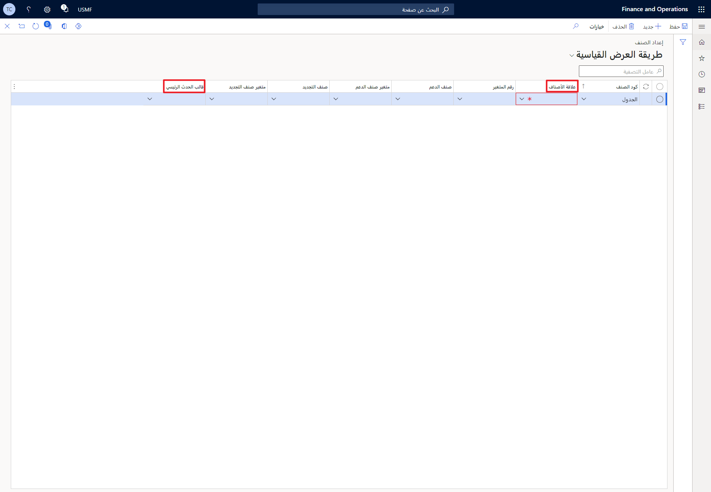
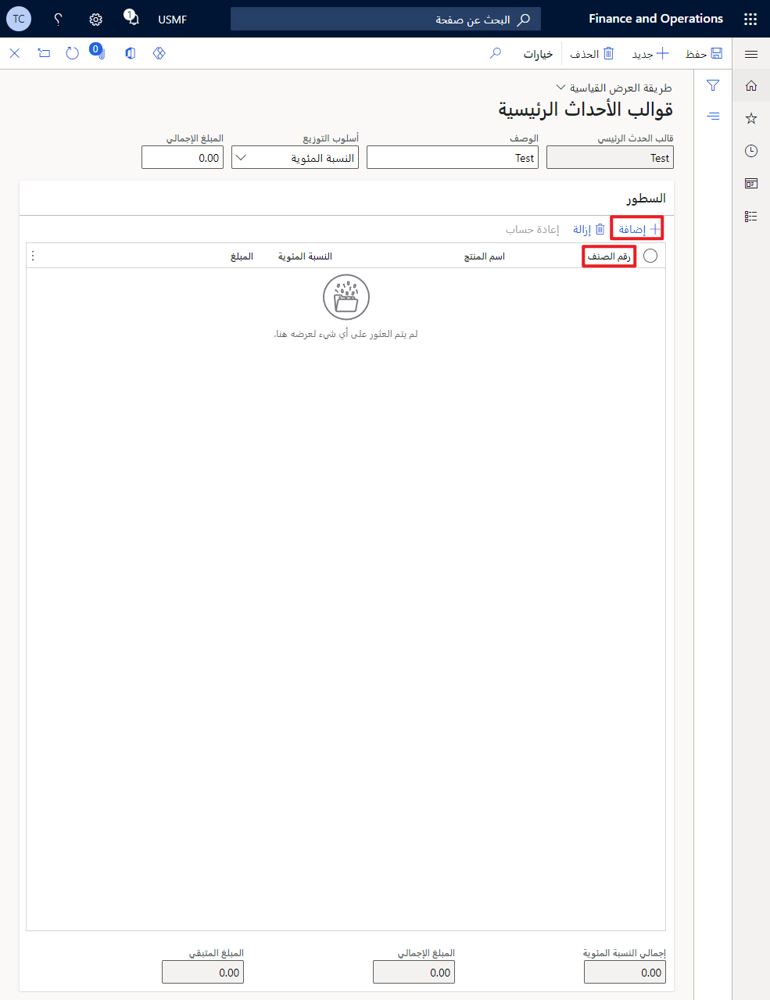
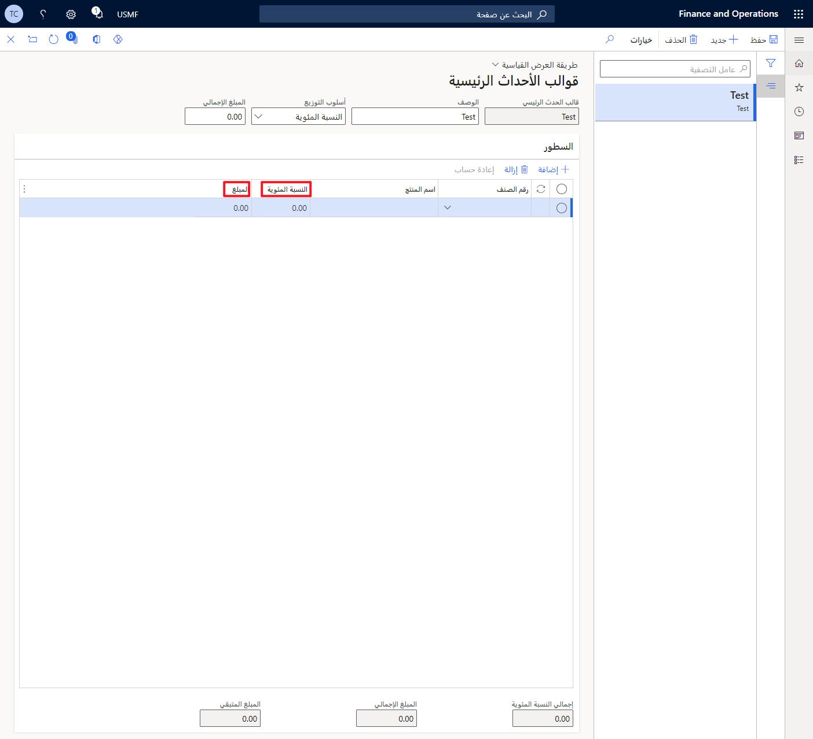
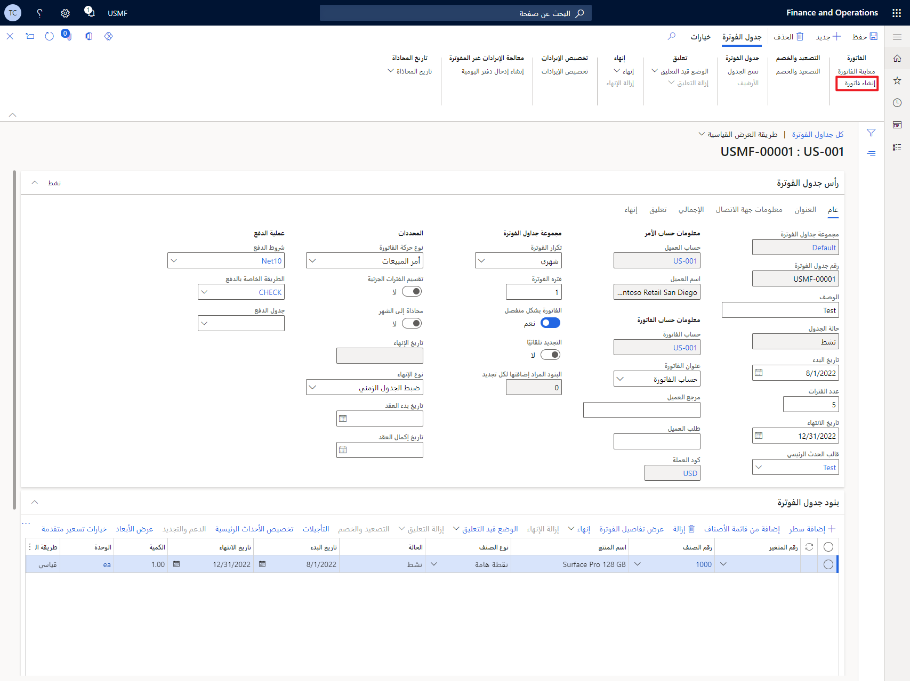
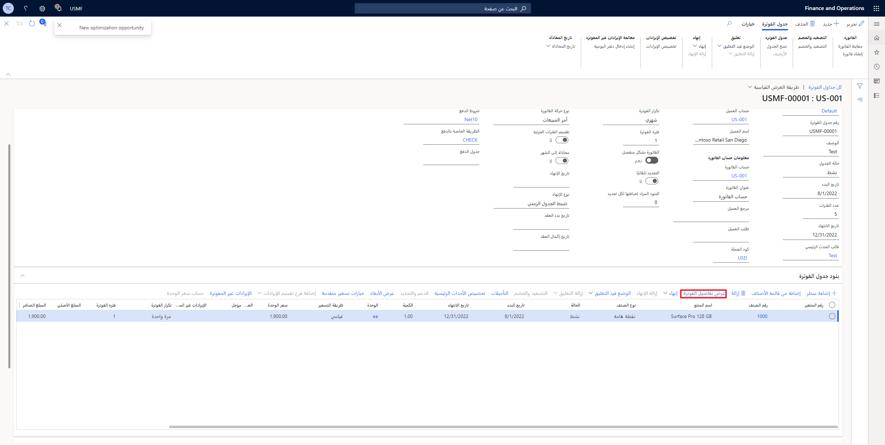

عن طريق إعداد مراحل الفوترة، يمكنك تنفيذ دورة دفع تقدم المواعيد النهائية للفواتير. إنها اتفاقية يمكنك استخدامها لفوترة العميل كلما تم إنشاء المحتوى. بعد إنشاء **قالب الأحداث الهامة**، يمكنك تحديد عناصر **جدول الفواتير** لتعمل ضمن **فوترة الأحداث الهامة**.

لإعداد قالب حدث رئيسي، اتبع هذه الخطوات:

1.  انتقل إلى **فواتير الاشتراك > فواتير العقد المتكررة > الإعداد > قوالب الأحداث الرئيسية**.

1.  حدد **جديد**،

1.  ضمن **قالب المرحلة الرئيسية**، حدد الاسم المطلوب. ثم أضف **الوصف** للقالب.

1.  قبل أن تتمكن من البدء فِي استخدام وظيفة **الحدث الرئيسي**، ستحتاج إلى إنشاء **مجموعة جدول الفواتير**. في الصفحة **مجموعة جدول الفواتير**، حدد **الأحداث الرئيسية** كنوع العنصر وحدد **قالب الأحداث الرئيسية** الذي تريده. بعد ذلك، حدد **علاقة الصنف** و **قالب الأحداث الرئيسية** الموجودين فِي الصفحة **إعداد الصنف** **(فواتير الاشتراك > فواتير العقد المتكررة > الإعداد > الأصناف)**.

    > [!div class="mx-imgBorder"]
    > 

1.  حدد **أسلوب التخصيص**. تتكون الخيارات من **النسبة المئوية** و **المبلغ المتغير** و **المبلغ المتساوي** و **النسبة المئوية للاكتمال**. **مبلغ الإجمالي** الموجود أسفل **أسلوب التخصيص** اختياري.

1.  حدد **إضافة** لإضافة خط. يمكنك تحديد رقم الصنف المطلوب، بعد إضافة السطر.

    > [!div class="mx-imgBorder"]
    > 

1.  بعد إضافة الأصناف الجديدة، إذا حددت **النسبة المئوية** أو **المبلغ المتغير** فِي **أسلوب التخصيص**، فستحتاج إلى تحديد المبلغ أو النسبة المئوية للتخصيص لكل سطر. إذا حددت **النسبة المئوية**، يجب أن تساوي **النسبة المئوية الإجمالية** قيمة **100**.

    > [!div class="mx-imgBorder"]
    > 

1.  حدد **حفظ**.

لـ **حذف** قالب حدث رئيسي، حدد الأسطر المرغوبة التي تريد إزالتها من القالب. بعد تحديد الخطوط التي تريدها، حدد **حذف**. سيُطلب منك تأكيد الإجراء. إذا كنت تريد المتابعة، فحدد **نعم**.

## إنشاء جدولة الفوترة

بعد قيامك بإنشاء **قوالب الأحداث الرئيسية** و **مجموعات جدول الفواتير** و **الأصناف**، يمكنك إنشاء **جدول الفواتير** الذي يخصص وظيفة **الأحداث الرئيسية**. لإنشاء **جدول الفواتير** الذي يقوم بتنفيذ وظيفة **الحدث الرئيسي**، اتبع هذه الخطوات.

1.  انتقل إلى **فواتير الاشتراك > فواتير العقد المتكررة >** **جداول الفواتير النشطة**. في الصفحة، حدد **جديد** فِي "جزء الإجراءات".

1.  بعد إنشاء **جدول الفوترة** الجديد، حدد **إضافة سطر** ضمن **بنود جدول الفواتير**.

1.  عندما يتم إنشاء السطر الجديد الخاص بك، حدد **رقم الصنف** و **نوع الصنف** المطلوبين إلى **الحدث الرئيسي**.

    > [!NOTE]
    > لتنفيذ **الحدث الرئيسي** كنوع الصنف، ستحتاج إلى تحديد **الموقع** و **المستودع**. انتقل إلى **تفاصيل البنود > المنتج > أبعاد التخزين**.

1.  لإضافة فواتير لجدول الفوترة، ستحتاج إلى تحديث تاريخ الانتهاء لكل **حدث رئيسي**. يمكنك القيام بذلك فِي **بنود جدول الفوترة** ضمن **تاريخ الانتهاء**. إذا كانت لديك عدة جداول فوترة، فحدد **تحديث عملية تاريخ الانتهاء**.

1.  بعد تحديث **تاريخ الانتهاء**، حدد **إنشاء فاتورة**.

    > [!div class="mx-imgBorder"]
    > 

1.  حدد **عرض جدول الفواتير**.

1.  حدد **إنشاء الكل**.

1.  بعد إنشاء الفاتورة، قم بالتمرير لأسفل إلى **بنود جدول الفواتير**، ثم حدد علامة التبويب **عرض تفاصيل الفوترة**. ستُظهر علامة التبويب هذه الفاتورة التي تم إنشاؤها.

> [!div class="mx-imgBorder"]
> 

