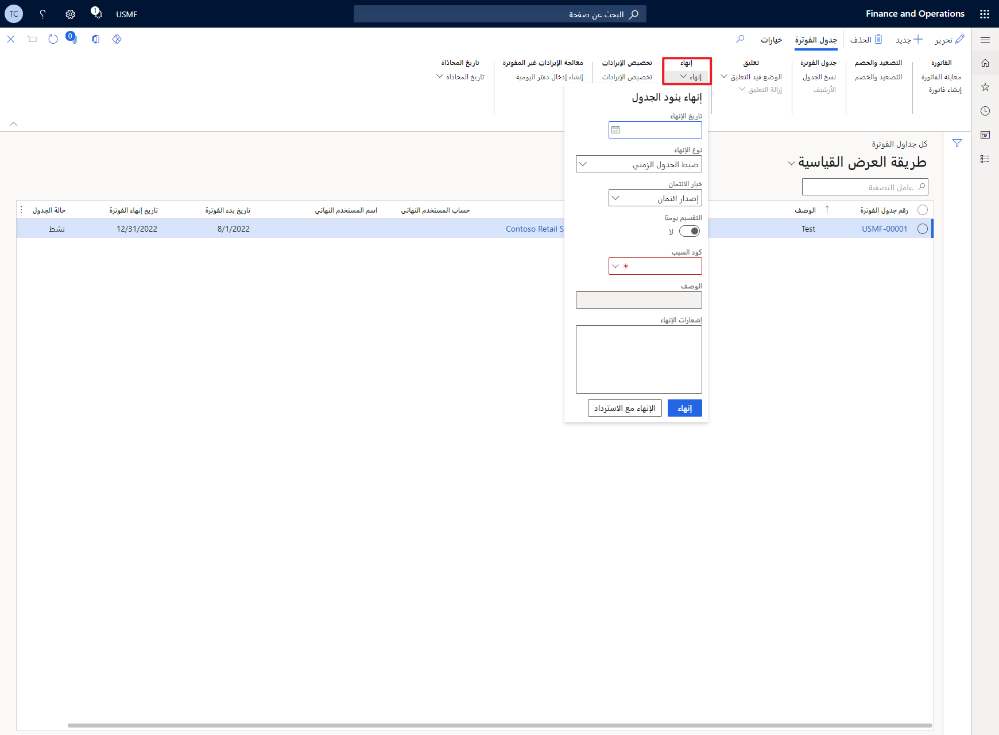

يمكن أن يساعد **إنهاء فوترة الاشتراك** فِي مواقف معينة، مثل عندما يحتاج المستخدمون إلى إلغاء العقود وتقديم المبالغ المستردة بالتناسب ويحتاجون إلى تعديل جدول التأجيل عند إنهاء العقد. على وجه التحديد، سيؤدي **إنهاء جدولة الفواتير** إلى إيقاف دفع المزيد من الفواتير إلى العميل، بدءاً من وقت معين. ومع ذلك، **لإنهاء جداول الفواتير**، يجب أن يكون لها الحالة **نشطة**.

بالنسبة لـ **إنهاء جدولة الفواتير**، اتبع الخطوات التالية:

1.  حدد **جدول الفوترة** أو **بند جدول الفواتير** الذي له الحالة **نشطة**. بعد إجراء التحديد، حدد **إنهاء**.

1.  أدخل **تاريخ الإنهاء** و **نوع الإنهاء** و **كود السبب**. قم بتعيين **خيار الائتمان** إلى **إصدار ائتمان**.

1.  حدد **إنهاء**.

> [!div class="mx-imgBorder"]
> 

> [!NOTE]
> بناءً عَلى نوع الإنهاء الذي تحدده، ستتغير حالة جدول الفواتير. ستؤدي **الفاتورة المتبقية** إلى تغيير حالة جميع البنود فِي جدول الفوترة إلى **آخر فاتورة**. حتى تتم معالجة آخر فاتورة، إن **جدول الفواتير** سيظل **نشطاً**. رغم ذلك، إذا حددت **ضبط الجدول** كنوع الإنهاء، فسيتم تحديثه عَلى الفور إلى **تم الإنهاء**.

لإنهاء جدول أو بند فوترة وتطبيق استرداد، اتبع الخطوات التالية:

1.  حدد **جدول الفوترة** أو **بند جدول الفواتير** الذي له الحالة **نشطة**. بعد إجراء التحديد، حدد **إنهاء**.

1.  أدخل **تاريخ الإنهاء** و **نوع الإنهاء** و **كود السبب**. قم بتعيين **خيار الائتمان** إلى **إصدار ائتمان**.

1.  حدد **إنهاء مع مبلغ مسترد**.