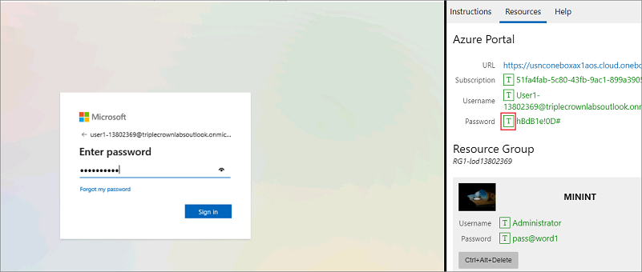

## اقرأ هذا أولاً - قبل أن تبدء المعمل! 

> [!IMPORTANT]
> بالنسبة لهذا المعمل، لا يمكنك تسجيل الدخول باستخدام بيانات الاعتماد الخاصة بك. استخدم الخطوات التالية لتسجيل الدخول إلَى بيئة المعمل باستخدام بيانات الاعتماد الصحيحة. 

1. تأكد من تسجيل الدخول على Microsoft Learn.
1. حدد **تشغيل وضع VM** أو **تسجيل الدخول لتشغيل وضع VM** فِي هذه الوحدة. 
2. في علامة التبويب **الموارد** على الشريط الجانبي للمعمل، حدد الرمز **T** بجوار **كلمة المرور** فِي الصندوق **MININT**، للحصول على كلمة مرور المسؤول للجهاز الظاهري الخاص بك.

     

3. حدد **إدخال**. 
4. سترى نافذة PowerShell وستظهر نافذة أوامر Windows. بعد مرور دقيقتين إلَى ثلاث دقائق، سيتم إغلاقها وسيفتح Microsoft Edge تلقائياً. انتظر حتى ينتقل إلَى صفحة **تسجيل الدخول** للتمويل والعمليات. 
    > [!NOTE]
    > عند فتح المستعرض، إذا تلقيت تحذيرًا بأن **اتصالك ليس خاصًا**، فهذا يدل عَلى أن هناك شهادة منتهية الصلاحية يمكننا تجاوزها بأمان. حدد **خيارات متقدمة** فِي نافذة الرسالة، ثم حدد الارتباط ذي التسمية **متابعة إلَى usnconeboxax1aos.cloud.onebox.dynamics.com (غير آمن)** لمواصلة تدريبك العملي عَلى موقع الويب غير الأمان.

5. في صفحة **تسجيل الدخول** إلَى Microsoft فِي التمويل والعمليات، أدخل مؤشر الماوس فِي الحقل **اسم المستخدم**. 
6. في علامة التبويب **الموارد** للشريط الجانبي للمعمل، أسفل عنوان **مدخل Azure**، حدد رمز **T** بجوار **اسم المستخدم**، ثم اضغط على **إدخال**. 

     

7. سيكون مؤشر الماوس الآن فِي صفحة **كلمه المرور**.
8. في علامة التبويب **الموارد** للشريط الجانبي للمعمل، أسفل عنوان **مدخل Azure**، حدد رمز **T** لتحديد **كلمة المرور**، ثم اضغط على **إدخال**. 

     

9.  لا تظل مسجلاً للدخول، أو تخزن كلمة المرور على الجهاز الظاهري.
10. للاطلاع على تعليمات المعمل، حدد علامة التبويب **التعليمات** على الشريط الجانبي للمعمل.

يمكنك الآن أن تبدأ عملك فِي هذا المعمل. 
