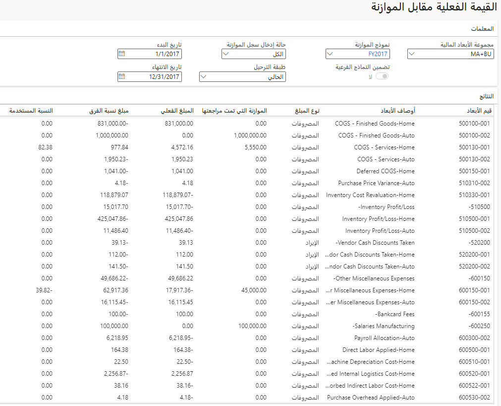
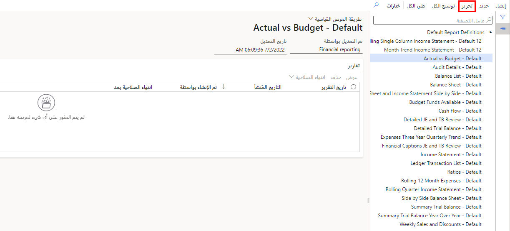

تستخدم ميزة **مقترحات الموازنة** التعلم الآلي الذكي لتوفير مقترح موازنة دقيق. يحصل النموذج على البيانات القديمة من النظام ويستخدمها لتشكيل الموازنة. إذا كانت هناك كمية وفيرة من البيانات في النظام، فمن المرجح أن تكون التوقعات أكثر دقة. يكون عادةً وجود خمس إلى عشر سنوات من البيانات مثالياً، ولكن ثلاث سنوات من البيانات ستكون كافية لإنشاء مقترح الموازنة.

ثمة عوامل يمكنها التأثير على دقة مقترحات الموازنة. 

- العامل الأول هو وجود بيانات كافية، وقد تمت الإشارة إلى هذا العامل سابقاً. 
- العامل الرئيسي الآخر هو مشاركة المدراء في عمليات الإنشاء والتحسين. بشكل أساسي، يعني هذا الأمر السماح للمدراء بأداء دور نشط في تنقية البيانات وتحديد تلك التي يجب تضمينها في مقترح الموازنة.

يمكنك مقارنة نتائج الموازنة مقابل القيم الفعلية باستخدام طريقة عرض كل بند على حدة في النموذجين. في **معلمات الاستعلام**، عيّن تاريخ البدء وتاريخ الانتهاء ومخرجات نموذج الموازنة، ثم عيّن الخيار **حالة إدخال سجل الموازنة‬** إلى **مسودة**. ستوفر لك النتيجة طريقة عرض سنوية لمبلغ الموازنة والمبلغ الفعلي ومبلغ نسبة الفرق والنسبة المئوية المستخدمة. بعد ذلك، يمكنك الانتقال إلى المزيد من التفاصيل عن طريق فتح صفحة **رصيد الفترة**، حيث يمكنك مراجعة أحد الحسابات على أساس كل فترة.

> [!div class="mx-imgBorder"]
> 

لإنشاء تقرير مالي يعرض تفاصيل القيم الفعلية مقابل مقترح الموازنة:

1.  انتقل إلى **دفتر الأستاذ العام > الاستعلامات والتقارير > التقارير المالية، ثم حدد القيم الفعلية مقابل الموازنة‬ – افتراضي**. 
2.  يتضمن التقرير طريقة عرض سنة واحدة لخيارات **الموازنة الأصلية‬** و **الموازنة التي تمت مراجعتها‬** و **القيم الفعلية** و **مبلغ نسبة الفرق‬** و **نسبة الفرق‬** و **نسبة الموازنة‬**، جنباً إلى جنب. إذا حددت الزر **جميع الحسابات‬**، فيمكنك عرض هذه الأعمدة مصنفة بشكل تفصيلي حسب الحساب. 
3.  إذا تنقلت بشكل تفصيلي في أحد الحسابات، فيمكنك عرض تصنيفه التفصيلي حسب الحركات الفردية.
4.  إذا أردت تغيير التقرير، فحدد **تحرير** في الجزء العلوي من الصفحة، مما يؤدي إلى نقلك إلى Report Designer. في Report designer، يمكنك تعديل أي تقرير افتراضي في النظام، بما في ذلك تقرير **القيم الفعلية مقابل الموازنة**.

> [!div class="mx-imgBorder"]
> 

5.  عندما تشعر بالرضا عن التقرير، يمكنك تصديره إلى Excel عن طريق تحديد الزر **تصدير** في الجزء العلوي من تقريرك. في Excel، يمكنك إدراج مخطط خطي أو خط مؤشر لتوفير طريقة عرض لبيانات الإدخال أو الإخراج التي تساعد في الكشف عن الاتجاهات في البيانات.

يشرح الفيديو التالي تقرير "القيم الفعلية مقابل الموازنة" ويُظهر سنة واحدة من الموازنة المتوقعة.

> [!VIDEO https://www.microsoft.com/videoplayer/embed/RE4ZcZa]
