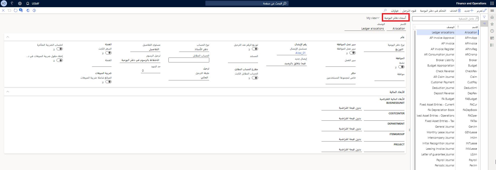
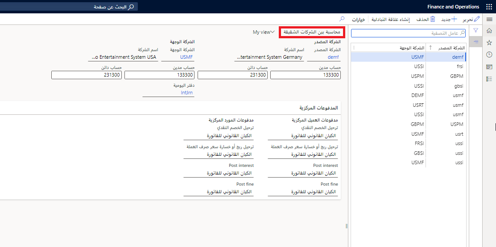

عند استخدام دفاتر اليومية للمحاسبة بين الشركات الشقيقة في Finance، فإن الحركات التي تم ترحيلها في إحدى الشركات ستؤدي إلى ترحيل الحركات ذات الصلة تلقائياً في الشركة الأخرى. 

توضح هذه الوحدة كيفية تكوين المحاسبة بين الشركات الشقيقة.

يجب إكمال الإعداد التالي لاستخدام المحاسبة بين الشركات الشقيقة:

1.  إنشاء الحسابات الرئيسية اللازمة في مخطط الحسابات.
2.  إعداد أسماء دفاتر اليومية.
3.  إعداد علاقات الترحيل بين الشركات.

شاهد هذا الفيديو للتعرف على كيفية إعداد المحاسبة بين الشركات الشقيقة في Finance:

 > [!VIDEO https://www.microsoft.com/videoplayer/embed/RE3TQTV]

## إنشاء حسابات رئيسية 

أولاً، تحتاج إلى إنشاء الحسابات الرئيسية بين الشركات الشقيقة لاستخدامها في إدخالات المحاسبة **مستحق إلى** و **مستحق من**. نوصي باستخدام حسابات رئيسية فريدة لكل شركة لتبسيط التسوية والتخلص من إدخالات المحاسبة بين الشركات الشقيقة. 

مخطط الحسابات هو إعداد عالمي، لذلك يمكن لجميع الشركات مشاركة مخطط حسابات واحد يحتوي على حسابات **مستحق إلى** و **مستحق من** الفريدة لكل شركة، أو يمكن أن يكون لكل شركة مخطط حسابات خاص بها. 

يجب أن تشتمل الحسابات التي تم إنشاؤها في مخطط حسابات **مستحق إلى** و **مستحق من** على حقل **نوع الحساب الرئيسي** معيناً إلى **الميزانية العمومية** لكي يعمل الترحيل بشكل صحيح.

إذا كنت تستخدم شريكاً تجارياً أو بُعداً نظيراً لتحديد الطرف بين الشركات الشقيقة، فيمكنك تحديد هذا البعد كبُعد ثابت في الحساب الرئيسي المحدد في المحاسبة بين الشركات الشقيقة. وصفحة **الحسابات الرئيسية** (**دفتر الأستاذ العام > مخطط الحسابات > الحسابات > الحسابات الرئيسية**) مبينة أدناه.

## إعداد أسماء دفاتر اليومية 

بعد ذلك، سوف تحدد اسم دفتر اليومية. يجب إعداد أسماء دفتر اليومية في كل كيان قانوني. على سبيل المثال، قم بتعيين حقل **نوع دفتر اليومية** إلى **يومي** في صفحة **أسماء دفاتر اليومية** (**دفتر الأستاذ العام > إعداد دفتر اليومية > أسماء دفتر الأستاذ**). نوصي باستخدام اسم دفتر يومية محدد للمحاسبة بين الشركات الشقيقة واستخدام نفس اسم دفتر اليومية في جميع الكيانات القانونية. 

## إعداد علاقات الترحيل بين الشركات 

عندما يتم إعداد الحسابات في مخطط الحسابات ودفاتر اليومية، يمكنك إعداد علاقات الترحيل بين الشركات.

تُستخدم صفحة **المحاسبة بين الشركات الشقيقة** لإنشاء أزواج الكيانات القانونية التي يمكنها التعامل مع بعضها البعض. تتم مشاركة إعداد المحاسبة بين الشركات الشقيقة، بحيث يكون الإعداد مرئياً من داخل جميع الكيانات القانونية. 

عند إنشاء زوج كيان قانوني جديد، تأكد من أنك على دراية بالكيان القانوني الذي يتم تعريفه على أنه الشركة المنشئة مقابل الشركة الوجهة. عند إدخال الحركات بين الشركات الشقيقة، تحدد المعاملة الكيان القانوني الذي يقوم ببدء أو إنشاء الحركة استناداً إلى الشركة النشطة. 

على سبيل المثال، تم إعداد المحاسبة بين الشركات الشقيقة لـ USMF (الأصلية) وAdventure Works Cycles (الوجهة). إذا كان المستخدم نشطاً في Adventure Works Cycles ودخل حركة بين الشركات الشقيقة مع USMF، فلن يتم ترحيل الحركة لأن المحاسبة بين الشركات الشقيقة محددة فقط لأن USMF هو المنشئ. إذا كان بإمكان أي من الشركتين إنشاء حركة، فستحتاج إلى إنشاء زوج كيان قانوني ثانٍ للإعداد المتبادل.

حدد **حساب الخصم (مستحق إلى)** و **حساب الائتمان (مستحق من)** لكل من الكيان القانوني المنشأ والوجهة. 

حدد **اسم دفتر اليومية** الذي سيتم استخدامه عند إنشاء الحركة في الشركة الوجهة. إن دفتر اليومية للشركة المنشأ معروف بالفعل لأنه يتم تحديده من قبل المستخدم عند إنشاء الحركة بين الشركات الشقيقة.

وأخيراً، حدد الكيان القانوني الذي سيتلقى المحاسبة عن المبالغ الداعمة، مثل الخصم النقدي أو المكاسب/الخسائر المحققة للمدفوعات المركزية.

يمكن بسهولة إعداد علاقة متبادلة في صفحة **المحاسبة بين الشركات الشقيقة** (**دفتر الأستاذ العام > إعداد الترحيل > المحاسبة بين الشركات الشقيقة**) باستخدام الزر **إنشاء علاقة متبادلة** بعد إنشاء أول زوج من الكيانات القانونية. عندما يتم إنشاء الزوج المتبادل، يتم نسخ معلومات الشركة الوجهة إلى الشركة المنشأ والعكس صحيح. 

سيبقى دفتر اليومية المحدد للشركة الوجهة. تستخدم معظم المؤسسات نفس اصطلاح التسمية لأسماء دفاتر اليومية الخاصة بهم، لذا فإن اسم دفتر اليومية يكون نفس الشيء. إذا كان اسم دفتر اليومية مختلفاً، فسيظهر تحذير في الحقل لإعلامك بعدم وجود دفتر اليومية، ويمكن تحديد دفتر يومية مختلف.

بغض النظر عن اتجاه الترحيل بين حسابات الشركات، يجب أن يكون لدى كلتا الشركتين حسابات بين الشركات الشقيقة تم إعدادها لحسابات الشركة الأخرى. ستؤدي أي أخطاء في الإعداد إلى حدوث أخطاء في محاكاة الترحيل والترحيل في دفاتر اليومية.

