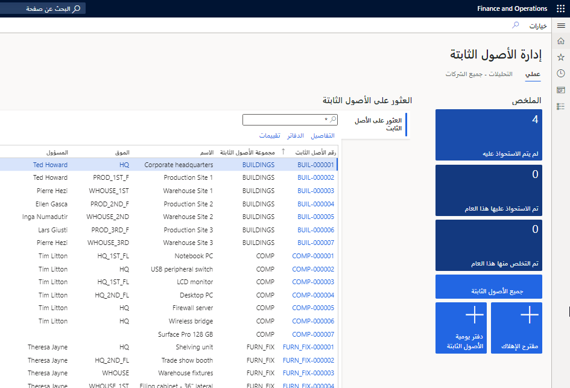
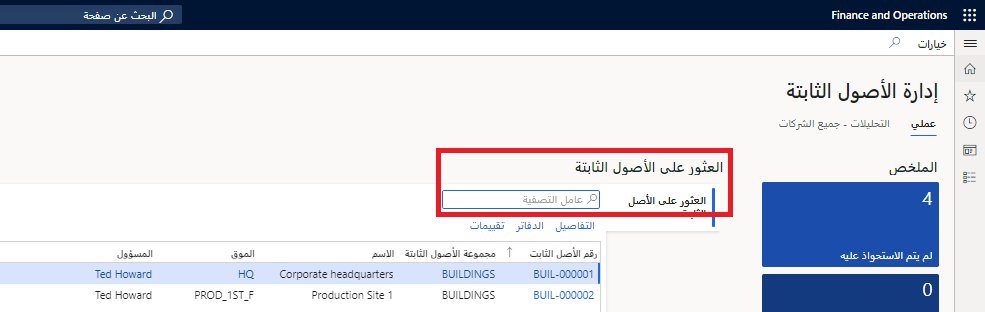
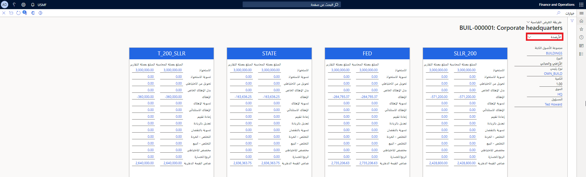
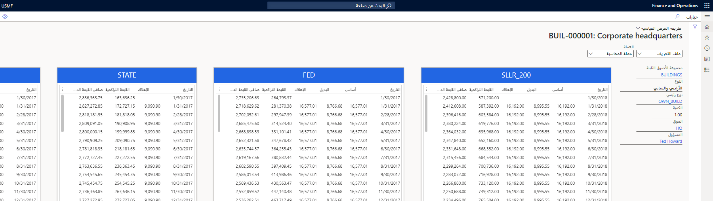

لتسجيل حركات الأصول الثابتة باستخدام دفاتر اليومية، يجب عليك إنشاء اسم دفتر يومية واحد على الأقل باستخدام نوع دفتر اليومية ترحيل الأصول الثابتة في إعداد وحدة دفتر الأستاذ العام. إذا كانت ميزانيات الأصول الثابتة مطلوبة، فيجب أيضاً إنشاء اسم دفتر يومية يستخدم نوع دفتر اليومية لموازنة الأصول الثابتة. تشرح هذه الوحدة كيفية معالجة وإدارة الأصول الثابتة.

## فهم دورة حياة الأصل الثابت

ضع في اعتبارك السيناريو التالي لفهم دورة حياة الأصل الثابت بشكل أفضل.

كاسي، المحاسب في Adventure Works Cycles، مسؤولة عن إدارة الأصول الثابتة للشركة. على أساس شهري، تقوم كاسي بمراجعة أوامر الشراء وفواتير الأصول الجديدة التي تم شراؤها في الشهر السابق. نظراً لأنه لم يتم تسجيل الأصناف كأصول أثناء عملية الشراء، فإنها تقوم بإدخال سجل أصول جديد لكل أصل محدد.

عندما تدخل كاسي الأصل الجديد، فإن الحقل الأول الذي تدخله هو **مجموعة الأصول الثابتة**، التي يتم تحديدها من القائمة المنسدلة للمجموعات المحددة مسبقاً. تظهر العديد من سمات مجموعة الأصول بشكل افتراضي في الأصل.
تقوم كاسي بإدخال البيانات الخاصة بالسمات المتبقية، وهي حقول توفر مستوى أكثر تفصيلاً لتعقب الأصول مع تقليل إدخال البيانات.

## مساحة إدارة الأصول الثابتة

تعرض مساحة عمل **إدارة الأصول الثابتة** المعلومات المتعلقة بالأصول الثابتة التي يتم إدخالها في النظام. تشتمل مساحة العمل هذه على طريقة عرض **ملخص** وطريقة عرض **تحليلات**. تعرض علامة التبويب **عملي** الإطارات المتجانبة للملخص وتفاصيل الأصول الثابتة والمعلومات ذات الصلة حول الأصول الثابتة في الشركة الحالية. يمكنك أيضاً إضافة التحليلات إلى قسم **تحليلات Power BI** في مساحة العمل مباشرةً. تستخدم علامة التبويب **التحليلات - جميع الشركات** إمكانات Microsoft Power BI لإظهار المرئيات المتعلقة بالأصول الثابتة في جميع الشركات.

## قسم الملخص

توفر الإطارات المتجانبة في قسم **الملخص** نظرة عامة على أصولك الثابتة. تتضمن المعلومات مقاييس حول الأصول التي لم تتم حيازتها بعد، والأصول التي تم الحصول عليها خلال العام الحالي، والأصول التي تم التخلص منها خلال العام الحالي. كما يحتوي قسم **الملخص** على تنقل سريع إلى صفحة قائمة **الأصول الثابتة**، واقتراح إهلاك الدُفعات، ودفتر يومية **الأصل الثابت**.

**الأصول الثابتة > مساحة عمل إدارة الأصول الثابتة**.

## قسم البحث عن الأصول الثابتة

يتيح لك قسم **البحث عن الأصول الثابتة** البحث بسرعة عن الأصول من خلال توفير رقم الأصل الثابت أو المجموعة أو الاسم أو الموقع أو الشخص المسؤول. ستظهر جميع الأصول التي تطابق معايير البحث في القائمة.

**الأصول الثابتة > مساحة عمل إدارة الأصول الثابتة**.

من القائمة يمكنك عرض الصفحات التالية:

- صفحة **التفاصيل** للأصل الثابت
- صفحة **الدفاتر** لجميع الدفاتر المرتبطة بالأصل الثابت
- صفحة **تقييمات الأصول الثابتة**

## صفحة تقييمات الأصول الثابتة

تتيح لك صفحة **تقييم الأصول الثابتة** مشاهدة، في صفحة واحدة، أهم المعلومات حول الأصل الثابت، وتفاصيل جميع الدفاتر المرتبطة بالأصل الثابت. يعرض خيار **الأرصدة** في الجزء العلوي الأيسر من الصفحة التقييم الحالي لكل دفتر مرتبط بالأصل الثابت. يمكنك التراجع عن القيم لعرض الحركات التفصيلية التي تشكل قيمة الملخص.

**‎الأصول الثابتة> ‎الأصول الثابتة > خيار قائمة التقييمات**

يعرض خيار **ملف التعريف** في الجزء العلوي الأيسر من الصفحة جدول الإهلاك لكل دفتر مرتبط بالأصل الثابت. في هذه الصفحة، يمكنك عرض المبالغ بناءً على عملات المحاسبة أو التقارير.

يمكنك الوصول إلى صفحة **تقييمات الأصول الثابتة** من مساحة عمل **إدارة الأصول الثابتة** أو صفحة **قائمة الأصول الثابتة**.

**‎الأصول الثابتة> ‎الأصول الثابتة > ‎خيار قائمة التقييمات**

## قسم المعلومات ذات الصلة

يمكنك الانتقال مباشرةً إلى صفحة **إعداد الدفاتر**، وصفحة الاستعلام عن **حركات الأصول الثابتة**، والعديد من التقارير باستخدام الارتباطات الواردة في قسم **المعلومات ذات الصلة** في مساحة العمل.

## التحليلات - جميع الشركات

توفر صفحة **التحليلات** مقاييس مهمة حول الأصول الثابتة في جميع الكيانات القانونية في النظام. يتم التحكم في الوصول إلى علامة التبويب بواسطة معلمة **عرض تحليلات الأصول الثابتة لجميع امتيازات أمان الشركة**.

## صفحة الأصول الثابتة

توفر صفحة **الأصول الثابتة > الأصول الثابتة > الأصول الثابتة** موقعاً حيث يمكن للشركة تسجيل معلومات حول الأصول الثابتة وإدارتها. يحتوي جدول الأصول الثابتة على معلومات مالية وغير مالية حول الأصول. المعلومات غير المالية تتعلق بالأصل المادي. يتم تسجيل معظم المعلومات غير المالية عند إعداد الأصل. تتضمن أمثلة المعلومات غير المالية ما يلي:

- اسم الأصل
- الرقم التسلسلي
- المعلومات الفنية مثل تواريخ الصيانة
- معلومات التأمين
- الكود الشريطي
- الموقع

يمكن تسجيل تقييمات متعددة للمعلومات المالية حول كل أصل باستخدام الدفاتر التي تم تخصيصها للصفحة. بالإضافة إلى ذلك، يتم تسجيل المعلومات المالية عند ترحيل الحركات.

يمكن أن تتطلب إدارة الأصول أيضاً تعقب الكمية ووحدة القياس (UOM) وتكلفة الوحدة للأصل. وغالباً ما يكون هذا ضرورياً عندما يتم اعتبار مجموعة من الأصناف المتشابهة أصلاً واحداً بشكل منطقي، ولكن كل صنف يعتبر غير مكلف للغاية بحيث يتعذر تعقبه كأصل. على سبيل المثال، قد لا يتم تعقب كرسي غرفة المؤتمرات كأصل، ولكن قد يتم تعقب خمسين كرسياً تم تجميعها وشراؤها في نفس الوقت كأصل. للمساعدة في تعقب هذه الأنواع من الأصول، تتوفر حقول **الكمية**، و **وحدة القياس**، و **تكلفة الوحدة** في سجل الأصول.

تشير علامة التبويب السريعة **البنية** إلى العلاقة بين الأصل والأصول الأخرى، إما كأصل رئيسي مع مكونات أساسية أو كمكون تم تعيينه لأصل آخر.

تتكون تسويات القيم من أنواع الحركات التالية: **التسوية بالزيادة**، و **التسوية بالنقصان**، و **إعادة التقييم**.

دائماً ما يتم إدخال التسويات بالزيادة والتسوية بالنقصان كبنود دفتر يومية يدوي لأنه لا يمكن عادةً إعداد قواعد لتسويات القيم تلك. تتطابق عمليات استخدام دفاتر اليومية هذه مع العمليات الموضحة لعمليات الاستحواذ والإهلاك.

من ناحية أخرى، يمكن إعداد إعادة التقييم لكل أصل، بحيث يمكنك استخدام الاقتراحات. نظراً لأن هذه الوظيفة خاصة بإسبانيا، يُرجى الرجوع إلى المحتوى المترجم لإسبانيا في [موارد العولمة](/dynamics365/unified-operations/dev-itpro/lcs-solutions/country-region?azure-portal=true&toc=/fin-and-ops/toc.json) للحصول على تفاصيل إضافية حول هذه الوظيفة.
