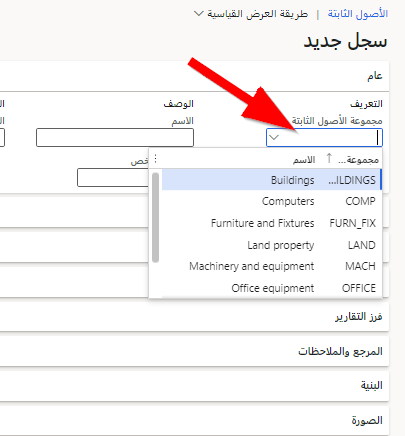
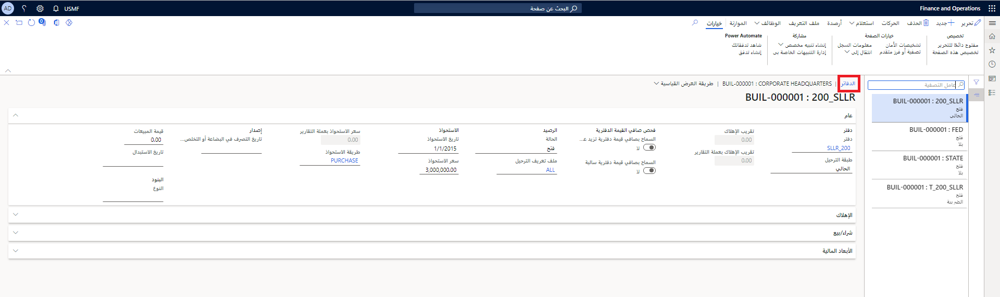

تتطلب وحدة محاسبة الأصول الثابتة القوية عدة أنواع مختلفة من معاملات الأصول الثابتة، وطرق مفصلة لتسجيل تلك الحركات. يقدم Finance أنواعاً عديدة من المعاملات لتصنيف الأصول الثابتة وتتبعها.

بالنسبة لعمليات الاستحواذ والاستهلاك وتعديل القيمة والتخلص من الأصول الثابتة، يقدم Finance أنواع الحركات التفصيلية التالية:

-   تسوية الاستحواذ والاستحواذ
-   تسويه الإهلاك والإهلاك
-   الإهلاك الاستثنائي
-   تسويات القيم - التسوية بالزيادة، والشطب، وإعادة التقييم
-   التخلص - البيع والخردة ومخصص الاحتياطي

## إعداد الأصول

أولاً، يجب أن يكون لديك أصل لتسجيل المعاملات مثل عمليات الاستحواذ والإهلاك والتخلص والعديد من الأصول التي سيتم ترحيلها مقابلها.

تتمثل الخطوة الأولى في معرفة كيفية إعداد الأصل بناءً على النوع والخصائص، والتي تحدد كيفية تجميعها في مجموعة الأصول الثابتة وتحديد الدفاتر وتنفيذ العمليات مثل الإنشاء والشراء والاستلام والإهلاك والتسوية بالزيادة أو النقصان وإعادة التقييم والمزيد.

يمكنك إنشاء أصل ثابت وإعداده بعدة طرق: يدوياً، باستخدام التكامل مع إما الحسابات الدائنة أو المشتريات وتحديد المصادر، أو باستخدام إما فاتورة المورد عند الترحيل، أو أمر شراء عند إيصالات المنتج.

شاهد هذا الفيديو لتتعلم كيفية إنشاء أصل:

  > [!VIDEO https://www.microsoft.com/videoplayer/embed/RE3TYJc]

بغض النظر عن الطريقة التي تريد بها إنشاء أحد الأصول، إن تحديد **مجموعة الأصول الثابتة**، وهو حقل إلزامي، سيسهل عملية إعداد العديد من الحقول في الأصل سجل. ومع ذلك، لا يزال من الممكن إدخال معظم المعلومات أو الاحتفاظ بها يدوياً.

**الأصول الثابتة > الأصول الثابتة > الأصول الثابتة > +جديد** 

عند إدخال المعاملات، يتم تسجيل إدخالات الكتب التي لها نفس طبقة الترحيل فقط كما هو محدد في اسم دفتر اليومية.

## المزيد حول الدفاتر

تحدد التحديدات التي تم إجراؤها في صفحة **الدفاتر** المعلومات المالية التي يتم تسجيلها وتخزينها للأصل الثابت. يرتبط كل دفتر بمجموعة أصول ثابتة. يتم الوصول إلى الصفحة عن طريق تحديد زر **الدفاتر** في صفحة **الأصول الثابتة**.

يتم ملء الدفاتر المرتبطة بالأصل الثابت المحدد والعديد من حقول الدفتر تلقائياً استناداً إلى الدفاتر التي تم إعدادها لمجموعة الأصول الثابتة المحددة.

يمكن استخدام الدفاتر المقترحة التالية، أو يمكن للمستخدم اختيار دفاتر مختلفة.

-   إذا كانت الشركة تسجل معاملات الأصول فقط للأغراض المحاسبية، فسيكون دفتراً واحداً كافياً عادةً.
-   إذا تم أيضاً تسجيل الحركات الضريبية، فيجب أن يتوفر دفتر إضافي، وعادة ما يكون الدفتر الذي يستخدم طبقة ترحيل الضرائب.

**الأصول الثابتة > الأصول الثابتة > الأصول الثابتة** ثم حدد **الدفاتر** من القائمة العلوية 

## إنشاء أصل ثابت

يتم تخصيص رقم الأصل الثابت يدوياً أو تلقائياً، اعتماداً على الإعداد في صفحتي **مجموعات الأصول الثابتة** و **معلمات الأصول الثابتة**.

تجمع الأصول الثابتة أرقام الأصول باستخدام القيمة الموجودة في حقل **نوع الخاصية**، الذي يصف الأصل الثابت ليكون واحداً مما يلي:

-   **الأصل الثابت** - الأصول العادية، ليتم معالجتها كالمعتاد.
-   **ملكية الاستمرار** - ملكية موجودة لأغراض المخزون فقط، مثل الهواتف أو أجهزة الراديو أو الأجهزة المحمولة التي تقل عن حد الرسملة. بشكل نموذجي، يتم إدخال عمر خدمة بقيمة صفر (0) لأصول الممتلكات المستمرة ويتم استبعاد أصول الممتلكات المستمرة من تقرير التقييم الذي تقوم بتسويته مع دفتر الأستاذ العام.
-   **أخرى** - الأصول غير الملموسة التي يتم عرضها بشكل منفصل في الميزانية العمومية.

يحدد حقل **النوع الرئيسي** مجموعات الأصول عالية المستوى، مثل المعدات والمباني والأراضي والبنية التحتية والمرافق. يتم استخدام الأنواع الرئيسية لإعداد التقارير فقط، ويمكن تخصيصها للأصول الثابتة أو مجموعات الأصول الثابتة. يمكن حذف الأنواع الرئيسية فقط التي لم يتم تعيينها لأصل ثابت أو مجموعة أصول ثابتة.

لإنشاء أصل ثابت جديد، استخدم الإجراء التالي:

1.  انتقل إلى **الأصول الثابتة > الأصول الثابتة > الأصول الثابتة**.
2.  حدد **جديد**.
3.  في حقل **مجموعة الأصول الثابتة**، أدخل قيمة أو حددها.
4.  سيكون الرقم افتراضياً إذا قمت بتمكين وظيفة **الترقيم التلقائي للأصول الثابتة** في **معلمات الأصول الثابتة** و **مجموعة الأصول الثابتة**. وإذا لم يكن الأمر كذلك، فيجب إدخال رقم فريد لتحديد الأصل الثابت.
5.  في الحقل **الاسم**، اكتب قيمة‎.
6.  أدخل المعلومات الإضافية التي يحتاجها عملك لهذا الأصل.
7.  حدد **دفاتر**.
8.  في حقل **تاريخ** **الاستحواذ**، أدخل تاريخاً.
9.  في حقل **سعر** **الاستحواذ**، أدخل رقماً.
10. أدخل المعلومات الإضافية التي يحتاجها عملك لهذا الدفتر.
11. أدخل المعلومات الإضافية التي يحتاجها عملك للدفاتر المتبقية.
12. أغلق الصفحة.

في حقل **الحالة** في صفحة دفتر الأصل، يستخدم الحقل أولاً قيمة **لم يتم الاستحواذ عليها بعد.** يتم تعيين الحالات الأخرى يدوياً أو تلقائياً كما يلي:

-   **مفتوح** - قم بالتعيين عند امتلاك الأصل.
-   **معلق** - يتم تعيينه يدوياً.
-   **مقفلة -** يتم تخصيصها للأصول القابلة للإهلاك عندما يصبح صافي القيمة الدفترية صفراً.
-   **تم البيع -** يتم تعيينه للأصول المتصرف بها عن طريق البيع.
-   **خردة -** يتم تعيينه للأصول التي تم التخلص منها كخردة من خلال دفتر يومية.

لا يمكن تحديث الأصول التي تكون حالتها **معلقة** أو **مقفلة** أو **مباعة** أو **خردة** بحركات إضافية. ومع ذلك، يمكن تحديث الحالة يدوياً للسماح بالترحيل.

يتم إجراء تحديث حالة الأصل دائماً لكل **دفتر**. يعد ذلك ضرورياً لأنه قد يتم إهلاك الأصل بالكامل للأغراض الضريبية، ولكن لا يزال مفتوحاً لترحيل إهلاك إضافي للأغراض المحاسبية.

## إدخال إضافة إلى الأصول الثابتة

يوضح هذا الإجراء كيفية إدخال إضافة إلى أصل ثابت موجود. الغرض من إضافات الأصول الثابتة هو تتبع إضافات العناصر أو الصيانة أو التحسينات لأحد الأصول، وهي معلوماتية فقط.
يجب إجراء أي تغييرات على قيمة الأصول الثابتة أو مدة الخدمة بشكل منفصل.

1.  انتقل إلى **الأصول الثابتة > الأصول الثابتة > الأصول الثابتة**.
2.  في القائمة، ابحث عن الأصل الثابت وحدده للإضافة.
3.  في جزء الإجراء، حدد **أصل ثابت**.
4.  حدد **إضافات الأصول الثابتة**.
5.  حدد **جديد**.
6.  في الحقل **الاسم**، اكتب قيمة‎.
7.  قم بتعيين تاريخ إضافة الشراء أو الخدمة.
8.  أدخل تكلفة الصنف أو الصيانة أو التحسينات الأخرى للأصل.
9.  في الحقل **كمية**، أدخل رقماً.

لن يكون للتكلفة الإجمالية أي تأثير على قيمة الأصول الثابتة وهي لأغراض التتبع والمعلومات فقط. إذا تمت رسملة التكلفة، فيجب ترحيل حركة التسوية بالزيادة بشكل منفصل.

1.  حدد علامة التبويب **عام**.
2.  حدد خيار **زيادة عمر الخدمة**، إذا أدت الإضافة إلى زيادة عمر خدمة الأصل. هذا الحقل معلوماتي فقط.
3.  لزيادة عمر الخدمة، قم بتعديل **عمر الخدمة** في دفتر الأصل.
