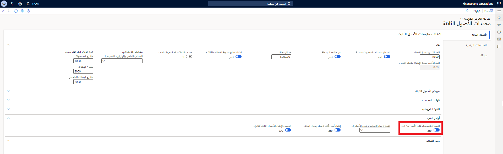

## إنشاء أصول ثابتة يدوياً 

عند قيامك بترحيل فاتورة مورد لها رقم أصل ثابت تم إدخاله في البنود، إذا تم تحديد الخيار **السماح بالاستحواذ على الأصول** في الصفحة **معلمات الأصول الثابتة**، فسيتم ترحيل الاستحواذ تلقائياً، ويتم تغيير حالة الأصل إلى "فتح".

في حاله تعذر ترحيل استحواذ، فإنه يمكنك إما إدخال حركة استحواذ يدوياً في الأصول الثابتة أو استخدام اقتراح استحواذ في دفتر يومية **الأصول الثابتة** لإنشاء حركات استحواذ متعددة في نفس الوقت.

إذا قمت بإعداد الأصول الثابتة للحد من ترحيل حركة الاستحواذ إلى مجموعة مستخدمين معينة، فيجب أن تكون عضواً في مجموعة المستخدمين هذه لنشر حركات الاستحواذ من الفواتير.
 
صفحة **الأصول الثابتة** في **الأصول الثابتة > إعداد > معلمات الأصول الثابتة** 

## إنشاء أصول ثابتة تلقائياً 

عند قيامك بترحيل إيصال استلام منتجات تم تحديد الخيار **إنشاء أصل ثابت جديد** فيه لأحد البنود، فسيتم إنشاء أصل ثابت جديد بالحالة لم يتم الاستحواذ عليه بعد. بعد ذلك عندما تقوم بترحيل فاتورة مورد بأصل ثابت جديد، يتم ترحيل حركة الاستحواذ للأصل الجديد وتتغير حالة الأصل إلى "مفتوح"، إذا قمت بإعداد الأصول الثابتة للسماح بعمليات الاستحواذ على الأصول من الحسابات الدائنة، وأنت عضو بمجموعة مستخدمين يمكنها نشر حركات الاستحواذ.

إذا لم يتم تحديد الخيار **الأصل الثابت الجديد؟** في بند الشراء عند ترحيل إيصال استلام المنتجات، ولكن تم تحديده عند ترحيل فاتورة المورد، فإنه يتم إنشاء الأصل الثابت الجديد والاستحواذ عليه بالحالة مفتوح، إذا قمت بإعداد الأصول الثابتة وسمحت بإنشائها والاستحواذ عليها. لا يتم إنشاء أصل إضافي عندما تقوم بترحيل فاتورة مورد إذا كان قد تم إنشاؤه بالفعل عند ترحيل إيصال استلام المنتجات.

## حد الرسملة

عند استخدام طريقة يتم فيها إنشاء الأصل والاستحواذ عليه تلقائياً، يمكنك إعداد النظام للتحقق مما إذا كان مبلغ شراء الأصل الثابت يلبي حد رسملة محدد لإهلاك الأصول. إذا كان الأمر كذلك، سيتم تحديد الخيار **الإهلاك** في الدفاتر الخاصة بالأصل عند إنشائه من الحسابات الدائنة.

حد الرسملة هو مبلغ العملة الذي يحدد ما إذا كان سيتم إهلاك الأصول إذا كانت تفي بالمبلغ المحدد.

على سبيل المثال، إذا اشتريت أحد الأصول وكان مبلغ الشراء أقل من حد الرسملة، فلن يتم تخصيص الأصل ليتم إهلاكه؛ وإذا كان مبلغ الشراء يستوفي الحد المحدد أو يتجاوزه، فسيتم تخصيص الأصل للإهلاك.

يمكنك إعداد حد الرسملة في صفحة **مجموعات الأصول الثابتة**.
