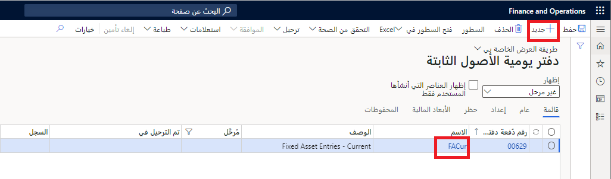
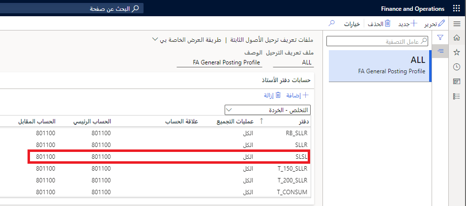
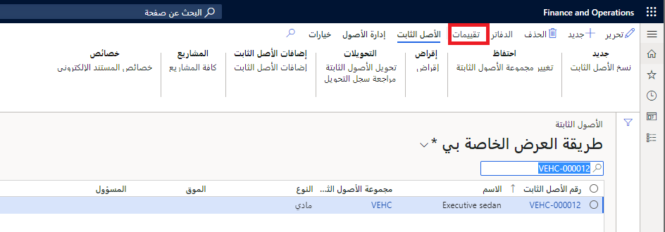
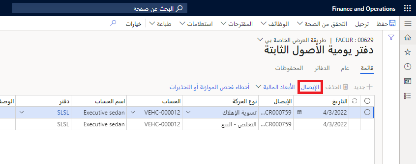
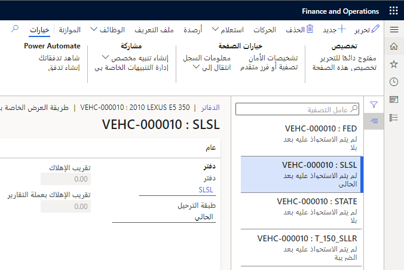
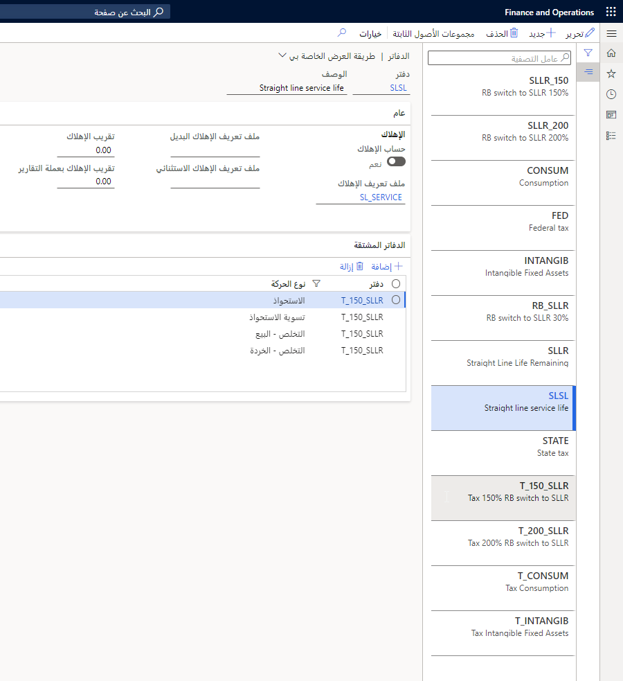
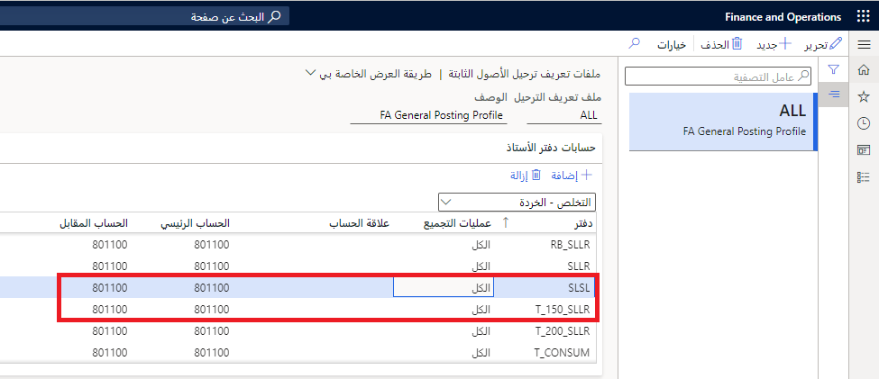
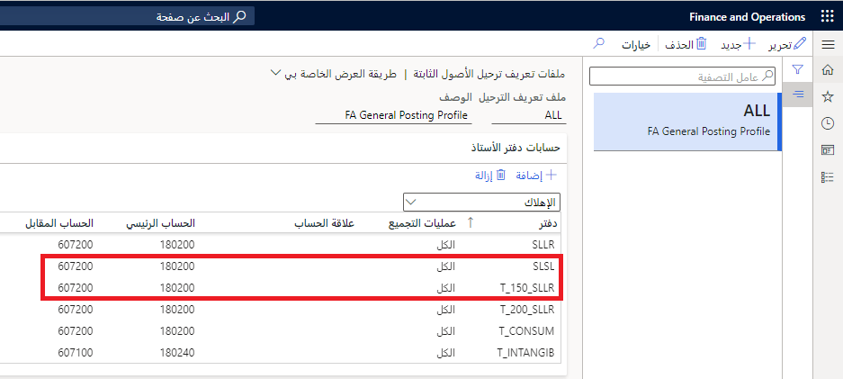
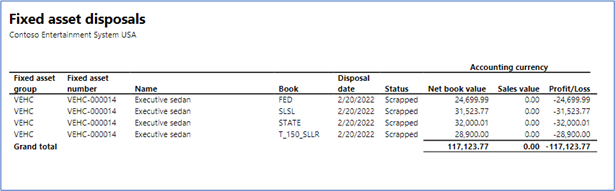

في حالة عدم الحاجة إلى أحد الأصول الثابتة بعد الآن، يمكن تخريده أو بيعه. إذا كان الأصل لا يزال يحتفظ بقيمته، فمن المحتمل أن يتم بيعه. إذا لم يكن للأصل قيمة حقيقية، يتم تخريده. تصف هذه الوحدة عملية تخريد أصل ثابت. 

الأصل في هذا المثال هو مركبة.

## إنشاء دفتر يومية التخلص من الأصول الثابتة لتخريد أصل ثابت
يمكنك إنشاء مقترح التخلص من الأصول الثابتة عن طريق الانتقال إلى الوحدة النمطية الخاصة بالأصول الثابتة، وتحديد مجموعة **إدخالات دفتر اليومية** ثم تحديد عنصر قائمة **دفتر يومية الأصول الثابتة**.

1. حدد **جديد** لإنشاء دفتر يومية جديد. ستستخدم عدة أسماء عند وجود دفاتر متعددة. 
2. حدد اسم دفتر اليومية الذي يقوم بالترحيل إلى طبقة الترحيل **الحالية**. وفي هذه الحالة، يكون اسم دفتر اليومية هو **FACur**.

    > [!div class="mx-imgBorder"]
    > 

1. حدد رقم دفتر اليومية أو زر **السطور** في جزء الإجراءات لفتح صفحة **سطور دفتر اليومية**.
2. في السطر، حدد **التخلص - الخردة** في حقل **نوع الحركة**. 
3. للتخلص من أصل ثابت واحد، أدخل رقم الأصل في حقل **الحساب**. 
4. يمكنك أيضاً إدخال **وصف**. 
5. لا تقم بإدخال قيمة للسطر. قيمة الأصل تساوي صفراً. 

 
يحدد ملف تعريف ترحيل الأصول الثابتة حساب دفتر الأستاذ المقابل الذي يتم استخدامه. لعرض ملف التعريف، انتقل إلى الوحدة النمطية الخاصة بالأصول الثابتة، ثم حدد **إعداد**، ثم حدد **ملفات تعريف ترحيل الأصول الثابتة**. 

1. حدد **التخلص – الخردة** في القائمة المنسدلة **حسابات دفتر الأستاذ** وقم بالتمرير إلى دفتر الأصل **SLSL**.

    > [!div class="mx-imgBorder"]
    > 

 
    تأتي الأبعاد المالية المستخدمة من دفتر الأصول الثابتة. في هذا المثال، يتم استخدام وحدة الأعمال **002** في حساب دفتر الأستاذ المقابل وحساب الأصل. 

1. حدد عنصر القائمة **الأبعاد المالية** وحدد **الحساب**.
2. قم بترحيل دفتر اليومية من خلال تحديد الزر **ترحيل**. 
3. بعد الترحيل، يتم إضافة السطر إلى دفتر اليومية. يؤدي هذا السطر إلى إهلاك الأصل من آخر تاريخ تم استهلاكه فيه حتى التاريخ الحالي.
 

## مراجعة تقييم الأصول الثابتة
لفهم الترحيلات التي تحدث لهذا الأصل، نحتاج إلى إلقاء نظرة على صفحة **تقييمات الأصول الثابتة**. هناك نوعان من دفاتر الأصول التي يتم ترحيلها. يقوم دفتر **SLSL** بالترحيل إلى الطبقة **الحالية** بينما يقوم **T_150_SLLR** بالترحيل إلى طبقة **الضريبة**. دعنا نركز على دفتر الأصل **SLSL** نظراً لأن هذا هو الدفتر الذي تم تحديده لعملية البيع هذه.

قبل عملية البيع، تم الحصول على الأصل مقابل **40,000 دولار أمريكي**. كان هناك **8,000.04 دولار أمريكي** للإهلاك. كان **صافي القيمة الدفترية** **31,996.96 دولار أمريكي**. 

للاطلاع على التقييم، انتقل إلى الوحدة النمطية الأصول الثابتة، ثم قائمة **الأصول الثابتة** التي تعرض صفحة قائمة **الأصول الثابتة**. حدد عنصر قائمة **التقييمات** في صفحة القائمة.

> [!div class="mx-imgBorder"]
> 

سوف تطلع على التقييم الحالي لكل دفتر من الدفاتر الأربعة الموجودة في الأصل. تركز هذه الوحدة على دفتر الأصل **SLSL**.
 
بعد التخلص من الخردة، يوضح التقييم أن **صافي القيمة الدفترية** يساوي صفراً لأن الأصل لم يعد موجوداً في الدفاتر. يتم تسجيل **صافي القيمة الدفترية** قبل التخريد كخسارة في السطر **الربح/الخسارة**.

## مراجعة الإيصال 
يمكن عرض الإيصال الناتج عن ترحيل دفتر يومية الأصول الثابتة هذا من عنصر قائمة **الإيصال** أعلى شبكة السطور.

> [!div class="mx-imgBorder"]
> 

هناك ترحيلات إلى طبقة **الضريبة** من دفتر الأصل **T_150_SLLR**. لا يتم ترحيل دفتري الأصل الآخرين إلى أي طبقة. في هذا المثال، نقوم بالاطلاع على الترحيلات الخاصة بطبقة الترحيل **الحالية** من دفتر الأصل **SLSL**. 
 
ونتيجة هذه الترحيلات هي:

- تم ترحيل إهلاك التسوية الخاص بـ **476.19 دولار أمريكي** للفترة النهائية.
- يتم قيد قيمة اقتناء الأصل، ويتم خصم الإهلاك لأننا لم نعد نملك الأصل. 
- هناك خسارة بنحو **31,523.77 دولار أمريكي** – **صافي القيمة الدفترية** للأصل عند تخريده. 

يأتي الحساب الرئيسي في سطر دفتر اليومية من ملف تعريف ترحيل الأصول الثابتة الخاص بـ **التخلص – الخردة**. على الرغم من أننا قمنا بتحديد دفتر الأصل **SLSL** لعملية البيع، تم إدراج دفتر الأصل **T_150_SLLR** كدفتر **مشتق** من **SLSL** لـ **التخلص – الخردة**. سنقوم بالترحيل للحصول على خردة أصل ثابت في الدفتر **T_150_SLLR** عندما يتم ترحيل الخردة لدفتر الأصل **SLSL**. بالنسبة لأغراض هذا المثال، ستتم مراجعة عمليات ترحيل دفتر **SLSL** فقط.

## مراجعة إعدادات الترحيل 

### دفاتر الأصول/الدفاتر المشتقة
توجد أربعة دفاتر ضمن إعداد الأصول الثابتة. يقوم هذا الأصل الثابت بتسجيل الحركات مقابل كافة الدفاتر الأربعة. لعرض دفاتر الأصول لأصل ثابت، حدد عنصر القائمة **دفاتر** في جزء الإجراءات الخاص بصفحة قائمة **الأصول الثابتة** أو صفحة **التفاصيل**.

لا يتم ترحيل دفترين إلى دفتر الأستاذ على الإطلاق. يقوم دفتر **SLSL** بالترحيل إلى الطبقة **الحالية** ويقوم دفتر **T_150_SLLR** بالترحيل إلى طبقة **الضريبة**. 

> [!div class="mx-imgBorder"]
> 

يتم إعداد الدفاتر بحيث يتم ترحيلها إلى دفتر واحد وأيضاً يتم ترحيلها إلى الدفاتر المدرجة كدفاتر مشتقة. يقوم المثال الموجود في هذه الوحدة بالترحيل إلى دفتر الأصل **SLSL** والدفاتر المشتقة. يتم عرض ترحيلات الحركات أدناه. 

يتم تسجيل الحركات الخاصة بـ **الاستحواذ** والخاصة بـ **التخلص – الخردة** في دفتر **T_150_SLLR** عند ترحيله إلى دفتر أصل **SLSL**. 

يتم ترحيل الإهلاك مع الترحيلات الفردية إلى كل دفتر من دفاتر الأصول. سيتم أيضاً ترحيل التخلص من خردة الأصل الثابت في الطبقة **الحالية** لدفتر الأصل **SLSL** إلى طبقة **الضريبة** لدفتر الأصل **T_150_SLLR**.

> [!div class="mx-imgBorder"]
> 

### علامة التبويب حساب دفتر الأستاذ - ملف تعريف ترحيل الأصول الثابتة
لعرض ملف تعريف ترحيل الأصول الثابتة، انتقل إلى الوحدة النمطية الخاصة بالأصول الثابتة، ثم حدد **الإعداد**، ثم حدد **ملف تعريف الأصول الثابتة**.

#### خردة
ويستخدم التخلص من الخردة الإعدادات الخاصة بـ **التخلص – الخردة** في علامة تبويب **حسابات دفتر الأستاذ** من ملف تعريف الترحيل. 

> [!div class="mx-imgBorder"]
> 

|     المدين        |     الدائن       |     الحساب    |     السبب           |
|------------------|------------------|----------------|----------------------|
|                  |     31,523.77    |     801100     |     سعر البيع    |
|     31,523.77    |                  |     801100     |     الإزاحة           |

#### إهلاك التسوية
يتم تسجيل الإهلاك للأيام الأخيرة خلال الشهر الأخير الذي كان مسجلاً فيه الأصل الثابت في دفاترنا باستخدام حسابات **الإهلاك** المحددة في علامة تبويب **حسابات دفتر الأستاذ**.

> [!div class="mx-imgBorder"]
> 

|     المدين     |     الدائن    |     الحساب    |     السبب                        |
|---------------|---------------|----------------|-----------------------------------|
|               |     476.19    |     180200     |     الإهلاك، الفترة النهائية    |
|     476.19    |               |     607200     |     الإزاحة                        |

### علامة تبويب التخلص - ملف تعريف الأصول الثابتة
تحتوي علامة تبويب **التخلص** في ملف تعريف الأصول الثابتة على مزيد من الحسابات التي قد تكون مطلوبة عند بيع أحد الأصول أو تخريده. يجب تحديد **عملية البيع** في القائمة المنسدلة التي تظهر أعلى الشبكة.

#### صافي القيمة الدفترية
الحالة الأولى التي تستخدمها عمليات البيع الخاصة بنا هي إدخالات **صافي القيمة الدفترية**. وتتم إضافة **صافي القيمة الدفترية** ‎للأصل الخاص بنا لإزالة الأصل من دفتر الأستاذ. وهذه حالة أخرى يكون فيها الحساب الرئيسي والمقابل نفس الحساب. على الرغم من ترحيل هذه الإدخالات، إلا أنها تلغي بعضها البعض. 

> [!NOTE]
> يتم بالفعل خفض صافي القيمة الدفترية عن طريق إدخال الإهلاك النهائي الذي يتم إجراؤه عند بيع الأصل.

|     المدين        |     الدائن       |     الحساب    |     السبب                   |
|------------------|------------------|----------------|------------------------------|
|                  |     31,523.77    |     801100     |     تقليل صافي القيمة الدفترية    |
|     31,523.77    |                  |     801100     |     الإزاحة                   |

#### تكلفة الاستحواذ
يمكنك خصم تكلفة الاستحواذ الأصلية باستخدام إدخالات **البيع - الاستحواذ** في علامة التبويب **التخلص**.

 
|     المدين        |     الدائن       |     الحساب    |     السبب               |
|------------------|------------------|----------------|--------------------------|
|                  |     40,000.00    |     180100     |     قيمة الاستحواذ    |
|     40,000.00    |                  |     801100     |     الإزاحة               |

تم الخصم من الحساب **180100** الذي يتم قيده الآن أصلاً من خلال عملية الاستحواذ.

#### الإهلاك
يمكنك خصم مصروفات الإهلاك للسنوات السابقة والحالية باستخدام الإدخالات **الإهلاك (السنوات السابقة)** و **الإهلاك (هذه السنة)** في علامة التبويب السريعة **التخلص – البيع**.

 
|     المدين           |     الدائن        |     الحساب    |     السبب                        |
|---------------------|-------------------|----------------|-----------------------------------|
|      7,333.37       |                   |     180200     |     الإهلاك (سنوات سابقة)    |
|                     |      7,333.37     |     801100     |     الإزاحة                        |
|           666.67    |                   |     180200     |     الإهلاك (هذه السنة)      |
|                     |         666.67    |     801100     |     الإزاحة                        |

إيصالات الإهلاك الأصلية (واحد كل شهر) كلها مخصومة من الحساب 180200 الذي يتم قيده الآن.
 
يتم تسجيل تسوية الإهلاك لإزاحة إهلاك الفترة النهائية الذي تم ترحيله كجزء من البيع. ويستخدم هذا إدخالات **تسوية الإهلاك (هذه السنة)**.
 
|     المدين     |     الدائن    |     الحساب    |     السبب                                 |
|---------------|---------------|----------------|--------------------------------------------|
|     476.19    |               |     180200     |     تسوية الإهلاك (هذه السنة)    |
|               |     476.19    |     801100     |     الإزاحة                                 |

## حالة الأصل الثابت
تتغير حالة الأصل الثابت إلى **تم تخريده** في التاريخ الذي يتم فيه ترحيل دفتر يومية الأصول الثابتة. قيمة المبيعات الموجودة في صفحة **دفتر الأصول** هي صفر. اعرض دفاتر الأصول عن طريق تحديد عنصر قائمة **الدفاتر** في صفحة **الأصول الثابتة**.
 
## تقرير التخلص من الأصول الثابتة
يعرض تقرير التخلص من الأصول الثابتة عملية البيع. قم بتشغيل هذا التقرير من الوحدة النمطية للأصول الثابتة عن طريق تحديد **الاستعلامات والتقارير**. حدد **تقارير الحركة** ثم حدد عنصر قائمة **التخلص من الأصول الثابتة**. يسجل كل دفتر من دفاتر الأصول القيم الخاصة به ويجب عرض كل سطر بشكل منفصل مقابل الإجمالي.

> [!div class="mx-imgBorder"]
> 

