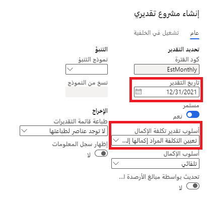

غالباً ما يكون للمشاريع نفقات كبيرة. خذ بعين الاعتبار إنشاء مصنع جديد. ستبقى العديد من الأصول الثابتة في المصنع عند اكتمال المشروع. سيتضمن تقدير المشروع هذه الأصول الثابتة. يتم شراء الأصول وربط فواتير AP بالمشروع. يتم إنشاء أصل ثابت وربطه بالتقدير الخاص بأحد المشاريع. يتم تنفيذ تكاليف الأصل الثابت في الأعمال تحت التنفيذ (WIP). عندما تكون جاهزاً لتحويل التكلفة إلى الأصل الثابت وإزالتها من التقدير، قم بإزالة الأصل من تقدير المشروع.

## إنشاء مشروع يتضمن أصلاً ثابتاً
يجب أن يكون المشروع المرتبط بأصل ثابت من نوع **مشروع الاستثمار**. 

بالنسبة للمثال في هذه الوحدة، خذ بعين الاعتبار المصنع الجديد والأصل الثابت الذي يكون ختاماً. ابدأ بإنشاء مشروع استثمار يمثل بناء المصنع الجديد.

1. انتقل إلى الوحدة النمطية لإدارة المشاريع والمحاسبة وحدد عنصر قائمة **كافة المشروعات** من مجموعة **المشروعات** لفتح صفحة قائمة **كافة المشروعات**. حدد **جديد** في صفحة القائمة.

    > [!div class="mx-imgBorder"]
    > 

1. لترحيل الفواتير إلى المشروع يجب إصدار المشروع. حدد قائمة **المشروع** ثم حدد مجموعة قائمة **الاحتفاظ**. حدد **مرحلة المشروع** وقم بتغيير المرحلة إلى **تم الإصدار**.

يمكنك الآن تسجيل المصروفات مقابل المشروع.
 
## ترحيل فاتورة حسابات مدفوعة التي تقوم بشراء الأصل الثابت وربط الفاتورة بالمشروع

أنت الآن بحاجة إلى ترحيل فاتورة الحسابات المدفوعة للمشروع. عادةً ما يتم شراء الأصل باستخدام أمر الشراء. بالنسبة لهذا المثال، ستقوم بإنشاء فاتورة المورّد بدون أمر الشراء.

1. انتقل إلى الوحدة النمطية لحسابات المدفوعات ثم حدد **مجموعة الفواتير**. حدد **فتح فواتير المورّد**. 
2. حدد الزر **جديد** لإنشاء فاتورة مورّد جديد. 
3. حدد **فاتورة المورّد** كنوع. 
4. أدخل **حساب الفاتورة**، **رقم الفاتورة**، و **تاريخ الفاتورة**. 
5. في البنود، قم بإضافة **STAMPER**. أدخل **1.00** في حقل **الكمية**، **ea** في حقل **الوحدة** وأدخل سعر الوحدة.
6. في تفاصيل البند، حدد **معرف المشروع** للمشروع الذي قمت بإنشائه.
1. قم بترحيل الفاتورة بالنقر فوق الزر **ترحيل**.

## إنشاء الأصول الثابتة
لإنشاء أصول ثابتة، اتبع الخطوات التالية:

1. في الوحدة النمطية الأصول الثابتة، حدد عنصر القائمة **الأصول الثابتة** في **مجموعة الأصول الثابتة**. في صفحة قائمة **الأصول الثابتة**، حدد زر **جديد**. اختر مجموعة الأصول الثابتة، أدخل **الاسم**: **الختام**، وحدد **الكمية**: **1**، و **الوحدة**: **ea**، و **تكلفة الوحدة**: **10,000.00**.
2. حدد **حفظ**. يقوم النظام بإنشاء رقم أصل للأصل. 

    > [!div class="mx-imgBorder"]
    > 
    
لا تقم بالحصول على أي عمليات أخرى في هذا الأصل أو تنفيذها.

## إنشاء تقدير المشروع
لإنشاء تقدير المشروع، اتبع هذه الخطوات:

1. افتح المشروع من الوحدة النمطية لإدارة المشروعات والمحاسبة. انتقل إلى مجموعة **المشروعات** وحدد عنصر القائمة **كافة المشروعات**. حدد معرف المشروع لفتح صفحة **تفاصيل المشروع**. 
2. حدد علامة التبويب **إدارة**، ثم حدد **التقديرات** في مجموعة القائمة **معالجة**. 
3. حدد الزر **جديد** لإنشاء تقدير جديد.
4. تحديد اليوم الأخير من الفترة الحالية. يحدد هذا كافة الحركات التي تمت خلال هذه الفترة. 
5. قم بتعيين قيمة الحقل **أسلوب تقدير تكلفة الإكمال** إلى **تعيين التكلفة المراد إكمالها إلى صفر**.
 
    > [!div class="mx-imgBorder"]
    > 

## إقران الأصول الثابتة بالمشروع
لإقران الأصول الثابتة بالمشروع، اتبع الخطوات التالية.

1. افتح المشروع من الوحدة النمطية لإدارة المشروعات والمحاسبة. انتقل إلى مجموعة **المشروعات** وحدد عنصر القائمة **كافة المشروعات**. 
2. حدد معرف المشروع لفتح صفحة **تفاصيل المشروع**. 
3. حدد علامة التبويب **الاحتفاظ**. 
4. حدد مجموعة القائمة **معالجة**، ثم حدد **تقديرات**. 
5. حدد التقدير الذي تم إنشاؤه للتو وانتقل إلى علامة التبويب **عام**. 
6. حدد **إزالة الأصول الثابتة**، ثم حدد **رقم الأصول الثابتة**. 

    > [!div class="mx-imgBorder"]
    > 

1. حدد علامة التبويب **نظرة عامة**. يجب أن يشبه التقدير لقطة الشاشة التالية ويوضح أن الحالة مكتملة بنسبة 100%. 

    > [!div class="mx-imgBorder"]
    > 
     
2. حدد **حساب**. يجب أن تظل الحالة مكتملة بنسبة 100%.
3. يقوم النظام بإنشاء ملخصات مجموعة تقدير التكلفة. حدد الزر **تقدير التكلفة** لرؤية هذه الملخصات. الأصل الثابت هو تكلفة صنف.
4. حدد علامة التبويب **عام** من بند تكلفة الصنف. توجد قوالب تكلفة مختلفة يمكنك استخدامها. 
5. بالنسبة لهذا المثال، يجب عليك استخدام قالب التكلفة **AutoUnit** لإظهار اكتمال البند عند تطابق الكمية. لقد قمنا بشراء ختام واحد. هذه هي القيمة التي يتعين علينا مطابقتها.

    > [!div class="mx-imgBorder"]
    > 

1. قم بترحيل التقدير من خلال تحديد الزر **ترحيل**.
2. حدد **موافق** في صفحة **ترحيل التقدير**.
3. يتم احتساب تكلفة الختام في الأعمال تحت التنفيذ **WIP** حتى نقوم بحذف التكلفة. حدد علامة التبويب **WIP** لمراجعة التكلفة. 

    > [!div class="mx-imgBorder"]
    > 

## حذف الأصول الثابتة
عندما يتم ترحيل التقدير ونسبة الاكتمال 100%، يتم تمكين الزر **حذف**. 

1. حدد الزر **حذف**.
2. راجع علامة التبويب **WIP**.

    > [!div class="mx-imgBorder"]
    > 
 
1. يقوم البند الذي **تم ترحيله** بخصم WIP ويقوم البند **تم حذفه** بمنح WIP بنفس المقدار مما ينتج عنه رصيد WIP يساوي صفراً.
 
## مراجعة الأصول الثابتة بعد الحذف
لمراجعة الأصول الثابتة بعد الحذف، اتبع الخطوات التالية:

1. حدد رقم الأصل الثابت في علامة التبويب **عام** في البند الذي تم ترحيله.
2. من الأصل الثابت، حدد الزر **تقييمات**. 

    > [!div class="mx-imgBorder"]
    > 

1. وقام التقدير بتحديد دفتر **CONSUM** وهو دفتر الأصول الذي تم تعديل التقييم الخاص به.

    > [!div class="mx-imgBorder"]
    > 

    يتم تحويل قيمة الأصول من المشروع إلى الأصول الثابتة.

## مراجعة المشروع المقترن بالأصول الثابتة
لمراجعة المشروع المقترن بالأصول الثابتة، اتبع هذه الخطوات.

1. أثناء العمل في تفاصيل **الأصول الثابتة** أو صفحة القائمة، حدد عنصر قائمة **الأصول الثابتة**
2. حدد مجموعة **المشروعات**.
3. حدد **كافة المشروعات**. تعرض الصفحة التي يتم عرضها المشروع المرتبط بالأصل الثابت. 

    

