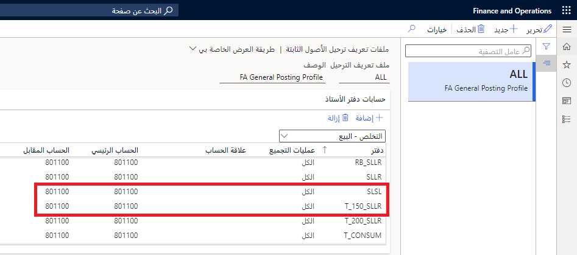

يجب إنشاء عميل يشتري أحد الأصول الثابتة للعمل مع الفواتير ذات النص الحر. بدلاً من ذلك، يُمكنك استخدام عميل حالي. عندما تعرف العميل الذي ستستخدمه، يُمكنك إنشاء فاتورة نصية مجانية جديدة. 

لإنشاء فاتورة ذات نص حر، اتبع الخطوات التالية:

1. انتقل إلى **الحسابات المدينة> الفواتير> كافة فواتير النص الحر‬‏‫**. يُمكنك أيضاً البدء من مساحة العمل **فواتير العميل** بتحديد الزر **الفاتورة ذات النص الحر الجديدة‬‏‫**.

1. أكمل الحقول التالية للرأس:
    - **حساب العميل**
    - **التاريخ** (القيم الافتراضية للبَيانات الحالية)
    - **العملة** (القيم الافتراضية لعملة العميل)

1. انتقل إلى علامتي التبويب السريعتين **بنود الفاتورة** و **تفاصيل البند**. حدد أصلًا ثابتًا في علامة التبويب **عام** في علامة التبويب السريعة **تفاصيل البند**. سيؤدي هذا الإجراء إلى تحديد دفتر الأصول وملء الحساب الرئيسي للأصل في بند الفاتورة. 
    > [!div class="mx-imgBorder"]
    > 

1. استخدم ملف تعريف ترحيل الأصول الثابتة لتحديد حساب دفتر الأستاذ الذي سيتم استخدامه للبيع. لعرض ملف التعريف الشخصي، انتقل إلى **الأصول الثابتة > إعداد > ملفات تعريف ترحيل الأصول الثابتة**. 

2. حدد **التخلص - البيع** في القائمة المنسدلة **حسابات دفتر الأستاذ**، ثم حدد دفتر الأصول **SLSL** لهذا المثال.

3. أضف وصفًا للبيع ومقداره. سيتم نسخ الوصف إلى نص الفاتورة. 

    > [!div class="mx-imgBorder"]
    > 
 
1. ستستخدم الأبعاد المالية في بند الفاتورة الأبعاد الافتراضية للعميل. حدد علامة التبويب **بند الأبعاد المالية** في القسم **تفاصيل البند** في صَفحة **الفاتورة ذات النص الحر** لعرض القيم الافتراضية. يُمكنك تجاوز القيم الافتراضية للعملاء إذا رغبت في استخدام الأبعاد من الأصل. 

2. قم بترحيل الفاتورة ذات النص الحر بتحديد الزر **ترحيل** في الصَفحة **الفاتورة ذات النص الحر**.
 
## مراجعة تقييم الأصول الثابتة
يجب مراجعة الصَفحة **تقييمات الأصول الثابتة** لفهم الترحيلات التي تحدث لأي أصل. يقوم دفتر **SLSL** بالترحيل إلى الطبقة **الحالية** ويقوم دفتر **T_150_SLLR** بالترحيل إلى طبقة **الضريبة**. 

يستخدم المثال التالي دفتر الأصل **SLSL**. لعرض التقييم، انتقل إلى **الأصول الثابتة > الأصول الثابتة**. سيتم عرض صَفحة قائمة **الأصول الثابتة**. حدد عنصر القائمة **التقييمات**.

تم شراء الأصل بمبلغ **40,000 دولار أمريكي**. الإهلاك هو **8,000.04 دولار أمريكي**. صافي القيمة الدفترية هو **31,996.96 دولارًا أمريكيًا**. 

بيع الأصل بمبلغ **35,000 دولارًا أمريكيًا**. هذه قيمة أكثر من صافي القيمة الدفترية للأصل في وقت البيع. يتم تسجيل الفرق بين صافي القيمة الدفترية وسعر البيع على أنه "ربح / خسارة". بعد البيع، يساوي **صافي القيمة الدفترية** صفرًا لأن الأصل لم يعد موجودًا في الدفاتر. يتم إدراج سعر البيع على أنه **التخلص - سعر البيع**.

### مراجعة الإيصال 
افتح قائمة **الفاتورة** في صَفحة **الفاتورة ذات النص الحر**، ثم حدد **دفتر يومية الفاتورة**. عندما يتم عرض قائمة دفتر اليومية، حدد زر **الإيصال**.

ستظهر ترحيلات إلى طبقة **الضريبة** من دفتر الأصل **T_150_SLLR**. في هذا المثال، ركز فقط على الترحيلات الخاصة بطبقة الترحيل **الحالية** من دفتر الأصول **SLSL**. 

> [!div class="mx-imgBorder"]
> 
 
تمت تصفية الشبكة التالية لطبقة الترحيل **الحالية** فقط ويتم تجميعها بحسب حساب دفتر الأستاذ مع الإجماليات الفرعية على المبلغ. ونتيجة كل هذه الترحيلات هي:

- يظهر ربح قدره **3,476.23 دولارًا أمريكيًا**. هذا هو المبلغ بين سعر البيع وصافي القيمة الدفترية وقت البيع. 
- يتم قيد قيمة اقتناء الأصل، ويتم خصم الإهلاك لأنك لم تعد تملك الأصل. 
- يتم تسجيل رصيد حسابات المقبوضات مقابل الشركة التي قامت بشراء الأصل.

> [!div class="mx-imgBorder"]
> 

تأتي قيمة الحساب الرئيسي في سطر الفاتورة ذات النص الحر من ملف تعريف ترحيل الأصول الثابتة إلى **التخلص - البيع**. يفحص القسم التالي مصدر الحسابات والقيم الأخرى في الإيصال.

وعلى الرغم من ذلك، قمت بتحديد دفتر الأصل **SLSL** لعملية البيع، تم إدراج دفتر الأصل **T_150_SLLR** كدفتر **مشتق** من **SLSL** لـ **التخلص – البيع**. تشير هذه القائمة إلى أنك ستقوم بترحيل بيع أحد الأصول الثابتة في الدفتر **T_150_SLLR** عندما يتم ترحيل البيع لدفتر الأصل **SLSL**. 

## مراجعة الترحيلات
تستعرض الأقسام التالية الترحيلات التي حدثت في دفتر الأصول. 

### دفاتر الأصول/الدفاتر المشتقة
هناك أربعة كتب ضمن إعداد الأصول الثابتة. يقوم هذا الأصل الثابت بتسجيل الحركات مقابل جميع الدفاتر الأربعة. لعرض دفاتر الأصول لأصل ثابت، حدد عنصر القائمة **دفاتر** في صَفحة قائمة **الأصل الثابت** أو صَفحة **التفاصيل**.
 
لا يتم ترحيل دفترين إلى دفتر الأستاذ. يقوم دفتر **SLSL** بالترحيل إلى الطبقة **الحالية** ويقوم دفتر **T_150_SLLR** بالترحيل إلى طبقة **الضريبة**. لذا، حدثت الترحيلات لكلتا الطبقتين. 

> [!div class="mx-imgBorder"]
> 

يتم إعداد الدفاتر بحيث يتم ترحيلها إلى دفتر واحد وأيضاً يتم ترحيلها إلى الدفاتر المدرجة كدفاتر مشتقة. يقوم المثال الموجود في هذه الوحدة بالترحيل إلى دفتر الأصل **SLSL** والدفاتر المشتقة. لقطة الشاشة التالية تُظهر ترحيلات الحركة. 

يتم تسجيل كلا نوعي المعاملات **الاستحواذ** و **التخلص** في دفتر **T_150_SLLR** عند ترحيله إلى دفتر الأصل **SLSL**.

يتم ترحيل الإهلاك مع الترحيلات الفردية إلى كل دفتر من دفاتر الأصول. سيتم ترحيل رسالة فاتورة ذات نص حر إلى دفتر الأصل **SLSL** إلى طبقة الترحيل **الحالية** وسيتم ترحيلها أيضًا إلى طبقة **الضريبة** لدفتر الأصل **T_150_SLLR**.

> [!div class="mx-imgBorder"]
> 
 
### ملف تعريف ترحيل الأصول الثابتة - علامة التبويب حساب دفتر الأستاذ
لعرض ملف تعريف ترحيل الأصول الثابتة، انتقل إلى **الأصول الثابتة > الإعداد > ملف تعريف الأصول الثابتة**.

#### بيع
ويستخدم البيع الإعدادات الخاصة بـ **التخلص – البيع** في علامة تبويب **حسابات دفتر الأستاذ** من ملف تعريف الترحيل. 

> [!div class="mx-imgBorder"]
> 

|     المدين        |     الدائن‬       |     الحساب    |     السبب           |
|------------------|------------------|----------------|----------------------|
|                  |     35,000.00    |     801100     |     سعر البيع    |
|     35,000.00    |                  |     130100     |     الواقع المعزز               |

#### إهلاك التسوية
يتم تسجيل الإهلاك للأيام الأخيرة خلال الشهر الأخير الذي كان مسجلاً فيه الأصل الثابت في دفاترك بتحديد حسابات **الإهلاك** المحددة في علامة تبويب **حسابات دفتر الأستاذ**.

> [!div class="mx-imgBorder"]
> 

 |     المدين     |     الدائن‬    |     الحساب    |     السبب                        |
|---------------|---------------|----------------|-----------------------------------|
|               |     476.19    |     180200     |     الإهلاك، الفترة النهائية    |
|     476.19    |               |     607200     |     الإزاحة                        |

### علامة تبويب التخلص - ملف تعريف الأصول الثابتة
ستدرج علامة التبويب **التخلص** في **ملف تعريف الأصول الثابتة** الحسابات الأخرى التي قد تحتاجها عند بيع أحد الأصول أو إلغائها. يجب تحديد **عملية البيع** في القائمة المنسدلة التي تظهر أعلى الشبكة.

#### صافي القيمة الدفترية
الحساب الأول الذي تستخدمه عملية البيع لدينا هو حساب إدخالات **صافي القيمة الدفترية**. وتتم إضافة صافي القيمة الدفترية ‎للأصل لإزالة الأصل من دفتر الأستاذ. وهذه حالة أخرى يكون فيها الحساب الرئيسي والإزاحة نفس الحساب. بالرغم من ترحيل هذه الإدخالات، فإنها تزيح بعضها البعض. يتم بالفعل خفض صافي القيمة الدفترية عن طريق إدخال الإهلاك النهائي الذي يتم إجراؤه عند بيع الأصل.

> [!div class="mx-imgBorder"]
> 

|     المدين        |     الدائن‬       |     الحساب    |     السبب                   |
|------------------|------------------|----------------|------------------------------|
|                  |     31,523.77    |     801100     |     تقليل صافي القيمة الدفترية    |
|     31,523.77    |                  |     801100     |     الإزاحة                   |

#### تكلفة الاستحواذ
يمكنك خصم تكلفة الاستحواذ الأصلية باستخدام إدخالات **البيع - الاستحواذ** في علامة التبويب **التخلص**.

> [!div class="mx-imgBorder"]
> 

|     المدين        |     الدائن‬       |     الحساب    |     السبب               |
|------------------|------------------|----------------|--------------------------|
|                  |     40,000.00    |     180100     |     قيمة الاستحواذ    |
|     40,000.00    |                  |     801100     |     الإزاحة               |

يتم دمج الإزاحة الخاصة بالاستحواذ الأصلي وصافي القيمة الدفترية في إدخال مدين واحد بقيمة **71،523،77 دولارًا أمريكيًا**.
هذه هي قسيمة الشراء الأصلية. الخصم من الاستحواذ في الأصل من حساب **180100**. تمت إضافة هذا الحساب الآن.

#### الإهلاك
ومن ثم، يُمكنك خصم مصروفات الإهلاك للسنوات السابقة والحالية باستخدام الإدخالات **الإهلاك (السنوات السابقة)** و **الإهلاك (هذه السنة)** في علامة التبويب السريعة **التخلص – البيع**.

> [!div class="mx-imgBorder"]
> 

|     المدين           |     الدائن‬        |     الحساب    |     السبب                        |
|---------------------|-------------------|----------------|-----------------------------------|
|      7,333.37       |                   |     180200     |     الإهلاك (سنوات سابقة)    |
|                     |      7,333.37     |     801100     |     الإزاحة                        |
|           666.67    |                   |     180200     |     الإهلاك (هذه السنة)      |
|                     |         666.67    |     801100     |     الإزاحة                        |

قسائم الإهلاك الأصلية (واحدة كل شهر) تشبه الصورة التالية. القسائم مخصومة من حساب **180200**، والذي يتم قيده الآن.

> [!div class="mx-imgBorder"]
> 

يتم تسجيل تسوية الإهلاك لإزاحة إهلاك الفترة النهائية الذي تم ترحيله كجزء من البيع. وتستخدم هذه التسوية **تسوية الإهلاك (هذه السنة)**.

|     المدين     |     الدائن    |     الحساب    |     السبب                                 |
|---------------|---------------|----------------|--------------------------------------------|
|     476.19    |               |     180200     |     تسوية الإهلاك (هذه السنة)    |
|               |     476.19    |     801100     |     الإزاحة                                 |

يتم دمج مجموعتي إدخالات الإهلاك في الإيصال كإدخال فردي.

|     المدين      |     الدائن‬     |     الحساب    |     اسم الحساب الرئيسي                   |
|----------------|----------------|----------------|-----------------------------------------|
|     8476.23    |                |     180200     |     إهلاك متراكم            |
|                |     8476.23    |     801100     |     الربح والخسارة - التخلص من الأصول    |

 
## حالة الأصل الثابت
ستتغير حالة الأصل الثابت إلى **مباع** في تاريخ ترحيل الفاتورة ذات النص الحر. تعرض قيمة المبيعات الموجودة في صَفحة **دفتر الأصول**. يُمكنك عرض دفاتر الأصول عن طريق تحديد عنصر قائمة **الدفاتر** في صَفحة **الأصول الثابتة**.
 
## تقرير عمليات التخلص من الأصول الثابتة
يعرض تقرير **التخلص من الأصول الثابتة** عملية البيع. قم بتشغيل هذا التقرير من الوحدة النمطية للأصول الثابتة عن طريق تحديد **الاستعلامات والتقارير**. حدد **تقارير الحركات** ثم حدد عنصر قائمة **التخلص من الأصول الثابتة**. سيسجل كل دفتر من دفاتر الأصول القيم الخاصة به ويجب عرض كل بند بشكل منفصل بدلاً من الإجمالي.

> [!div class="mx-imgBorder"]
> 

