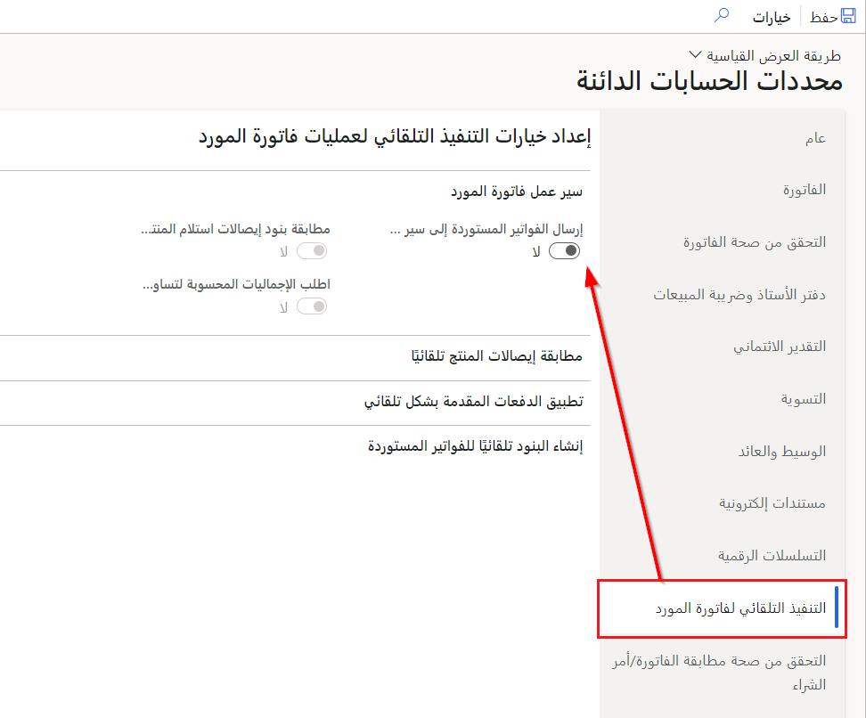

قبل العمل مع فوترة المورد وOCR، ستحتاج إلى إعداد المعلمات المطلوبة في Finance. يمكنك أيضاً استخدام هذا الوقت لتحديد الوظائف التي تريد تمكينها من استخدامها مع خدمة OCR. تشمل الوظائف التي يمكنك تمكينها:

- تطبيق الدفع المسبق تلقائياً على الفواتير المستوردة.
- تقديم الفواتير التي تم استيرادها إلى سير عمل لمطابقة بنود فاتورة المورد المعلقة.

> [!NOTE]
> لاستخدام الوظيفة لتكامل OCR، ستحتاج إلى تشغيل الوظيفة في مساحة عمل **إدارة الميزات**. انتقل إلى مساحة عمل **إدارة الميزات**، وابحث عن اسم ميزة **التنفيذ التلقائي لفاتورة المورد‬**، ثم قم بتمكينها.

بعد تمكين **التنفيذ التلقائي لفاتورة المورد**، يمكنك البدء في استخدام الوظيفة في أعمالك.

## مثال

للحصول على مثال على الوظيفة المستخدمة، فكر في السيناريو مع الترفيه Contoso أثناء التعامل مع الفواتير والموردين المختلفين.

يقدم موردو Contoso Electronics فواتيرهم باستخدام مدخل **تعاون الموردين** في Finance. عند تقديم فاتورة، سيعالج كاتب الحسابات الدائنة في Contoso الفاتورة يدوياً، ثم يرسله إلى سير عمل الموافقة على الفاتورة. لتبسيط هذه العملية، يمكن لشركة Contoso تطبيق إمكانيات التعرف البصري على الأحرف (OCR) بحيث يتم إرسال الفاتورة، وسيتم إرسالها تلقائياً إلى خدمة سير عمل Dynamics 365. سيتيح هذا النهج لشركة Contoso أن يكون لديك عملية فوترة المورد، التي يمكن معالجتها دون تدخل يدوي.

## المعلمات

لمراجعة العديد من عناصر الإعداد لتكوين OCR، انتقل إلى **الحسابات الدائنة > إعداد > معلمات الحسابات الدائنة**. في حالة تمكين **التنفيذ التلقائي لفواتير الموردين**، فستظهر علامة التبويب **التنفيذ التلقائي لفواتير الموردين** في المعلمات؛ وإلا لن تكون علامة التبويب مرئية. كما هو موضح في لقطة الشاشة التالية، تمنح علامة التبويب **التنفيذ التلقائي لفواتير الموردين** خيار الإعدادات المختلفة التي يمكنك تعديلها لتمكينها بعض السلوك في عملية الفوترة.

> [!div class="mx-imgBorder"]
> 

يجب أن تنظر في المعلمات الرئيسية التالية ووظائفها عند العمل مع OCR في Finance:

- **إرسال الفواتير المستوردة إلى سير العمل تلقائياً** - الوصول إلى هذه المعلمة ضمن علامة التبويب **سير عمل فاتورة المورد**. ويعني تعيين هذا الخيار إلى **لا** أنك ستحتاج إلى إرسال الفواتير يدوياً. إذا قمت بتعيين خيار التبديل هذا إلى **نعم**، فسيتم إرسال فواتير الموردين المستوردة إلى نظام سير العمل تلقائياً. عند تعيين خيار التبديل إلى **نعم**، ستعمل هذه العملية فقط إذا تم إعداد سير عمل فاتورة المورد بشكل صحيح للكيان القانوني الذي تعمل فيه.

- **مطابقة إيصالات المنتجات مع بنود الفواتير قبل إرسالها تلقائياً** - الوصول إلى هذه المعلمة ضمن علامة التبويب السريعة **مطابقة إيصالات المنتجات تلقائياً**. عند تعيين خيار التبديل إلى **نعم**، لا يمكن تقديم الفاتورة المستوردة في النظام باستخدام OCR تلقائياً إلى سير عمل ما لم تكن كمية استلام المنتج المتطابقة تساوي كمية الفاتورة. تضمن هذه المعلمة أنه لا تنشأ أي تباينات من مطابقة غير لائقة بسبب فواتير الموردين المستوردة. عندما تتطابق كمية استلام المنتج مع كمية الفاتورة، سيتم إرسال الفاتورة إلى سير العمل تلقائياً.

- **تطبيق الدفع المسبق تلقائياً للفواتير المستوردة** - الوصول إلى هذه المعلمة ضمن علامة التبويب السريعة **تطبيق الدفعات المسبقة تلقائياً**. في حالة تعيين هذا الخيار إلى **نعم**، سيبحث النظام تلقائياً عن الدفعات المسبقة الموجودة لأمر شراء محدد عند استيراد فواتير الموردين هذه. في حالة وجود الدفعات المسبقة، فسيتم إنشاء بند إضافي لتطبيق الدفع المسبق لفواتير الموردين ذات الصلة التي تم استيرادها.

- **حظر عملية التنفيذ التلقائي للمتابعة في حالة فشل تطبيق الدفع المسبق** - الوصول إلى هذه المعلمة في علامة التبويب السريعة **تطبيق الدفعات المسبقة تلقائياً**. إذا تم تعيين خيار التبديل إلى **نعم**، فسيتم حظر الفواتير المستوردة في حالة عدم القدرة على تطبيق الدفع المسبق. إذا تم حظره، فلن تتمكن عملية التنفيذ التلقائي للفاتورة من معالجة الدفع المسبق حتى يتم تطبيقه يدوياً.
 
- **خيار الكمية** - ثمة معلمة إضافية يمكن تمكينها وهي التعامل مع بنود الفاتورة وتسهيل مهمة كاتب حسابات المدفوعات لأنه يمكن إنشاء بنود الفاتورة تلقائياً. قد يحدث هذا الأمر، على سبيل المثال، عند فوترة أمر شراء بشكل جزئي، ثم استيراد الفاتورة. بدلاً من الاضطرار إلى الرجوع يدوياً وإعادة إدخال البنود، تسمح المعلمة **خيار الكمية** لموظف حسابات المدفوعات بتخطي خطوة إدخال البنود لأن الفاتورة المستوردة تعالج هذه الخطوة. 

هذه المعلمات هي بعض المعلمات التي يجب أن تكون على دراية بها، إلى جانب القدرات الأخرى في قسم **التنفيذ التلقائي لفواتير الموردين** بصفحة **المعلمات**. هناك اعتبار آخر في هذا الإعداد هو إمكانية تضمين مهمة نشر تلقائية داخل محرر سير العمل. ستتيح هذه المهمة معالجة فاتورة المورد المستوردة من خلال سير العمل دون تدخل يدوي وسوف تنتهي بنشر الفاتورة.

> [!VIDEO https://www.microsoft.com/videoplayer/embed/RE4VXYk]
