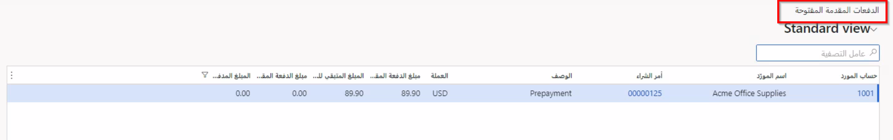

في حالة تمكين معلمة **تطبيق الدفع المسبق تلقائياً للفواتير المستوردة**، يمكنك إنشاء دفعة مسبقة لأمر شراء كجزء من اتفاقية الشراء. خذ بعين الاعتبار مثالاً على أنه تم استلام فاتورة مورد بواسطة شركتك وقد قمت بالفعل بالدفع لأمر الشراء في شكل دفعة مسبقة.

> [!div class="mx-imgBorder"]
> 

بدلاً من دفع كاتب الحسابات الدائنة إلى التحول يدوياً خلال الدفعات وأوامر الشراء المتبقية التي تمت فوترتها، يمكنك استخدام التنفيذ التلقائي لفواتير الموردين لجعل هذه العملية تحدث دون خطأ مستخدم يدوي.

عند العثور على بند دفعة مسبقة في النظام، فستتم مزامنة بنود الفاتورة القابلة للتطبيق تلقائياً. كجزء من عملية مطابقة الفاتورة، لا تؤخذ بنود الدفعات المسبقة في الاعتبار أبداً في عملية المطابقة هذه. تظهر لقطة الشاشة التالية مثالاً على الدفعة المسبقة الموجودة في النظام في صفحة **الدفعات المسبقة المفتوحة**. عند استخدام عملية الفوترة التلقائية، سيبحث النظام خلال الدفعات المسبقة المفتوحة لتحديد ما إذا كانت هناك أي مطابقة موجودة مع الفواتير المستوردة.

> [!div class="mx-imgBorder"]
> 

ووفقاً لعملية الشراء التي تستخدمها، تتوفر بعض الطرق المختلفة لتطبيق الدفعات المسبقة. في عدد قليل السيناريوهات التالية سيتم التعامل مع هذه الدفعات بشكل مختلف بناء على عدد أوامر الشراء والفواتير:

- **فاتورة مورد واحدة لكل أمر شراء** - إذا ارتبط أمر شراء واحد فقط بفاتورة واحدة، فسيتم تطبيق الدفعة المسبقة على الفاتورة عند إنشائها.

- **فاتورة مورد واحدة لأوامر شراء متعددة** - على غرار معالجة الفاتورة الفردية لأمر شراء واحد، سيُطبق الدفع المسبق في هذا السيناريو على إجمالي الفاتورة في جميع أوامر الشراء.

- **فواتير موردين متعددة لكل أمر شراء** - الترتيب الذي يتم فيه استيراد الفواتير أمر مهم لمعالجة فواتير الموردين المتعددة. سيتم تطبيق الدفع المسبق على الفاتورة الأولى المستوردة في النظام. إذا تجاوز الدفع المسبق مقدار الفاتورة التي يتم تطبيقها، فسيكون هناك حاجة إلى إدخال يدوي. سيتم تعيين المبلغ المتبقي كدفع مسبق للمستقبل.

- **فواتير موردين متعددة لأوامر شراء متعددة** - على غرار سلوك الفواتير السابقة، سيتم تطبيق الدفع المسبق في هذا السيناريو على أول فاتورة مستوردة ذات صلة. نظرا لأن هذا السيناريو يتعامل مع أوامر شراء متعددة، إذا تجاوز الدفع المسبق الفاتورة الأولى، فسيتم تطبيقها على الفواتير التالية المستوردة حتى لا يبقى الدفع المسبق.

يمكنك العثور على برنامج الإعداد المرتبط بالتعامل مع الدفع المسبق في الوحدة السابقة التي تركز على **معلمات الحسابات الدائنة**. يمكنك أيضا الرجوع إلى تلك الوحدة إذا كنت تريد التعامل مع نظام الدفع المسبق عند إرسال الفواتير المستوردة. من الدفعات المسبقة، تستخدم الوحدة التالية التي ستكتشفها عمليات سير العمل لمطابقة إيصالات المنتجات.
