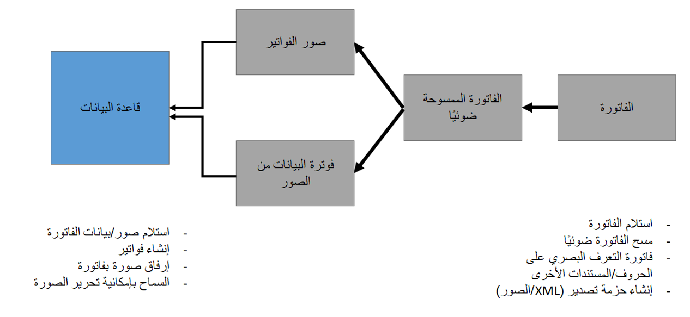

يمكنك إعداد خدمة التعرّف البصري على الحروف (OCR) الخارجية لأتمتة عمليات فوترة الموردين في Dynamics 365 Finance. تستكشف هذه الوحدة ميزات وإمكانات التعرف الضوئي على الأحرف (OCR) الذكية التي يمكن أن تساعد مؤسستك على أن تكون أكثر كفاءة عند العمل مع فواتير الموردين.

يدعم Finance دورة الحياة الكاملة لفواتير الموردين، من الاستلام إلى السداد. أثناء هذه العملية، قد يتم إجراء الإدخال اليدوي بشكل غير صحيح، مما قد يتسبب في حدوث مشكلات في المدفوعات والمحاسبة باستمرار. لتمكين مؤسستك من الحصول على عملية فواتير للبائع أكثر كفاءة، يدعم Finance خدمات التعرف البصري على الأحرف (OCR) للتعامل مع فواتير الموردين. يقوم برنامج التعرّف البصري على الحروف (OCR) الخارجي بمسح المستندات للتحميل التلقائي. من خلال هذا البرنامج، يمكنك إعداد عملية فوترة الموردين لتكون تلقائية لتسريع عملية الفوترة ومنع أخطاء المستخدم المحتملة.

إن OCR هي عملية تقوم بإرجاع بيانات التعريف القابلة للقراءة من خلال الجهاز وذلك بفحص المستندات. وقد تشتمل هذه المستندات على فواتير، وباستخدام OCR، يمكنك إعداد هذه الفواتير ليتم فحصها تلقائياً وإدخالها في Finance. ومع تنفيذ خدمة خارجية، يمكن لموظفي الحسابات الدائنة ومديريها معالجة الفواتير بشكل أكثر كفاءةً. يمكنها أيضاً تقليل الأخطاء التي تأتي من الإدخال اليدوي غير الصحيح.

ستقوم هذه الوحدة باستكشاف عناصر OCR التي يمكن أن تساعد في جعل أعمالك أكثر كفاءةً.

> [!div class="mx-imgBorder"]
> 

يوضح الرسم تخطيطي السابق الخطوات الأولى لخدمة OCR، والتي تبدأ بالفاتورة. تعرض وحدات السيناريو خلال هذه الوحدة الأدوار المختلفة داخل المؤسسة لمساعدتك على فهم كيفية تفاعلها مع أجزاء مختلفة من عملية الفوترة. ستقوم الوحدة التالية بالتركيز على الإعداد داخل بيئة Finance.

لمزيد من المعلومات، راجع [التنفيذ التلقائي للفواتير للمستندات الممسوحة ضوئياً](https://community.dynamics.com/business/b/dynamics365businesscloudfronts/posts/implementing-ocr-services-in-dynamics-365-for-financials/?azure-portal=true).
