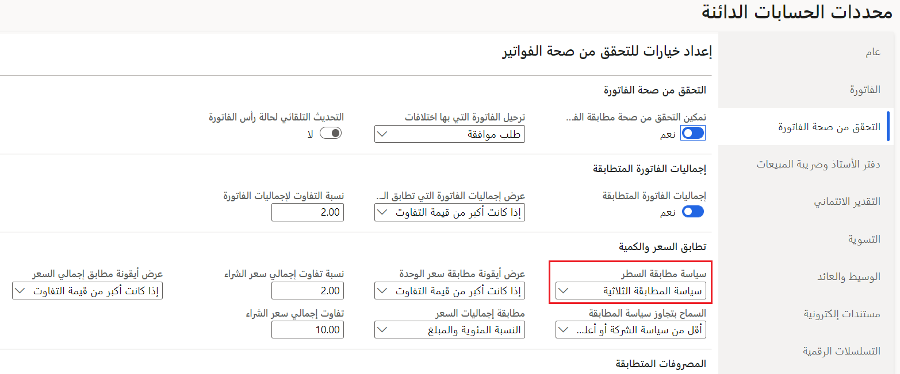
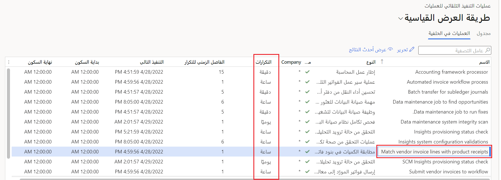

يُمكّنك Finance من تنفيذ مطابقة ثلاثية الاتجاهات لفواتير الموردين تلقائياً. ستقوم هذه الوظيفة بمطابقة إيصالات استلام المنتجات المنشورة تلقائياً مع بنود الفواتير، حيث تم تحديد سياسات مطابقة ثلاثية الاتجاهات. يمكنك تحديد الحد الأقصى لعدد المرات التي يجب أن يحاول فيها التطبيق مطابقة إيصالات استلام المنتجات مع بنود الفواتير قبل فشل عملية المطابقة. يمكنك إعداد العملية في وظيفة دُفعة لتشغيلها في فترات ذات مغزى لمؤسستك.

## إرسال فواتير المورّدين المستوردة

يمكنك استخدام سير عمل في Finance لاستيراد فواتير الموردين باستخدام OCR لجعل عملية فوترة الحسابات الدائنة لا تلامسية. بعد إعداد **معلمات الحسابات الدائنة**، يمكنك إعداد فواتير الموردين المستوردة ليتم إرسالها تلقائياً إلى سير عمل الحسابات الدائنة للمراجعة.

علي سبيل المثال، خذ بعين الاعتبار كاتب الحسابات الدائنة الذي يعمل لصالح شركة Contoso entertainment والمسؤول عن معالجة كل فواتير الموردين المستوردة. بدلاً من أن يرسل الكاتب الفواتير المستوردة إلى سير عمل يدوياً، يمكنك إضافة خطوة التنفيذ التلقائي في محرر سير العمل. ونظراً لأن الموظف يستخدم سير عمل تلقائياً للفواتير المستوردة، يمكنه تشغيل هذه العملية في الخلفية بالتكرار المحدد في الكيان القانوني الذي يعمل فيه هذا الكاتب بالساعة أو يومياً. عندما تقوم بإعداد سير العمل في المحرر، لتجاوز التدخل اليدوي بواسطة الكاتب تماماً، أضف خطوة تسمح بمهمة ترحيل تلقائية. وبعد ذلك، يمكن ترحيل الفواتير التي تم استيرادها تلقائياً إلى سير العمل للموافقة، وسيظل بإمكانك إرسال فواتير الموردين، التي تم إنشاؤها إلى نظام سير العمل يدوياً. توفر هذه العملية على كاتب الحسابات الدائنة مهمة عمل مكثفة لإرسال كل فاتورة تم استيرادها يدوياً، وتسمح لهذا الكاتب معالجة الموافقات والمهام الأخرى بدلاً من ذلك.

## مطابقة إيصالات استلام المنتجات المنشورة

عند مطابقة إيصالات استلام المنتجات المنشورة، يجب أن تفي بمتطلبين أساسيين لهذه الإمكانية للعمل في Finance:

- قم بتمكين ميزة **التنفيذ التلقائي لفاتورة المورد**.

- قم بتشغيل **المطابقة ثلاثية الاتجاهات**.

يمكنك تمكين **المطابقة ثلاثية الاتجاهات** عن طريق الانتقال إلى **الحسابات الدائنة > إعداد > معلمات الحسابات الدائنة**. ضمن علامة التبويب **التحقق من صحة الفاتورة**، قم بتعيين **سياسة مطابقة البنود** إلى **المطابقة ثلاثية الاتجاهات**، كما هو موضح في لقطة الشاشة التالية.

> [!div class="mx-imgBorder"]
> 

تتضمن عملية مطابقة إيصالات استلام المنتجات مع فواتير الموردين المستوردة بضع خطوات أساسية. عند تشغيل عملية المطابقة، سيقوم التنفيذ التلقائي لفاتورة المورد بالبحث عن إيصالات استلام المنتجات المرّحلة ليتم إقرانها تلقائياً ببنود الفاتورة. ستتم مواصلة تشغيل العملية حتى يساوي إيصال استلام المنتجات المطابق كمية الفاتورة الإجمالية. 

على سبيل المثال، إذا كان بند فاتورة واحد مرتبطاً بإيصالات استلام منتجات متعددة، فقد تحتاج إلى تشغيل العملية عدة مرات للحصول على المطابقة الكاملة للكمية. يمكنك تحديد تشغيل هذه العملية بالساعة أو يومياً، بحيث لا تتداخل مع العمليات العادية.

> [!div class="mx-imgBorder"]
> 

في المثال السابق مع Contoso Entertainment، يمكن إجراء العملية الخاصة بها لمطابقة إيصال استلام المنتجات بإحدى طريقتين:

- **تغيير معلمات الحسابات الدائنة التي تعالج التحقق من صحة الفاتورة.** استخدم هذا الإجراء لتفريغ الوقت لموظف الحسابات الدائنة. يمكنك الوصول إلى العديد من معلمات الإعداد التي تم تغطيتها حتى الآن في علامة التبويب **التنفيذ التلقائي لفاتورة المورد**.

    تعرض لقطة الشاشة السابقة الإعدادات الموجودة في علامة التبويب **التحقق من صحة الفاتورة**. في علامة التبويب هذه، يمكنك تشغيل الخيار **تمكين التحقق من صحة مطابقة الفاتورة** للسماح بمطابقة إيصالات استلام المنتجات مع بنود الفاتورة كجزء من عملية تلقائيةـ حيث لا يحتاج موظف الحسابات الدائنة إلى التدخل يدوياً.

- **قم بإعداد المطابقة للتشغيل بشكل مستقل كعملية مستقلة.** ستسمح هذه العملية بمزيد من الإشراف على إيصالات استلام المنتجات نظراً لعدم مطابقة الإيصالات تلقائياً عند استيراد فاتورة مورد.

بغض النظر عن الأسلوب الذي تختاره شركة Contoso Entertainment، فإن كل عضو فيها يساعد علي جعل العمل أكثر فعاليةً لموظف الحسابات الدائنة باستخدام **التنفيذ التلقائي لفاتورة المورد**.

## عرض إيصالات استلام المنتجات المُطابقة

قد تحدث مواقف حيث لا يتم تلقائياً إرسال الفواتير البعيدة عن نظام سير العمل التلقائي. في هذه الحالة، يمكنك عرض الفاتورة المفتوحة من صفحة **فواتير الموردين المفتوحة**. ستقوم الفاتورة دائماً بتضمين حقل **المطابقة الأخيرة**، وهي الحالة التي يمكنك تحديثها باستخدام مهمة خلفية **التحقق من صحة مطابقة الفواتير**. تعرض لقطة الشاشة التالية التكوين لتحديث حالة المطابقة تلقائياً لفاتورة مورد.

انتقل إلى **إدارة النظام > إعداد > معالجة عمليات التنفيذ التلقائي**، حيث يمكنك تمكين التكرار في شاشة **معالجة عمليات التنفيذ التلقائي**. في هذه الشاشة، يمكنك أيضاً عرض الفاصل الزمني الذي يتم فيه إجراء التحديث، بالإضافة إلى نوع التنفيذ التلقائي للعملية.

> [!div class="mx-imgBorder"]
> 

تركز الوحدة التالية على متابعة عملية التنفيذ التلقائي. إنها تبحث عن كيفية عرض نتائج التنفيذ التلقائي لفواتير الموردين الناتجة من الفواتير المستوردة.
