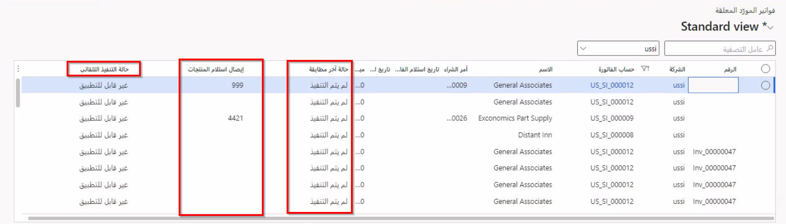

ترتبط هذه الوحدة مباشرةً بإعداد سير العمل من الوحدة السابقة وتوسيع نطاق عرض نتائج الفواتير المستوردة. في المثال السابق مع كاتب الحسابات الدائنة في Contoso Entertainment، سيقومون الآن بتتبع ومراقبة هذه الفواتير المختلفة التي تم تقديمها. وبدلاً من التحقق من كل فاتورة يدوياً، يمكن للكاتب الانتقال إلى صفحة **فواتير الموردين المعلقة** والحصول على تحديثات الوقت الحقيقي في حالة الفواتير المعلقة. من هذه الصفحة، يمكن أن يقوم الكاتب بالتحقق مما إذا كان قد تم إرسال الفواتير إلى سير العمل ثم القيام بالتغييرات اليدوية اللازمة لآي فاتورة.

## عرض النتائج

عند إرسال فاتورة مستورده إلى سير عمل، يمكنك عرض محفوظات التنفيذ التلقائي والحالة في صفحة **فواتير الموردين المعلقة**. للوصول إلى هذه الصفحة، انتقل إلى **الحسابات الدائنة > الفواتير > فواتير الموردين المعلقة**. ستتضمن هذه الصفحة قائمة بالفواتير المتعددة، بالإضافة إلى حالاتها، وما إذا كان قد تم استلام الفواتير أو لا. في لقطة الشاشة التالية، تعرض بعض الأعمدة، مثل **آخر حالة مطابقة** و **الإرسال التلقائي لحالة سير العمل**، وتُظهر الحالة الحالية لتعقب فواتير الموردين المعلقة هذه.

> [!div class="mx-imgBorder"]
> 

قد يحدث موقف عند فشل إحدى الفواتير في خطوة تلقائية. عند حدوث هذا الموقف، يمكنك عرض التفاصيل من الخطأ الذي يظهر. عند تصحيح المشكلة، يمكنك استئناف العملية التلقائية لهذه الفاتورة التي تم استيرادها بعينها.

بالإضافة إلى ذلك، يمكنك إيقاف الفاتورة المستوردة بشكل مؤقت، إذا لم تكن موجودة حالياً في نظام سير العمل أو إذا لم يتم استخدامها في عملية التنفيذ التلقائي. ووفقاً لحالة فاتورة المورد المستوردة في سير العمل، سيتم تحديث **حالة التنفيذ التلقائي**، التي يمكنك الوصول إليها في صفحة **فواتير الموردين**.

> [!NOTE]
> قد لا تري عمود **حالة التنفيذ التلقائي** في صفحة **فواتير الموردين**. قد يكون السبب هو العمود الذي يظهر في الجدول. لعرض هذا العمود، حدد القائمة علامة الحذف ( **...**) الموجودة إلى يمين رؤوس الأعمدة، ثم حدد **إدراج الأعمدة**. بعد ذلك، ابحث عن **حالة التنفيذ التلقائي** وأضفها إلى الجدول.

تتضمن الحالات المختلفة التي يتم تعقبها في صفحة **فواتير الموردين** ما يلي:

- **مضمنة** - بهذه الحالة، يتم تشغيل العمليات التلقائية التي تم تحديدها في صفحة **معلمات الحسابات الدائنة** كما هو محدد، ولكن لم يتم إكمالها بعد.

- **متوقفة مؤقتاً** - قد يحدث إيقاف مؤقت في العملية بسبب فشل خطوة في عملية التنفيذ التلقائي. وقد يظهر سبب آخر وراء ظهور الحالة **متوقفة مؤقتاً** إذا تم تعيين الحقل **تضمين في المعالجة التلقائية** إلى **لا**. لعرض المكان الذي حدث فيه الفشل، يمكنك تحديد **عرض أحدث النتائج**.

- **في سير العمل** - تحدث هذه الحالة عندما يتم إرسال فاتورة مورد تلقائياً إلى نظام سير العمل أو إذا تم إرسال الفاتورة التي تم استيرادها يدوياً.

- **اكتمال سير العمل** - هذه الحالة هي الحالة النهائية عند اكتمال عملية سير العمل بشكل كامل لفواتير الموردين المستوردة.

من خلال إعداد "محرر سير العمل" بشكل صحيح، يمكن تحميل فواتير الموردين المستوردة تلقائياً إلى النظام للحصول على موافقة وترحيل أسرع. يقلل هذا الأسلوب من فرص حدوث الخطأ البشري ويقوم بتفريغ الأوقات للأفراد المهمين لحضور مهام الحسابات الدائنة المختلفة.
