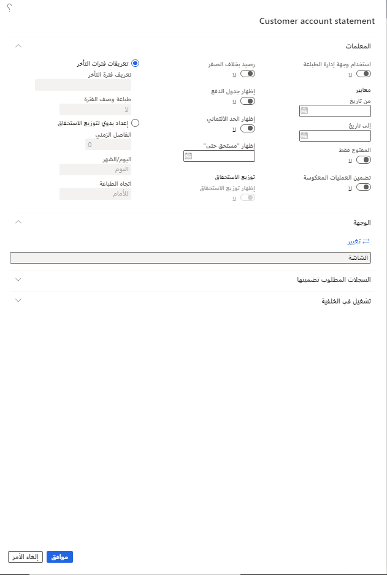

كشوف حسابات العملاء هي مستندات يمكنك إرسالها إلى عملائك لإخطارهم برصيدهم المستحق ونشاط الحركات لفترة معينة.

تظهر العملة واللغة الخاصة بالعميل في كشف الحساب. إذا تضمن كشف الحساب أكثر من عملة، فسيتم عرض الرصيد الافتتاحي والرصيد الختامي لكل عملة.

## خيارات كشوف حسابات العملاء

توضح القائمة التالية كل خيار من خيارات الحقول المتوفرة في صفحة **كشف حساب العميل** (التقرير) الموجودة ضمن الائتمان والتحصيلات > المهام الدورية> كشف حساب العميل.

-   **استخدام وجهة إدارة الطباعة** - الإشارة إلى ما إذا كان يجب استخدام إعداد وجهة إدارة الطباعة للعميل عند إنشاء كشوف حسابات العملاء.
-   **تاريخ البدء** - أدخل تاريخاً لطباعة حركات العملاء فقط مع تاريخ حركة يبدأ في التاريخ المحدد أو بعده.
-   **تاريخ الانتهاء** - أدخل تاريخاً لطباعة حركات العملاء فقط مع تاريخ حركة يبدأ في التاريخ المحدد أو قبله.
-   **فتح فقط** - حدد هذا الخيار لطباعة حركات العملاء التي لم تتم تسويتها فقط.
-   **تضمين عكس** - حدد هذا الخيار لإلغاء حركات العميل المطبوعة على كشف حساب العميل.
-   **رصيد بخلاف الصفر** - لاستبعاد الكشوفات برصيد ختامي صفر.
-   **إظهار جدول الدفع** - حدد هذا الخيار لطباعة أقساط جدول الدفع بالتفصيل. إذا تم إلغاء تحديد خانة الاختيار وكان جدول الدفع موجوداً، فسيتم عرض "متعدد" كتاريخ استحقاق.
-   **إظهار حد الائتمان** - حدد هذا الخيار إذا تم تعيين حد ائتماني للعميل وتريد عرض حد الائتمان في البيان.
-   **إظهار الاستحقاق حتى** - حدد تاريخاً لتضمين معلومات حول الحركات المستحقة اعتباراً من ذلك التاريخ في قسم منفصل من الكشف. على سبيل المثال، يمكنك استخدام هذا لتضمين المبلغ والحركات والتاريخ المستحق للدفعة التالية مع الكشف.
-   **إظهار توزيع الاستحقاق** - حدد هذا الخيار لطباعة توزيع الاستحقاق في أسفل الكشف.
-   **تعريف فترة التقادم** - إظهار توزيع الاستحقاق وفقاً لتعريفات فترة التقادم التي حددتها لشركتك. حدد تعريف فترة التقادم لاستخدامه عند طباعة الكشف. لا تظهر تعريفات فترة التقادم التي تحتوي على أكثر من ستة أعمدة في قائمة الاختيار، ولا يمكن تضمينها في الكشف المطبوع.
-   **وصف فترة الطباعة** - حدد ما إذا كنت تريد تضمين أوصاف مجموعة التقادم في الجزء العلوي من كل عمود من أعمدة مجموعة بيانات التقادم في التقرير أو لا.
-   **الإعداد اليدوي لتوزيع الاستحقاق** - إظهار توزيع الاستحقاق وفقاً للفترات الزمنية التي تحددها.
    -   **الفترة الزمنية** - حدد الفترة المراد استخدامها عن طريق إدخال عدد وحدات اليوم أو الشهر في كل فترة يتم تحديدها في حقل **اليوم/الشهر**.
    -   **اليوم/الشهر** - حدد إما اليوم أو الشهر من القائمة.
    -   **اتجاه الطباعة** - التحكم في ما إذا كان التوزيع يعرض معلومات الرصيد المستقبلية أو السابقة.

تعرض هذه الصورة صفحة **كشف حساب العميل** في **الائتمان والتحصيلات > المهام الدورية > كشف حساب العميل**. 

