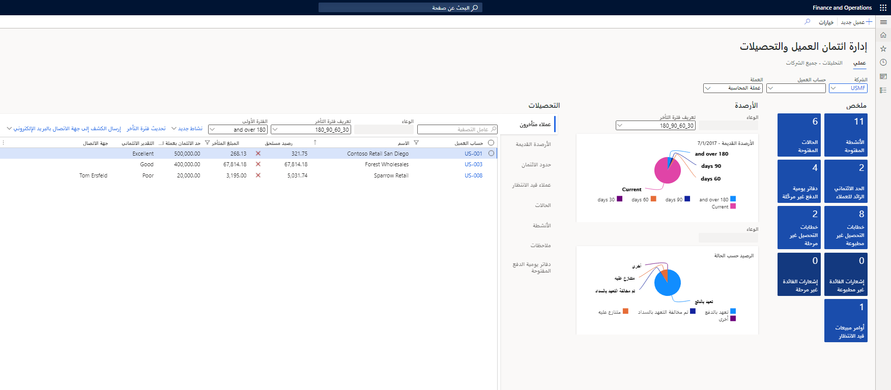

يمكنك استخدام مساحة عمل **تحصيلات وائتمان العميل** لعرض وإدارة واتخاذ إجراء بشأن معلومات التحصيلات والأنشطة والحالات للعميل، كل ذلك في مكان واحد.

دعونا نلقي نظرة على الميزات الرئيسية لمساحة عمل **تحصيلات وائتمان العميل**:

- في علامة التبويب **عملي**، يمكن للمندوب عرض أنشطته وعملائه على شاشة مخصصة.
- يمكن تصفية المعلومات حسب الشركة وحساب العميل والعملة.
- **الإطارات المتجانبة الملخص** توفر عرضاً عالي المستوى للأنشطة المفتوحة، والحالات المفتوحة، والعملاء الذين تجاوزوا حد الائتمان، ودفاتر اليومية غير المنشورة، وغير ذلك الكثير. من خلال النقر على الإطارات المتجانبة **الملخص**، يمكن للمندوب التعمق في التقارير التفصيلية الداعمة لكل إطار متجانب.
- توفر الرسومات التي توفر أرصدة قديمة ورصيداً حسب الحالة للمندوب نظرة على أرصدة الحسابات القديمة.
- **علامات التبويب السريعة** توفر وصولاً سريعاً إلى المزيد من معلومات المجموعات مثل العملاء المتأخرين، والأرصدة القديمة، وحدود الائتمان، والعملاء المعلقين وغير ذلك الكثير.

تعرض هذه الصورة صفحة **إدارة تحصيلات وائتمان العميل** في مساحة عمل **الائتمان والتحصيلات > تحصيلات وائتمان العميل**.

