إدارة الائتمان ميزة ذات قيمة كبيرة لتمويل مستخدمي Microsoft Dynamics 365 Finance. يمكن لإدارة الائتمان:

- اقتراح أنشطة مراقبة الائتمان، ومن ثَمّ تحسين التدفق النقدي.
- تقليل الديون المعدومة.
- تقديم رؤى وضوابط تساعدك في إدارة مخاطر الائتمان.

## إعداد وإنشاء تعديلات حد الائتمان  
يعد تعديل حد الائتمان عملية تستخدم دفاتر اليومية والموافقات والترحيلات لتعقب التغييرات في حدود ائتمان العميل. يقوم النظام بإنشاء سجل تاريخي للتغييرات التي تم إجراؤها على حد ائتمان العميل. يتيح لك ذلك مراجعة التغييرات المقترحة على حدود ائتمان العميل قبل الموافقة على التغييرات.

يتضمن Finance العديد من الخيارات لإنشاء تسويات حد الائتمان، بما في ذلك القدرة على جعلها مؤقتة. من الممكن إنشاء تسويات لعميل واحد أو قائمة عملاء. من الممكن أيضاً أن يتم إنشاء تسويات حد الائتمان تلقائياً بناءً على القواعد التي تم تكوينها في النظام.

### إعداد تسوية حد الائتمان
يجب عليك إكمال بضع خطوات لاستخدام تسويات حد الائتمان.  

#### التسلسلات الرقمية
نظراً لأن تسويات حد الائتمان تستخدم دفاتر اليومية، يلزم وجود تسلسل رقمي. أنت تحدد التسلسل الرقمي في علامة التبويب **التسلسلات الرقمية** في صفحة **معلمات الائتمان والتحصيل**. لتنفيذ هذه الخطوة، انتقل إلى وحدة الائتمان والتحصيلات، وحدد **إعداد**، ثم حدد عنصر قائمة **معلمات الائتمان والتحصيلات**.

> [!div class="mx-imgBorder"]
> 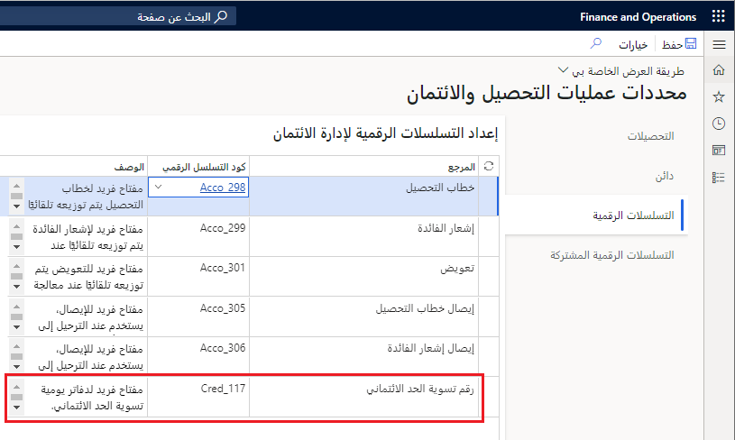

يجب عليك أيضاً التفكير فيما إذا كنت تريد تمكين خيار **السماح بالتحرير اليدوي لحد الائتمان**.  استخدم هذا الإعداد لتحديد ما إذا كان يمكن للمستخدمين تجاوز حد ائتمان العميل يدوياً. يمكنك الوصول إلى هذا الخيار في علامة التبويب **ائتمان**.

> [!div class="mx-imgBorder"]
> 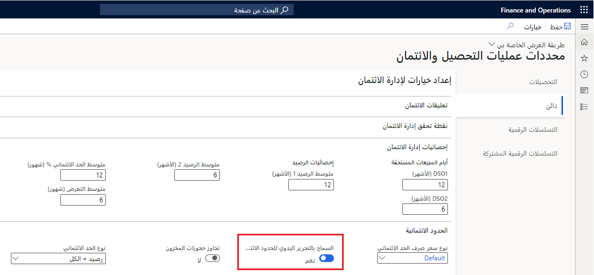

#### مجموعات الائتمان للعميل
يمكنك تكوين مجموعات ائتمان العملاء لإدارة حدود الائتمان. هذه خطوة اختيارية تتيح لك إنشاء مجموعات من العملاء يتشاركون حد الائتمان. يمكن تعيين تعديل حد الائتمان للمجموعة بأكملها باستخدام تسويات حد الائتمان. 

لإعداد مجموعات حد الائتمان، انتقل إلى وحدة الائتمان والتحصيلات، وحدد قسم **العملاء**، ثم حدد عنصر قائمة **مجموعات ائتمان العملاء**. تحتوي الصفحة على طريقة عرض قائمة وطريقة عرض تفاصيل. تُظهر لقطة الشاشة التالية طريقة عرض التفاصيل. 

في هذه الصفحة تقوم بإضافة كل عميل من العملاء إلى المجموعة. تقوم بإدخال حد الائتمان وتاريخ انتهاء صلاحية حد الائتمان. سيتم تطبيق هذا الحد وانتهاء الصلاحية على جميع العملاء في المجموعة. لاحظ أن تاريخ انتهاء الصلاحية غير مطلوب.  

> [!NOTE]
> يمكن أن يؤثر عدم تضمين تاريخ انتهاء الصلاحية على الإعدادات التي تحتاج إلى استخدامها عند إنشاء دفتر يومية لتسوية الائتمان. قد تتجاوز أي تسويات مباشرة يتم إجراؤها على العميل أي تسوية تم إجراؤها على مجموعة ائتمان العميل. سيتم تطبيق دفتر اليومية الذي تم ترحيله لاحقاً على العميل المحدد.

#### مجموعات تقييم المخاطر
تضع مجموعات تقييم المخاطر قواعد لتحديد ما إذا كان عميل معين يمثل مخاطرة منخفضة أو عالية. لإنشاء مجموعات تسجيل المخاطر، انتقل إلى وحدة الائتمان والتحصيلات وحدد قسم **الإعداد**. حدد **مجموعة المخاطر**، ثم حدد عنصر قائمة **مجموعات النقاط**. تم تحديد المعايير المسموح بها في **نوع المجموعة** كما هو موضح أدناه.

> [!div class="mx-imgBorder"]
> 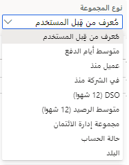

بالنسبة لكل **نوع مجموعة**، تقوم بتحديد **نوع النقاط**. يمكن أن يكون نوع التسجيل نطاقاً من القيم (حدد الحد الأدنى والحد الأقصى لكل نطاق) أو قيمة معرّفة من قِبل المستخدم.
تُظهر لقطة الشاشة التالية نتيجة نوع نقاط **متوسط الرصيد**. يؤدي ارتفاع متوسط الأرصدة إلى مخاطر أعلى.

> [!div class="mx-imgBorder"]
> 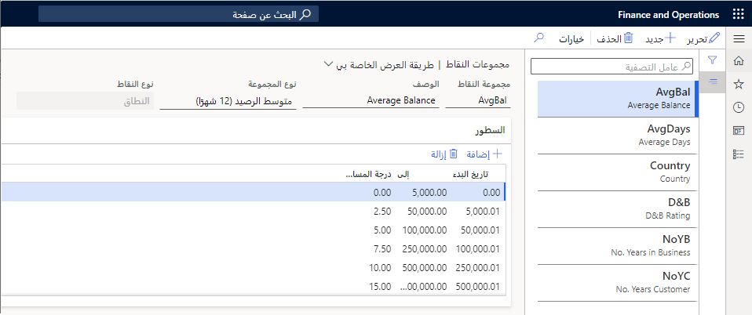

يتم تقييم كل عميل مقابل كل الأنواع التي تقوم بتكوينها للمجموعة. تتم إضافة هذه النقاط لكل نوع لإنشاء مجموع نقاط العميل.

يمكن أيضاً تحديد القيم المعرفة من قِبل المستخدم للنتائج.
 
#### تصنيف المخاطر/مجموعة المخاطر
عندما تضيف جميع درجات المخاطر للعميل، يمكنك تحديد مجموعة المخاطر التي يجب إضافة العميل إليها. لتكوين تصنيفات المخاطر، انتقل إلى وحدة الائتمان والتحصيلات وحدد قسم **الإعداد**. حدد **مجموعة المخاطر**، ثم حدد عنصر قائمة **تصنيفات المخاطر**. أدخل وصفاً لكل مجموعة مخاطر وحدد مجموعة من النقاط لمجموعة المخاطر. 

> [!div class="mx-imgBorder"]
> 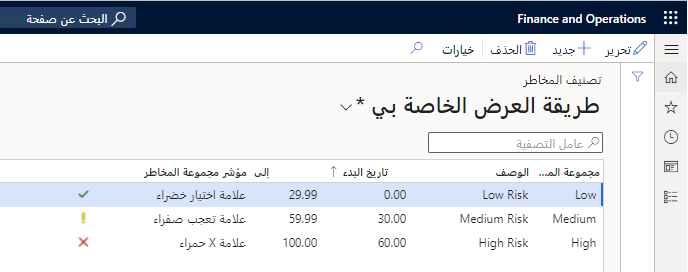
 
تظهر مؤشرات مجموعة المخاطر في صفحات قائمة **الاحتفاظ بإدارة الائتمان** موجودة في مجموعة **قائمة الاحتفاظ بإدارة الائتمان** في وحدة الائتمان والتحصيلات.
 
#### الحدود الائتمانية التلقائية
تحدد قواعد حد الائتمان التلقائية الشروط وحدود الائتمان التي يجب تطبيقها عند استيفاء شروط معينة. تستند الشروط إلى نقاط المخاطر وليس تصنيفات المخاطر.

> [!div class="mx-imgBorder"]
> 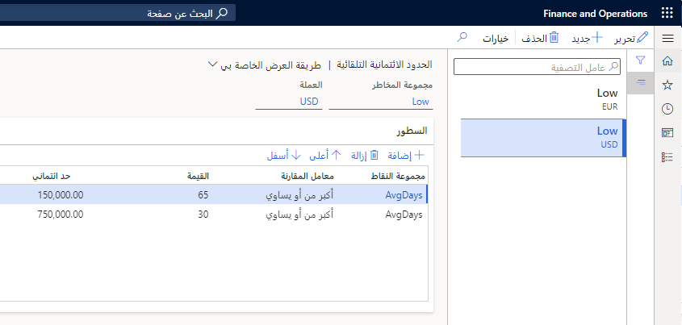

#### سير عمل تسوية ائتمان العميل
هناك نوعان من مهام سير عمل تسوية الائتمان. يقوم سير عمل واحد بالموافقة على دفتر اليومية بأكمله أو رفضه. يوافق الآخر أو يرفض إدخالات مستوى البند. لإعداد عمليات سير العمل، انتقل إلى وحدة الائتمان والتحصيلات، وحدد مجموعة **الإعداد**، ثم حدد عنصر قائمة **مهام سير عمل إدارة الائتمان**.
  
يدعم كلُّ من مهمتي سير العمل كلاً من مهمة **الموافقة** ومهمة **ترحيل دفتر اليومية**. يمكنك اختيار نشر دفتر يومية تلقائياً عند الموافقة عليه. يمكنك أيضاً استبعاد مهمة **ترحيل دفتر اليومية** في سير عملك. يمكن لأي شخص لديه أذونات **الترحيل** إجراء عمليات النشر يدوياً. 

يمكنك تكوين سير العمل على مستوى البند لتجميع حدود الائتمان بحيث يمكن للأشخاص المختلفين الموافقة على أساس مبلغ حد الائتمان الجديد. توضح الرسومات التالية تكوين التجميع لسير عمل على مستوى البند.

تعريف مستوى البند:

> [!div class="mx-imgBorder"]
> 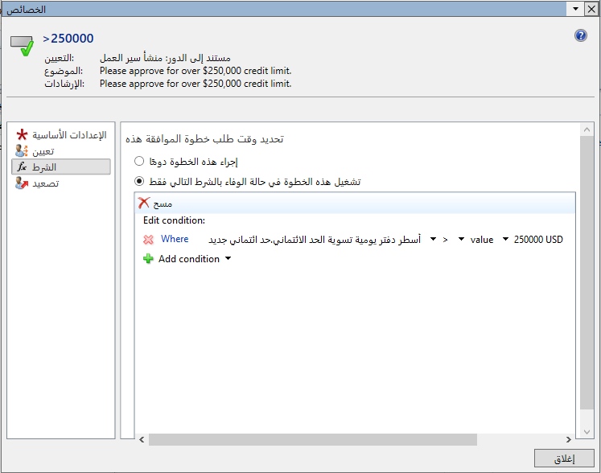

رسم تخطيطي لسير العمل على مستوى البند:

> [!div class="mx-imgBorder"]
> 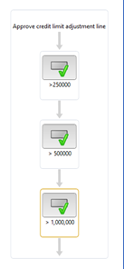

### إنشاء تسويات حد الائتمان
يمكنك إنشاء تعديلات حد الائتمان باستخدام وحدة الائتمان والتحصيلات أو صفحة **مجموعة ائتمان العملاء**. إذا كنت تبدأ من وحدة الائتمان والتحصيلات، فحدد مجموعة **تسويات حد الائتمان**، ثم عنصر قائمة **تسويات حدود الائتمان**. 

في حالة البدء من صفحة **مجموعات ائتمان العملاء**، فحدد إما **تسويات حدود الائتمان** أو الزر **حدود الائتمان المؤقتة**. ينقلك كلا الخيارين إلى صفحة **دفتر يومية تسويات حدود الائتمان**. 

يمكنك إنشاء تعديل لعميل فردي باستخدام صفحة قائمة **جميع العملاء** أو صفحة **تفاصيل العملاء**. 

هناك نوعان من التسويات التي يمكنك إجراؤها. يقوم النظام تلقائياً بتحديد النوع لك إذا انتقلت إلى نموذج تعديلات حد الائتمان من مجموعة ائتمان العميل وحدد أحد الأزرار في هذا النموذج:

- **حد الائتمان** – يقوم هذا الخيار بإجراء تغيير دائم على حد ائتمان العميل. يبدأ التغيير على الفور ويمكن أن يكون له تاريخ انتهاء الصلاحية.
- **حد الائتمان المؤقت** – ينشئ هذا الخيار تغييراً مؤقتاً قد يبدأ وينتهي في المستقبل. يمكنك إدخال قيمة لحقلي **تاريخ بدء جديد** و **تاريخ انتهاء الصلاحية** للبنود الموجودة في دفتر يومية **حد الائتمان المؤقت**.

> [!div class="mx-imgBorder"]
> 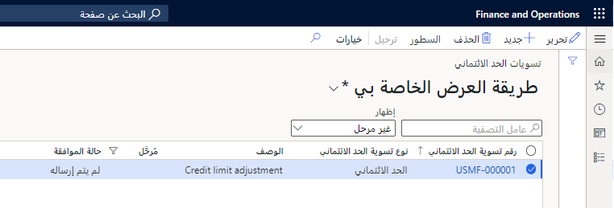

للتنقل إلى بنود دفتر اليومية، حدد رقم دفتر اليومية في حقل **تسوية حد الائتمان** أو حدد الزر **بنود** في جزء الإجراءات.

#### تحديد الحسابات المراد تسويتها
يمكنك إدخال حدود ائتمان جديدة وتواريخ انتهاء صلاحية لحسابات العملاء الفردية أو مجموعات ائتمان العملاء يدوياً باستخدام الزر **إنشاء** في جزء الإجراءات وتحديد أحد الخيارات التالية:

- **من العملاء الموجودين**
- **من مجموعات ائتمان العميل الموجودة**
- **الحدود الائتمانية التلقائية**

##### إضافة العملاء أو مجموعات ائتمان العملاء يدوياً
لإضافة عميل أو مجموعة ائتمان عملاء يدوياً، حدد إما **+إضافة تسوية العميل** أو **+إضافة تسوية مجموعة الائتمان**. يضيف كل من عنصري القائمة بنداً جديداً. الاختلاف الوحيد هو الحقل حيث يتم وضع المؤشر داخل البند الجديد - إما **حساب العميل** أو **مجموعة ائتمان العملاء**.

> [!div class="mx-imgBorder"]
> 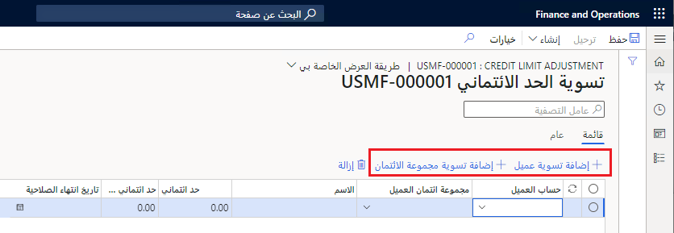

#### إنشاء قائمة عملاء
إذا حددت الزر **إنشاء** في جزء الإجراءات، فيجب عليك تحديد معايير لتحديد العملاء للتضمين. توضح لقطة الشاشة التالية الخيارات بعد تحديد خيار **إنشاء من العملاء الحاليين**.

> [!div class="mx-imgBorder"]
> 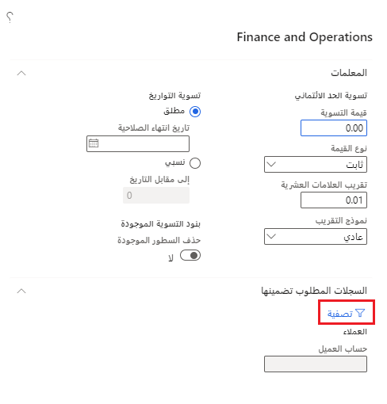
 
توضح لقطة الشاشة التالية الخيارات بعد تحديد خيار **إنشاء من مجموعات ائتمان العملاء الحالية**. في هذه الحالة، يضيف النظام تلقائياً عامل التصفية لحقل **مجموعة ائتمان العملاء**. 

> [!div class="mx-imgBorder"]
> 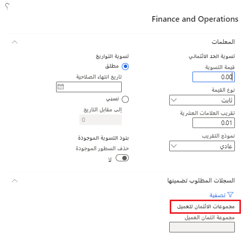

يصف الجدول التالي الخيارات المتوفرة في كلا النموذجين:

|     الخيار                      |     الوصف‏‎                                                                                                                                                                                                                                                                       |
|---------------------------------|---------------------------------------------------------------------------------------------------------------------------------------------------------------------------------------------------------------------------------------------------------------------------------------|
|     قيمة التسوية            |     المبلغ المطلوب تسوية حد الائتمان الحالي بواسطته. قد يكون مبلغاً بالدولار لإضافته إلى الحد الحالي أو نسبة مئوية من الحد الحالي بناءً على الخيارات المحددة في حقل نوع القيمة. يمكن أن يكون هذا رقماً سالباً.                                              |
|     نوع القيمة                  |     **ثابت** يشير إلى أن هذا مبلغ بالدولار لإضافته إلى حد الائتمان (وليس تسوية) **بالمائة** تشير إلى مبلغ يمكن تسويته بواسطته.                                                                                                                                              |
|     تقريب العلامات العشرية                   |     المكان العشري المطلوب التقريب إليه. تشير القيمة **01** إلى أنه يجب تقريب الرقم لأقرب جزء من مائة.                                                                                                                                                                   |
|     نموذج التقريب               |     تتضمن الخيارات **عادي**، و **تقريب لأسفل**، و **تقريب لأعلى**.   يتم التقريب العادي إلى الأدنى إذا كان مقدار الكسر < 50، أو أعلى إذا كان > 50، أو لأعلى أو لأسفل إلى العدد الصحيح إذا كان يساوي 50. يتم التقريب للأسفل دائماً إلى أقرب رقم. التقريب لأعلى دائماً يتم تقريبه إلى أقرب رقم.     |
|     تاريخ انتهاء الصلاحية المطلق    |     هذا هو تاريخ انتهاء صلاحية حد الائتمان الجديد. استخدم هذا أو التاريخ النسبي، وليس كلاهما. تاريخ انتهاء الصلاحية غير مطلوب.                                                                                                                                                     |
|     نسبي حتى تاريخ الإزاحة     |     هذا هو عدد الأيام التقويمية حتى تاريخ انتهاء صلاحية حد الائتمان الحالي.                                                                                                                                                                                             |
|     حذف السطور الموجودة       |     يزيل هذا الخيار جميع البنود في دفتر اليومية قبل إضافة البنود التي سيتم إنشاؤها من مربع الحوار هذا.                                                                                                                                                                    |

الخيارات التالية متاحة فقط لتسويات حد الائتمان المؤقت.

|     الخيار                       |     الوصف‏‎                                                                                                                          |
|----------------------------------|------------------------------------------------------------------------------------------------------------------------------------------|
|     تاريخ البدء الجديد المطلق       |     هذا هو التاريخ الذي يجب أن يصبح فيه الحد الائتماني سارياً. يُستخدم فقط للتسويات المؤقتة. هذا التاريخ غير مطلوب.         |
|     نسبي من تاريخ الإزاحة    |     أضف هذا العدد من أيام التقويم إلى التاريخ الجديد للتسوية المؤقتة لحد الائتمان الحالي. يُستخدم فقط للتسويات المؤقتة    |

يستخدم الخيار **إنشاء حدود ائتمان تلقائية** الصفحة التالية.

> [!div class="mx-imgBorder"]
> 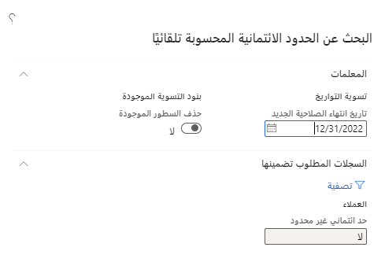

تتطلب حدود الائتمان التلقائية تاريخ انتهاء الصلاحية.

يمكنك إنشاء حدود ائتمان تلقائية لتعريف حدود ائتمان العميل وتحديثها. يتم إنشاء حدود الائتمان التلقائية لمجموعة مخاطر، وهي تستند إلى قيم محددة يتم استخدامها في مجموعات التسجيل. يمكنك استخدام حدود الائتمان التلقائية هذه لإنشاء إدخالات حد الائتمان. إذا تم تعيين عميل لمجموعة مخاطر معينة، وكانت معلومات ائتمان العميل مطابقة لمعايير حد الائتمان التلقائي، يتم إنشاء إدخال تعديل حد الائتمان.

تُظهر لقطة الشاشة التالية بنود تسوية حد الائتمان التي تم إنشاؤها عن طريق تشغيل عنصر قائمة **إنشاء حدود الائتمان التلقائية**. حدثت عمليتا حساب تلقائيتان مختلفتان. حددت إحدى العمليات الحسابية حد الائتمان إلى مليون وأخرى تركت حد الائتمان دون ضبط (0.00). 

> [!div class="mx-imgBorder"]
> [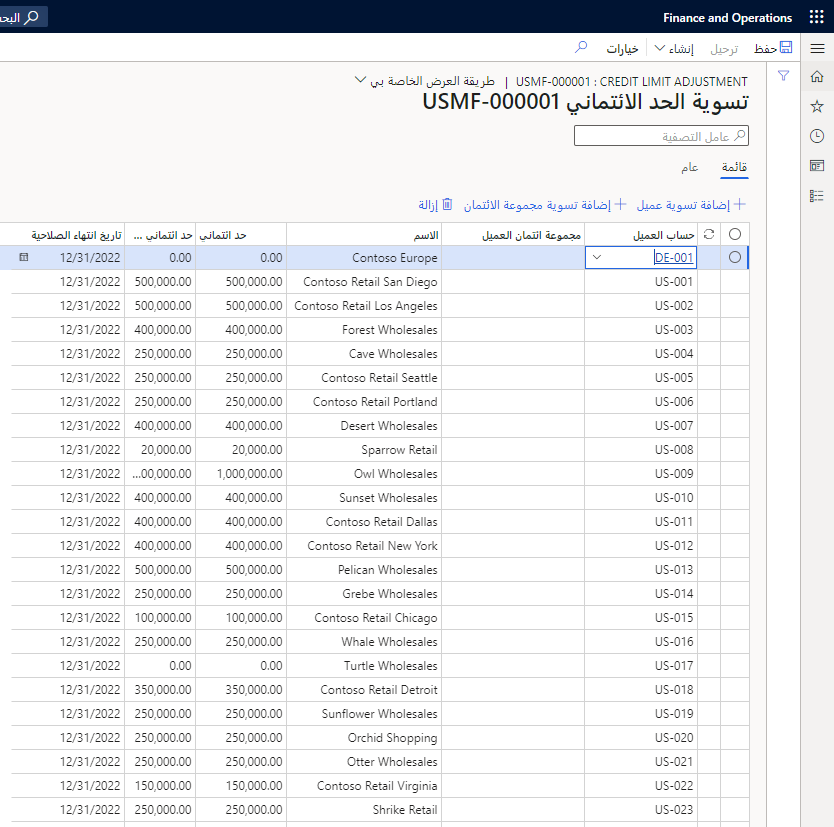](../media/generate-automatic-credit-limits-output.png#lightbox)
 
تستند عمليات الحساب التلقائية التي تم تطبيقها إلى حساب مجموعة النقاط **NoYC** (عدد سنوات العميل). يتم تطبيق حد ائتمان 1,000,000 على العملاء الذين ظلوا عملاء لأكثر من ثلاث سنوات. العملاء الذين يظهرون حد ائتماني جديد بقيمة 0.00 ليس لديهم قواعد حساب تلقائي مطبقة. 

> [!div class="mx-imgBorder"]
> [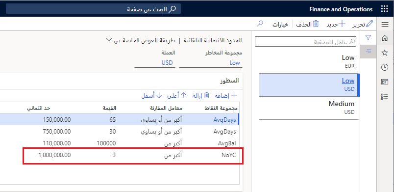](../media/number-years-customer-option.png#lightbox)

#### بنود دفتر اليومية
سواء اخترت إضافة بنود إلى دفتر اليومية يدوياً أو استخدام أحد الخيارات التلقائية، ستكون سطورك أحد التنسيقين.

- **بنود دفتر يومية حد الائتمان** - قم بتضمين حد الائتمان الحالي وحد الائتمان الجديد وتاريخ انتهاء الصلاحية. عند استخدام خيار **مجموعة الائتمان** لا ترى بنوداً فردية لكل عميل - سطر واحد فقط يمثل المجموعة. يستخدم هذا المثال التالي مبلغاً ثابتاً قيمته سالب 100,000 كقيمة تسوية.

    > [!div class="mx-imgBorder"]
    > 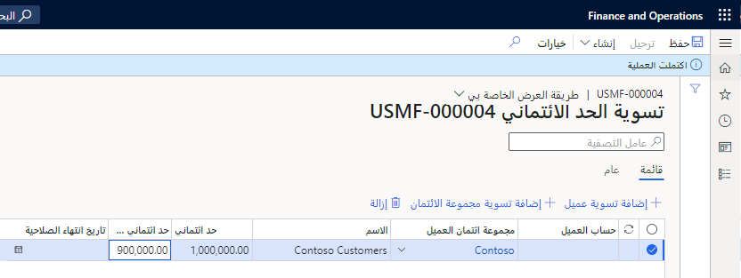

- **بنود حد الائتمان المؤقت** - إظهار تاريخي **البدء** و **الانتهاء** والسماح لك بإخال **تاريخ البدء الجديد** و **تاريخ انتهاء الصلاحية**. يضيف النظام هذه القيم لك إذا اخترت أحد عناصر القائمة **إنشاء**.

#### عملية الموافقة
عند تمكين سير عمل الموافقة، يتم عرض الزر **سير العمل** في جزء الإجراءات من صفحة **دفتر يومية تسوية حد الائتمان**. يمكنك إرسال دفتر اليومية للموافقة عليه من عنصر القائمة هذا.

يتم إنشاء عناصر عمل الموافقة، وسينتظر دفتر اليومية العديد من الموافقين كما هو محدد في سير العمل. كما هو موضح سابقاً، يمكن تلقائياً ترحيل دفتر اليومية بواسطة سير العمل، أو يمكنك ترك دفتر اليومية للمستخدم لنشره.

#### الترحيل
عند الموافقة على سير عمل، يتم تمكين الزر **ترحيل** في صفحة **دفتر يومية تسوية حد الائتمان**. قد تضطر إلى تحديد **حفظ** لتمكين **الترحيل** حتى لو لم تقم بإجراء تغيير على الصفحة. 

> [!div class="mx-imgBorder"]
> 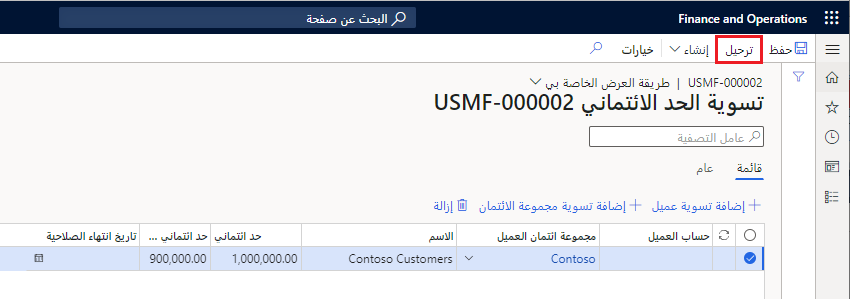

### مراجعة سجل تسوية حد الائتمان
يمكنك دائماً مراجعة دفاتر يومية تعديل حد الائتمان التي تم ترحيلها بالفعل من قوائم تسويات حدود الائتمان. لإجراء هذا الإجراء، انتقل إلى وحدة الائتمان والتحصيلات، فحدد مجموعة **تسويات حد الائتمان**، ثم حدد عنصر قائمة **تسوية حد الائتمان**. قم بتغيير الخيار **إظهار** إلى إما **الكل** أو **تم الترحيل** لمشاهدة دفاتر اليومية المرّحلة بالإضافة إلى دفاتر اليومية التي لا تزال مسودات.
 
يمكنك أيضاً عرض سجل حد الائتمان المؤقت لعميل معين من خلال الانتقال إلى صفحة قائمة **جميع العملاء**، وتحديد العميل، ثم تحديد عنصر قائمة **حدود الائتمان المؤقتة** من قائمة **إدارة الائتمان**.

يظهر حد الائتمان الحالي في علامة التبويب **الائتمان والتحصيلات** في صفحة **تفاصيل العميل**.

> [!div class="mx-imgBorder"]
> [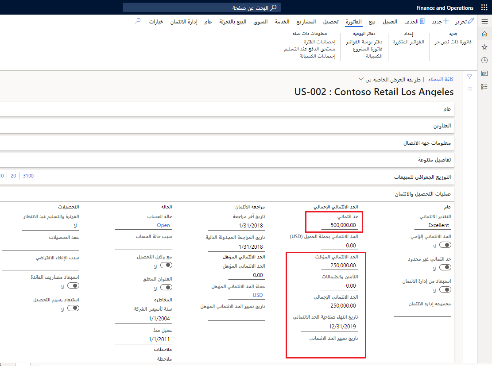](../media/customer-current-credit-limit.png#lightbox)
 
يمكنك مشاهدة كل من حد الائتمان وحد الائتمان المؤقت للعميل. يُظهر **إجمالي حد الائتمان** مقدار الائتمان الذي يمتلكه العميل الآن. في لقطة الشاشة أعلاه، لم تنته صلاحية حد الائتمان المؤقت، وتم تطبيق حد ائتمان بمبلغ 275,000 على العميل.

### مراجعة نقاط مخاطر العميل
لمراجعة درجة مخاطر العميل، انتقل إلى وحدة الائتمان والتحصيلات، وحدد **جميع العملاء**، ثم حدد إما صفحة قائمة **العميل** أو صفحة **تفاصيل العميل**. حدد عميلاً ثم حدد **قائمة إدارة الائتمان** في جزء الإجراءات. من هناك، حدد **المعلومات ذات الصلة**، ثم **نقاط المخاطر**. 

يجب عليك تشغيل وظيفة دورية لتحديث المخاطر. لجدولة الوظيفة، انتقل إلى وحدة الائتمان والتحصيلات، وحدد **المهام الدورية**. حدد **مجموعة إدارة الائتمان**، ثم حدد عنصر قائمة **تحديث نقاط المخاطر**.

يحسب النظام النقاط الرقمية لكل مجموعة تسجيل ويحسب إجمالي النقاط لكل عميل. العميل المشار إليه في لقطة الشاشة التالية لديه نقاط مخاطر **1**.

> [!div class="mx-imgBorder"]
> 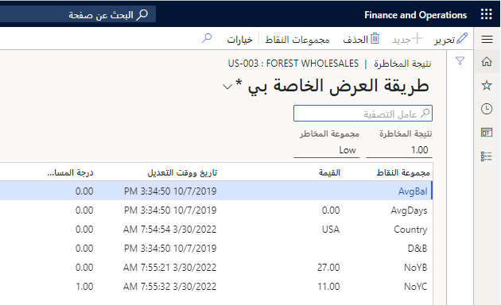
 
تظهر درجة المخاطر أيضاً في مربع حقائق **إحصاءات الائتمان**.

> [!div class="mx-imgBorder"]
> 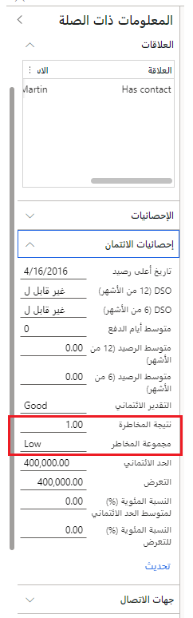

## قواعد الحظر القابلة للتكوين

تسمح صفحة **قواعد الحظر القابلة للتكوين** لأي شركة بتكوين مجموعة متنوعة من القواعد التي ستحظر إجراء المبيعات. على سبيل المثال، إذا استخدمت إحدى الشركات 100 بالمائة من حدود ائتمانها، فسيتم حظر أمر المبيعات. وخير مثال على الخيارات المتاحة يرد في لقطة الشاشة التالية في قواعد **الأيام المتأخرة**. يتوفر التحديد القياسي للجدول-المجموعة-الكل، ومن ثَمّ إذا كان يلزم تعيين قاعدة لعميل واحد أو مجموعة من العملاء أو جميع العملاء، فيمكن إجراء ذلك. وهناك متغير واحد في هذه القاعدة هو **مجموعه المخاطر**، ويمكن تحديد مجموعة محددة لتصبح عاملاً. ويمكن استخدام عوامل التشغيل القياسية عندما تقوم، في هذه الحالة، بتحديد عدد الأيام التي يمكن أن تكون فيها المجموعة متأخرة.

**الائتمان والتحصيلات > الإعداد > إعداد إدارة الائتمان > قواعد الحظر** 

[ 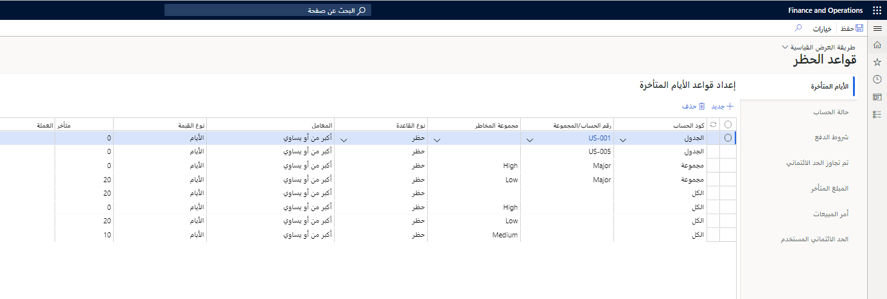 ](../media/blocking-rules-ss.png#lightbox)

## الإصدار الديناميكي للتعليقات الائتمانية

في الائتمان والتحصيلات، يمكنك العثور على **قائمة تعليقات إدارة الائتمان** في **الائتمان والتحصيلات > قائمة تعليقات إدارة الائتمان > التعليقات الائتمانية المستحقة للمراجعة**. تسرد هذه القائمة العديد من الأشياء، بما في ذلك جميع العملاء وأوامر المبيعات المعلقة ومبالغها وسبب التعليق الائتماني ومؤشر المخاطر. ومع ذلك، فإن ما يرد في هذه الصفحة بشكل أساسي هو القدرة على تحرير التعليق أو رفضه أو تقدير إمكانية تحريره.

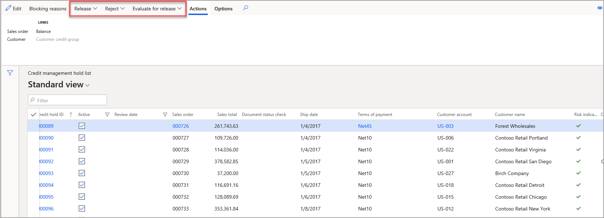

## إدارة حدود الائتمان

المهام الثلاث التي يمكنك القيام بها فيما يتعلق بحدود الائتمان هي:

- **فرض تعليق الائتمان** - في بعض الأحيان، يجب حظر أمر المبيعات، حتى إذا لم يستوفِ المعايير الواردة في قواعد الحظر، مثلما هو الحال إذا نما إلى علم مدير الائتمان احتمالية حدوث مشكلة ما. تتيح هذه الميزة تعليق طلبات متعددة لعميل معين أو مجموعة عملاء. ولإكمال هذه العملية، انتقل إلى صفحة **إدارة الائتمان > المهام الدورية > إدارة الائتمان > فرض تعليق الائتمان**، كما هو موضح في لقطة الشاشة التالية.
 
    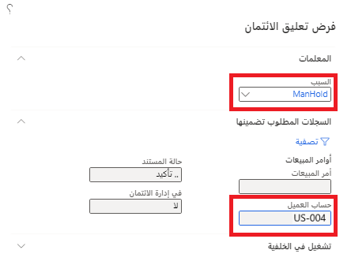

- **حساب إحصائيات الرصيد** - يُنشئ هذا الخيار قائمة بجميع **إحصاءات رصيد العميل**. وباستخدام هذا الخيار، يمكنك عرض العملاء وأرصدتهم في تواريخ محددة جنباً إلى جنب مع **حد الائتمان** و **التعرض**. يمكنك العثور على الاستفسار بالانتقال إلى **الائتمان والتحصيلات > الاستعلامات والتقارير > إدارة الائتمان > إحصاءات رصيد العميل**.

    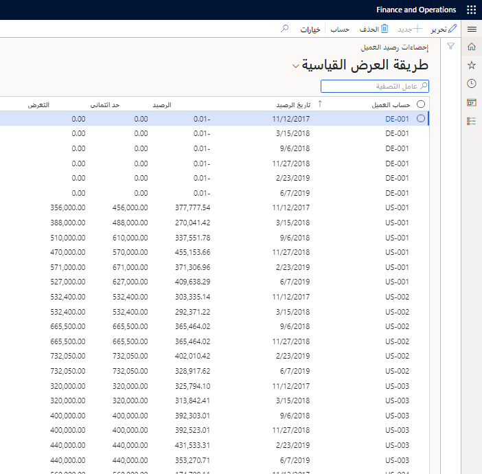

- **تحديث النتائج المتعلقة بالمخاطر** - تعيد هذه الوظيفة الدورية حساب النتائج المتعلقة بالمخاطر للعملاء. يمكنك العثور على الوظيفة بالانتقال إلى **الائتمان والتحصيلات > الاستعلامات والتقارير > إدارة الائتمان > تحديث النتائج المتعلقة بالمخاطر**. عند تشغيل الوظيفة، يمكنك عرض النتائج في صفحة **الائتمان والتحصيلات > العملاء > جميع العملاء** بالانتقال إلى علامة تبويب **إدارة الائتمان** وتحديد **النتيجة المتعلقة بالمخاطر**. تعرض لقطة الشاشة التالية النتيجة المتعلقة بالمخاطر لشركة Forest Wholesales، واستناداً إلى العوامل التي نوقشت سابقاً فيما يتعلق بـ **مجموعات النتائج**، تم تحديث النتيجة بأحدث البيانات لحساب نتيجتها البالغة 10.50. 

    
 
    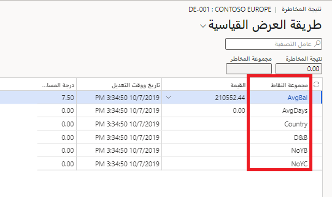
