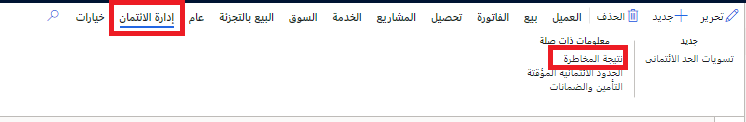

إدارة الائتمان ميزة ذات قيمة كبيرة لتمويل مستخدمي Microsoft Dynamics 365 Finance. يمكن لإدارة الائتمان:

- اقتراح أنشطة مراقبة الائتمان، ومن ثَمّ تحسين التدفق النقدي.
- تقليل الديون المعدومة.
- تقديم رؤى وضوابط تساعدك في إدارة مخاطر الائتمان.

## إدارة النتائج المتعلقة بالمخاطر

تتيح لك صفحة **تصنيف المخاطر** تحديد مستويات مختلفة من المخاطر التي لا تشعر شركتك بالقلق حيالها. تُظهر لقطة الشاشة التالية مثالاً على النتائج وما تعنيه.

**الائتمان والتحصيلات > الإعداد > إعداد إدارة الائتمان > المخاطر > تصنيف المخاطر**

في هذا المثال، أنت تقوم بتعيين ثلاثة مستويات للمخاطر والنتائج التي تحدد المستويات. يمكنك أيضاً التحكم في احتساب النتائج، كما هو موضح في لقطة الشاشة التالية.

**الائتمان والتحصيلات > الإعداد > إعداد إدارة الائتمان > المخاطر > مجموعات النتائج**
 

تمثل المجموعات الموضحة في لقطة الشاشة السابقة العوامل التي تراها الشركة مهمة عند تحديد تصنيف المخاطر. وباستخدام كل عامل، مثل متوسط الرصيد، يتم تحديد **نوع المجموعة** من قائمة ويكون **نوع النتيجة** إما **النطاق** أو **معرف من قبل المستخدم**. ويتم من القائمة إضافة **بنود** حسب اختيار كل شركة وتخصيص نتيجة بناءً على مكانها في النطاق. توضح لقطة الشاشة التالية ست مجموعات مختلفة للنتائج يتم النظر فيها عند قيام الشركة بتحديد تصنيف المخاطر.

### حدود الائتمان المقترحة من النظام

باستخدام ميزة حدود الائتمان المقترحة من النظام، يمكنك تعيين حدود ائتمان محددة بناءً على نتائج معينة. على سبيل المثال، فيما يتعلق بعميل لديه **متوسط أيام** أكبر من أو يساوي 65، فإنه سيحصل على **حد ائتماني** قدره 150،000 دولار أمريكي؛ وإذا كان أكبر من أو يساوي 30 يوماً، فسيكون الحد الأقصى له 750،000 دولار أمريكي. ويكون لـ **متوسط الرصيد** أيضاً تحديدَا للحد الائتماني لديه.

**الائتمان والتحصيلات > الإعداد > إعداد إدارة الائتمان > المخاطر > حدود الائتمان التلقائية**
 

### قواعد الحظر القابلة للتكوين

تسمح صفحة **قواعد الحظر القابلة للتكوين** لأي شركة بتكوين مجموعة متنوعة من القواعد التي ستحظر إجراء المبيعات. على سبيل المثال، إذا استخدمت إحدى الشركات 100 بالمائة من حدود ائتمانها، فسيتم حظر أمر المبيعات. وخير مثال على الخيارات المتاحة يرد في لقطة الشاشة التالية في قواعد **الأيام المتأخرة**. يتوفر التحديد القياسي للجدول-المجموعة-الكل، ومن ثَمّ إذا كان يلزم تعيين قاعدة لعميل واحد أو مجموعة من العملاء أو جميع العملاء، فيمكن إجراء ذلك. وهناك متغير واحد في هذه القاعدة هو **مجموعه المخاطر**، ويمكن تحديد مجموعة محددة لتصبح عاملاً. ويمكن استخدام عوامل التشغيل القياسية عندما تقوم، في هذه الحالة، بتحديد عدد الأيام التي يمكن أن تكون فيها المجموعة متأخرة.

**الائتمان والتحصيلات > الإعداد > إعداد إدارة الائتمان > قواعد الحظر** 

### الإصدار الديناميكي للتعليقات الائتمانية

في الائتمان والتحصيلات، يمكنك العثور على **قائمة تعليقات إدارة الائتمان** في **الائتمان والتحصيلات > قائمة تعليقات إدارة الائتمان > التعليقات الائتمانية المستحقة للمراجعة**. تسرد هذه القائمة العديد من الأشياء، بما في ذلك جميع العملاء وأوامر المبيعات المعلقة ومبالغها وسبب التعليق الائتماني ومؤشر المخاطر. ومع ذلك، فإن ما يرد في هذه الصفحة بشكل أساسي هو القدرة على تحرير التعليق أو رفضه أو تقدير إمكانية تحريره.

### إدارة حدود الائتمان

المهام الثلاث التي يمكنك القيام بها فيما يتعلق بحدود الائتمان هي:

- **فرض تعليق الائتمان** - في بعض الأحيان، يجب حظر أمر المبيعات، حتى إذا لم يستوفِ المعايير الواردة في قواعد الحظر، مثلما هو الحال إذا نما إلى علم مدير الائتمان احتمالية حدوث مشكلة ما. تتيح هذه الميزة تعليق طلبات متعددة لعميل معين أو مجموعة عملاء. ولإكمال هذه العملية، انتقل إلى صفحة **إدارة الائتمان > المهام الدورية > إدارة الائتمان > فرض تعليق الائتمان**، كما هو موضح في لقطة الشاشة التالية.
 
    

- **حساب إحصائيات الرصيد** - يُنشئ هذا الخيار قائمة بجميع **إحصاءات رصيد العميل**. وباستخدام هذا الخيار، يمكنك عرض العملاء وأرصدتهم في تواريخ محددة جنباً إلى جنب مع **حد الائتمان** و **التعرض**. يمكنك العثور على الاستفسار بالانتقال إلى **الائتمان والتحصيلات > الاستعلامات والتقارير > إدارة الائتمان > إحصاءات رصيد العميل**.

    

- **تحديث النتائج المتعلقة بالمخاطر** - تعيد هذه الوظيفة الدورية حساب النتائج المتعلقة بالمخاطر للعملاء. يمكنك العثور على الوظيفة بالانتقال إلى **الائتمان والتحصيلات > الاستعلامات والتقارير > إدارة الائتمان > تحديث النتائج المتعلقة بالمخاطر**. عند تشغيل الوظيفة، يمكنك عرض النتائج في صفحة **الائتمان والتحصيلات > العملاء > جميع العملاء** بالانتقال إلى علامة تبويب **إدارة الائتمان** وتحديد **النتيجة المتعلقة بالمخاطر**. تعرض لقطة الشاشة التالية النتيجة المتعلقة بالمخاطر لشركة Forest Wholesales، واستناداً إلى العوامل التي نوقشت سابقاً فيما يتعلق بـ **مجموعات النتائج**، تم تحديث النتيجة بأحدث البيانات لحساب نتيجتها البالغة 10.50. 

    
 
    