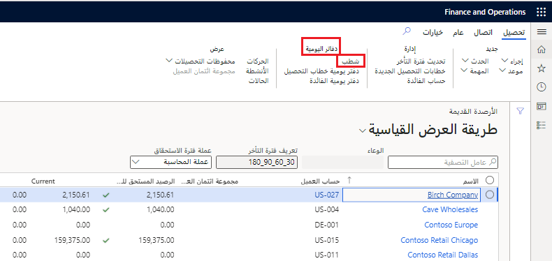

## السيناريو - إجراء عمليات الشطب

يحتوي هذا السيناريو على عدة طرق لإجراء عمليات الشطب للعملاء.

### شطب رصيد عميل من صفحة الأرصدة القديمة 

كمندوب تحصيلات في شركة **USMF**، تحتاج إلى إنشاء دفتر يومية شطب لأن شركة Birch لا تنوي دفع الرصيد بسبب حدوث خلل بالمنتجات التي تم شحنها إليها.

1.  الانتقال إلى شركة USMF
2.  انتقل إلى **الائتمان والتحصيلات > التحصيلات > الأرصدة القديمة**.
3.  حدد الصف الذي تريد شطبه من حساب العميل. علي سبيل المثال، حدد البند الذي يحتوي على **شركة Birch**.
4.  في جزء الإجراءات **تحصيل**، حدد **شطب**.
6.  حدد **موافق**.
7.  أغلق الصفحة.
8.  انتقل إلى **دفتر الأستاذ العام > إدخالات دفتر اليومية > دفاتر اليومية العامة**.
9.  حدد رقم دفعة دفتر اليومية لدفتر اليومية الذي يحتوي على عملية الشطب الخاصة بك. يتم إنشاء سطر واحد لعكس رصيد العميل. يتم إنشاء سطر واحد أو أكثر لترحيل الشطب إلى حساب الشطب.
10. إغلاق جميع الصفحات.

تعرض هذه الصورة صفحة **الأرصدة القديمة** في **عمليات التحصيل والائتمان > التحصيلات**

### شطب فاتورة باستخدام صفحة "فتح فواتير العملاء" 

1.  انتقل إلى **الحسابات المدينة > الفواتير > فتح فواتير العملاء‬‏‫**.
2.  حدد سطر فاتورة. على سبيل المثال، حدد السطر **CIV-000715**.
3.  في جزء الإجراء، حدد **الفاتورة > تحصيل**.
4.  حدد **شطب**.
5.  حدد **موافق**.
6.  أغلق الصفحة.

تعرض هذه الصورة صفحة **فتح فواتير العملاء** في **الحسابات المدينة > الفواتير**

### شطب رصيد عميل باستخدام صفحة العميل 

1.  انتقل إلى **الحسابات المقبوضات> العملاء> كافة العملاء.**
2.  حدد حساب العميل. على سبيل المثال، حدد **US-001** (Contoso Retail San Diego).
3.  في جزء الإجراءات، حدد **تجميع**.
4.  حدد **شطب**.
5.  حدد **موافق**.
6.  أغلق الصفحة.

تعرض هذه الصورة صفحة **كافة العملاء** في **الحسابات المدينة > العملاء**

## السيناريو - معالجة خطاب التحصيل

يجب أن يقوم مدير الائتمان والتحصيل في شركة Contoso **USMF**، بمعالجة وإرسال خطاب تحصيل للعميل Forest Wholesales (US-003). في الملخص، هذه هي الإجراءات التي تحتاجها للقيام بذلك.

1. قم بتشغيل وظيفة خطاب تحصيل لخطاب التحصيل.
2. استخدم الأول من أبريل 2020 كتاريخ. 
3. اطبع الخطاب.
4. قم بترحيل خطاب التحصيل.

### لتشغيل وظيفة خطاب التحصيل:

1. في شركة **USMF** انتقل إلى **الائتمان والتحصيلات** > **خطاب التحصيل >** **إنشاء خطابات تحصيل**.
1. قم بتعيين حقل **فاتورة** إلى **نعم**.
3. حدد القائمة المنسدلة **خطاب التحصيل**، ثم حدد **الكل**.
4. في حقل **تاريخ خطاب التحصيل**، أدخل **الأول من أبريل 2020**. 
5. حدد القائمة المنسدلة **استخدام ملف تعريف الترحيل من** ثم انقر على **تحديد**.
6. حدد القائمة المنسدلة **ملف تعريف الترحيل** ثم انقر على **GEN‎**.
8. قم بتوسيع علامة التبويب السريعة **السجلات المطلوب تضمينها**.
9. حدد الرمز **عامل التصفية**.
10. أدخل **US-003** في عمود **المعايير** في الصف **حساب العميل** ثم حدد **موافق**.
11. حدد **موافق** لمعالجة الوظيفة **إنشاء خطاب التحصيل**. ستظهر رسالة في مركز الإجراء تفيد بأن عملية إنشاء خطاب التحصيل قد اكتملت.
12. أغلق مركز الإجراء.

### اتبع الخطوات التالية لمراجعة خطاب التحصيل وطباعته وترحيله:

1. انتقل إلى **‎الائتمان والتحصيلات** > **خطاب تحصيل** >
    **مراجعة خطابات التحصيل ومعالجتها**.
1. حدد خطاب التحصيل الذي تم إنشاؤه مسبقاً للعميل **US-003** (يمكنك الفرز حسب التاريخ لإحضاره إلى أعلى القائمة)
2. حدد الزر **طباعة** ثم حدد **إشعار خطاب التحصيل**.
1. حدد **موافق** في الصفحة **إشعار خطاب التحصيل**.
1. راجع خطاب التحصيل.
1. أغلق خطاب التحصيل. يتم الآن تعيين الحقل **مطبوع** إلى **نعم**.
1. أثناء وجودك في خطاب التحصيل الذي تم إنشاؤه مسبقاً للعميل **US-003** حدد الزر **ترحيل**.
1. حدد تاريخ اليوم في الحقل **تاريخ الترحيل**.
1. حدد **موافق**. يظهر شريطان أزرقان؛ منهما شريط بالرسالة **اكتملت العملية**. تحتوي الرسالة الأخرى على رقم خطاب التحصيل، بالإضافة إلى رمز خطاب التحصيل والعميل الذي تمت معالجته.
1. أغلق صفحة **مراجعة رسائل المجموعة ومعالجتها**.

## السيناريو - إنشاء معلومات فترة استحقاق الحسابات المقبوضات
تحتاج إلى إعداد تعريف فترة الاستحقاق، وأرصدة العملاء العمريين، وعرض الأرصدة في قائمة **الأرصدة القديمة** في قائمة صفحة **المجموعات** في شركة **USMF**.

### إنشاء تعريف فترة تقادم 

1.  انتقل إلى **الائتمان والتحصيلات > إعداد > تعريفات فترة التقادم**.
2.  حدد **جديد‏‎**.
3.  في الحقل **تعريف فترة التقادم**، اكتب قيمة.
4.  في حقل **الوصف** أدخل قيمة.
5.  حدد **إضافة** **أدناه** لإدراج فترة تقادم جديدة.
6.  في حقل **الفترة** أدخل الوصف الذي تريد عرضه في تقارير التقادم.
7.  في حقل **الوحدة**، أدخل رقماً مرتبطاً بالفاصل الزمني.
8.  في حقل **الفاصل الزمني**، حدد خياراً. تتطابق **فترة دفتر الأستاذ** مع تقويم دفتر الأستاذ الخاص بك. يحدد **اليوم، الأسبوع، الشهر، ربع السنة** و **السنوات** مدى الفاصل الزمني حسب نوع التاريخ. **غير محدود** تحديد جميع الحركات قبل أو بعد الفترة السابقة، اعتماداً على ما إذا كانت الفترة الأولى أو الأخيرة.
9.  في حقل **مؤشر التقادم**، حدد الرمز، إذا رغبت في ذلك، لربطه بفترة التقادم.
10. حدد الفترة في الجزء العلوي من الشبكة. تحديث الوصف لوصف أقدم فترة في تعريف فترة التقادم
11. في حقل **الفترة** أدخل الوصف الجديد لفترة التقادم.
12. انقر فوق **حفظ**.
12. أغلق الصفحة.

### عمر الأرصدة 

1.  انتقل إلى **الائتمان والتحصيلات > المهام الدورية > أرصدة العميل القديمة**.
2.  في حقل **تعريف فترة التقادم**، حدد تعريف فترة التقادم الذي قمت بإنشائه. يمكنك الحصول على لقطة واحدة نشطة لكل تعريف لفترة التقادم. تتم معالجة جميع العملاء بشكل افتراضي. يمكنك استخدام هذا التحديد لحساب وعاء تحصيلات واحد من العملاء.
3. حدد التاريخ من الحركة التي ستستخدمها للتقادم. حدد تاريخ **التقادم اعتباراً من** لفترة التقادم. القيمة الافتراضية هي اليوم ولكن، إذا قمت بتغيير هذا الحقل إلى **التاريخ المحدد**، فستتمكن من انتقاء التاريخ الذي تريده. لمعالجة الدُفعات، استخدم "تاريخ اليوم".
4. قم بتوسيع **نطاق** **الشركة**. يمكنك تحديد الشركات التي سيتم تضمينها في اللقطة. يتم تحديد الشركة الحالية بشكل افتراضي.
5. حدد **موافق** لمعالجة اللقطة. سيستغرق الأمر بعض الوقت، لذا انتظر حتى يختفي شريط التمرير وتحقق من مركز الرسائل بحثاً عن رسالة.

### عرض الأرصدة في قائمة الأرصدة القديمة وصفحة التحصيلات 

1. انتقل إلى **الائتمان والتحصيلات > التحصيلات > الأرصدة القديمة**.
2. تعرض صفحة القائمة الأرصدة الخاصة بالعميل. يُظهر رمز **التقادم** فترة التقادم للحركة الأقدم.
3. حدد عميلاً لديه رصيد.
4. قم بتوسيع علامة التبويب **المعلومات ذات الصلة** الموجودة على يسار الصفحة، وحدد منطقة مربع حقائق **التقادم** لعرض الأرصدة القديمة.
5. يتم أخذ تعريف فترة التقادم من تعريف فترة التقادم الافتراضي الذي حددته في المعلمات. يمكنك تغيير ذلك باستخدام قائمة **تحصيل**.

### تشغيل تقرير تقادم العميل 

1.  انتقل إلى **الائتمان والتحصيلات > الاستعلامات والتقارير > العملاء > تقرير تقادم العميل**.
2.  حدد تاريخ اليوم في حقل **التقادم اعتباراً من**.
3.  في حقل **الرصيد** **اعتباراً من**، تاريخ اليوم.
4.  في الحقل **طباعة وصف فترة التأخر**، حدد **نعم**.
5.  في حقل **الفاصل الزمني**، أدخل **1**.
6.  في الحقل **يوم/شهر**، حدد **شهر**.
7.  في حقل **اتجاه** **الطباعة**، حدد **للخلف**.
8.  حدد **نعم** في الحقل **تفاصيل**.
9.  حدد **نعم** في الحقل **تضمين** **المبالغ** **في** **عملة**
    **الحركة**.
10. حدد **نعم‏‎** في الحقل **رصيد** **سالب**.
11. حدد **نعم** في حقل **الدفع** **تحديد الموقع**.
12. حدد **موافق**.
13. إغلاق جميع الصفحات.

## السيناريو - إعداد إدارة الائتمان

بصفتك مدير الائتمان للشركة **USMF**، فقد قررت استخدام ميزات إدارة الائتمان في الموارد المالية. لبدء الاستخدام، ستحصل على النظام الجاهز عن طريق قيامك بإنشاء مجموعات النقاط وتصنيفات المخاطر وقواعد الحظر. 

بالنسبة لهذه المعامل، عليك باستخدام شركة **USMF‎**. 

### مجموعات النقاط

ستقوم بإعداد **مجموعة نقاط** جديدة مرتبطة بعدد أوامر المبيعات المتوقعة من العميل. 

1. انتقل إلى **‎الائتمان والتحصيلات > إعداد > إعداد إدارة الائتمان > المخاطر > مجموعات النقاط**.
2. حدد **جديد**.
3. في الحقل **مجموعة النقاط**، أدخل **SO_Year**.
4. في الحقل **الوصف‏‎**، أدخل **أوامر المبيعات في السنة**.
5. في الحقل **نوع المجموعة**، حدد **معرّف من قبل المستخدم**.
6. في الحقل **نوع النقاط**، حدد **النطاق**.
7. في علامة التبويب السريعة **البنود**، حدد **إضافة**.
8. قم بإعداد هذه النطاقات:

    أ. 1-29 - **درجة المساهمة‬ في المخاطر** 5

    ب. 30-59 - **درجة المساهمة‬ في المخاطر** 10

    ج. 60-200 - **درجة المساهمة‬ في المخاطر** 15

1. حدد **حفظ** و **أغلق** الصفحة.

### تصنيف المخاطر

ستقوم بتغيير **تصنيف المخاطر** وإضافة تصنيف جديد. يجب تغيير تصنيف المخاطر الحالي لتتمكن من إدخال تصنيف جديد. لا يمكن أن تكون هناك نطاقات متراكبة في أي وقت. 

1. انتقل إلى **‎الائتمان والتحصيلات > إعداد > إعداد إدارة الائتمان > المخاطر > تصنيف المخاطر**.
2. حدد **تحرير**.
3. في الصف الذي تكون فيه **مجموعة المخاطر** بالقيمة **عالٍ**، قم بتغيير رقم القيمة **من** إلى 80.
4. حدد **جديد‎**.
5. في الحقل **مجموعة المخاطر**، أدخل **متوسط عالي**.
6. في حقل **الوصف**، أدخِل **متوسط عالي**.
7. في حقل **من**، أدخِل **60**.
8. في حقل **إلى**، أدخل **79**.
8. في الحقل **مؤشر مجموعة المخاطر**، حدد **برتقالي**.
8. حدد **حفظ** و **أغلق** الصفحة.

### قواعد الحظر

ستقوم بإعداد قاعدة جديدة لإضافة قواعد لأكثر من عميل واحد موجود في البيانات الأساسية.

1. انتقل إلى **الائتمان والتحصيلات > الإعداد > إعداد إدارة الائتمان > قواعد الحظر**
2. حدد علامة تبويب **المبلغ المتأخر**.
3. حدد **جديد‎**.
4. في الحقل **كود الحساب**، حدد **مجموعة**
5. في الحقل **رقم الحساب/المجموعة**، حدد **رئيسي**.
6. في الحقل **مجموعة المخاطر**، حدد **عالٍ**.
7. في الحقل **نوع القاعدة**، حدد **حظر**.
8. في حقل **المبلغ المتأخر**، أدخِل **50.000**.
9. في حقل **الحد**، أدخل **100**.
10. حدد **حفظ** و **أغلق** الصفحة.
 
