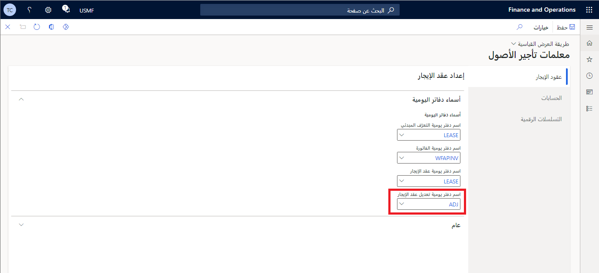

يجب تعيين العديد من التكوينات لضمان عمل وظيفة تأجير الأصول على النحو المنشود. إذا لم تكن الوحدة النمطية "تأجير الأصول" متوفرة حالياً في البيئة، فيجب على المسؤول تمكينها في مساحة عمل **إدارة الميزات**. 

## تأجير الأصول في إدارة الميزات

للوصول إلى تأجير الأصول في مساحة عمل **إدارة الميزات**، اتبع هذه الخطوات:

1.  إذا لم يكن تأجير الأصول مدرجاً كوحدة نمطية، فانتقل إلى مساحة العمل **إدارة الميزات** وحدد علامة التبويب **غير ممكّن**. 
2.  انتقل إلى عامل التصفية وابحث عن "تأجير الأصول"، ثم حدد الوحدة النمطية.
3.  في الزاوية السفلية اليسرى، حدد **تمكين الآن** لتمكين الميزة في البيئة. سيؤدي ذلك إلى تمكين الوحدة النمطية "تأجير الأصول".  

## معلمات تأجير الأصول

لإعداد معلمات تأجير الأصول‬، اتبع هذه الخطوات:

1.  انتقل إلى **تأجير الأصول > الإعداد > معلمات تأجير الأصول**.
2.  ضمن علامة التبويب **عقود الإيجار**، حدد علامة التبويب السريعة **عام**.

    - تحدد المعلمة **السماح بتجاوز التصنيف اليدوي** ما إذا كان من الممكن تجاوز تصنيف عقد الإيجار قبل تأكيد جدول الدفع.

    - وتقرر معلمة **الدفعة عبر الكيان** ما إذا كان يمكنك الترحيل إلى كيانات قانونية أخرى من الكيان القانوني الحالي. إذا تم تشغيل هذه المعلمة، يمكنك إنشاء إدخالات دفتر اليومية للكيانات القانونية التي يتوفر لديك حق الوصول إليها.

    - عيّن خيار **السماح بعمليات عكس الإهلاك على إصدار دفتر مغلق** إلى **نعم** للسماح بعكس حركات مصروفات الإهلاك. يمكن عكس حركات المصروفات، حتى عندما يكون إصدار الدفتر مغلقاً.

    - عيّن خيار **السماح بحذف عقود الإيجار المؤكدة** إلى **نعم** للسماح بحذف عقود الإيجار التي أكدت جداول الدفع. لا يمكن حذف عقود الإيجار عند اقتران الحركات المُرحلة أو غير المرحلة بها، بغض النظر عن إعداد هذا الخيار. لا يمكنك استعادة سجل عقد إيجار بعد حذفه. إذا قمت بتحميل سجلات لعقد إيجار محذوف، إما يدوياً أو من خلال كيانات البيانات، فسيتم التعامل مع المعلومات التي تم تحميلها على أنها جديدة، وليس كتحديث لعقد إيجار موجود. 

        > [!NOTE]
        > ونوصي بأن تحتفظ بتعيين الخيار **السماح بحذف عقود الإيجار المؤكدة** إلى القيمة **لا**. يتم استخدام تعيين هذا الخيار كوسيلة للتحقق من الصحة والتحكم في منع حدوث إهلاك عرضي لإصدار دفتر مغلق.

بالإضافة إلى دفتر يومية الاعتراف الأولي، يمكنك تحديد اسم دفتر يومية لتعديل عقد الإيجار وإنهائه وحركات انخفاض القيمة. يمكنك تحديد اسم دفتر اليومية لهذه الأنواع من الحركات في الحقل **اسم دفتر اليومية لتعديل عقد الإيجار**. 

