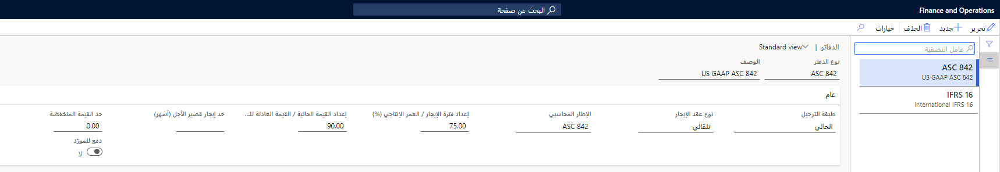

تحتوي دفاتر عقود الإيجار على إعداد تم تكوينه سابقاً سيتم ربطه بكل عقد إيجار. يحدد الدفتر معيار المحاسبة المطبق وأنواع عقود الإيجار والحد المستخدم كأساس لاختبارات التصنيف. يتم استخدام اختبارات التصنيف لتحديد نوع الإيجار بشكلٍ تلقائي. استناداً إلى المعلومات التي تقوم بإدخالها في ملخص عقود الإيجار، ستقوم المعادلات داخل Dynamics 365 Finance بحساب المدفوعات والفائدة والمصروفات وما إلى ذلك، لضمان اتباعك معايير المحاسبة الصحيحة في كل من ASC 842 وIFRS 16. ونتيجة لذلك، ستقلل من قضاء وقت طويل في إجراء عمليات حسابية دون اتصال.

لإنشاء دفتر عقود إيجار، اتبع الخطوات الآتية:

1.  انتقل إلى **إيجار الأصول > الإعداد > دفاتر عقود الإيجار**.
2.  حدد **جديد** لإضافة دفتر.
3.  عيِّن الحقول الآتية:

    - **طبقة الترحيل** - كل دفتر مرفق بعقد إيجار يتم إعداده لطبقة ترحيل معينة. تتميز كل طبقة ترحيل بأغراض ترحيل مختلفة.
    - **نوع الإيجار** - حدد ما إذا كان ينبغي تصنيف الإيجار تلقائياً أو ما إذا كان يجب تحديده سابقاً كإيجار تمويلي أو تشغيلي.
    - **إطار عمل المحاسبة** - حدد إطار العمل المرتبط بالدفتر.
    - **إعداد فترة الإيجار / العمر الإنتاجي (النسبة المئوية)** - سيقوم النظام بتصنيف الإيجار كإيجار تمويلي في حالة تعيين نوع الإيجار إلى **تلقائي**، وإذا كانت فترة الإيجار على العمر الإنتاجي للأصل أكبر من أو تساوي النسبة المئوية التي تم إدخالها في هذا الحقل.
    - **إعداد القيمة الحالية / القيمة العادلة للأصل (النسبة المئوية)** - أدخل رقماً صحيحاً لتحديد الحد الذي سيحدد نوع الإيجار. إذا كانت القيمة الحالية للحد الأدنى المستقبلي لدفعات الإيجار أكبر من القيمة المحددة من جانب المستخدم من إعداد الدفتر وإذا تم تعيين تصنيف الإيجار الخاص بالدفتر إلى **تلقائي**، فسيقوم النظام بتصنيف الإيجار كإيجار تمويلي.
    - **حد الإيجار قصير الأجل (أشهر)** أدخل عدد الأشهر المراد استخدامها كحد لعقود الإيجار قصير الأجل. إذا كانت فترة الإيجار أقل من أو تساوي عدد الأشهر التي تدخلها في هذا الحقل، فسيقوم النظام بتصنيف الإيجار كإيجار قصير الأجل، ومن ثمَّ سيتم تطبيق معالجة الإيجار المؤجل.
    - **حد عقد إيجار أصول منخفضة القيمة** - أدخل مبلغاً يتم استخدامه كحد لعقود إيجار أصول منخفضة القيمة. إذا كانت القيمة العادلة للأصل أقل من أو تساوي القيمة التي تدخلها في هذا الحقل، فسيقوم النظام بتصنيف الإيجار كإيجار أصول منخفضة القيمة، ومن ثمَّ سيتم تطبيق معالجة الإيجار المؤجل.
    - **الدفع إلى المورّد** - عيِّن هذا الخيار إلى **نعم** للسماح بترحيل دفعات الإيجار، في شكل فاتورة، إلى حساب المورّد المحدد في كل عقد إيجار. عند ترحيل دفعة الإيجار، ستتم إضافتها إلى رصيد حساب المورّد. إذا تم تعيين هذا الخيار إلى **لا**، فستتم إضافة رصيد إلى الحساب المحدد لنوع ترحيل دفعات الإيجار في الصفحة **معلمات ترحيل دفعات الإيجار** بدلاً من ذلك.

