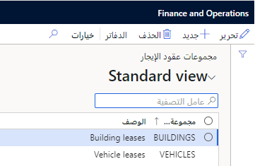

‏‫مجموعات عقود الإيجار‬‬ مطلوبة لإنشاء عقود إيجار جديدة. ترتبط دفاتر عقود الإيجار بكل مجموعة عقود إيجار وتحدد الدفاتر الافتراضية التي يجب إنشاؤها لكل عقد إيجار. يمكنك تعيين حسابات محددة لمجموعة عقود إيجار في الصفحة **معلمات ترحيل عقد الإيجار**.

على سبيل المثال، تعرض لقطة الشاشة الآتية مجموعتي عقود إيجار: مجموعة للمباني وأخرى للمركبات. يسمح إنشاء هذه المجموعات بتجميع عقود إيجار متشابهة وتوفير تقارير أفضل.

لإنشاء مجموعة عقود إيجار، اتبع هذه الخطوات:

1. انتقل إلى **تأجير الأصول > الإعداد > مجموعات عقود الإيجار**.
2. في جزء الإجراءات، حدد **جديدة** لإضافة مجموعة عقود إيجار. ستتم إضافة سطر إلى الشبكة.
3. في السطر الجديد، في الحقل مجموعة **عقود الإيجار**، أدخِل قيمة.
4. في حقل **الوصف**، أدخل قيمة.

    

بعد أن تقوم بإنشاء مجموعات عقود الإيجار، يمكنك تعيين دفاتر لكل مجموعة. عند إنشاء عقد إيجار وتعيينه لمجموعة عقود إيجار، يقوم النظام بإنشاء مجموعة من الجداول لكل دفتر مرتبطة بمجموعة عقود الإيجار هذه.

ولتعيين المجموعة لأحد الدفاتر، اتبع هذه الخطوات:

1. انتقل إلى **تأجير الأصول > الإعداد > مجموعات عقود الإيجار**.
2. حدد مجموعة عقود الإيجار، ثم حدد **الدفاتر**.
3. حدد **جديد**، ثم في الحقل **نوع الدفتر**، حدد الدفتر الذي تريد تعيينه لمجموعة عقود الإيجار. يمكنك تعيين عدة دفاتر لمجموعة عقود الإيجار إذا كان من الضروري حساب عقد الإيجار بطرق مختلفة.
