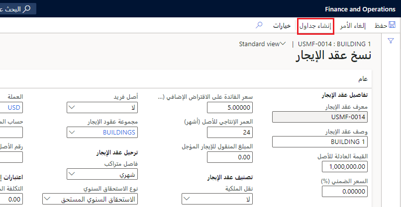

بعد الانتهاء من إدخال المعلومات الخاصة بالإيجار، يجب إنشاء جدول الإيجار. عند إنشاء الجدول، ستقوم الجداول بتنفيذ ثلاثة إجراءات: 

- إنشاء دفاتر استناداً إلى مجموعة الإيجار.
- إنشاء الجداول (المدفوعات والالتزامات والإهلاك والمصروفات).
- حساب أصول حق الاستخدام الأولية والالتزامات الأولية. 

على سبيل المثال، عند حساب فترة الإيجار بالأشهر، يقوم النظام بالبحث عن الفرق بين تاريخ البدء وتاريخ الانتهاء لسطر جدول دفعات معين. بعد ذلك، ينتقل إلى سطر جدول الدفعات التالي ويبحث عن الفرق مرة أخرى. وفي النهاية، سيضيف النظام جميع المبالغ لتحديد فترة الإيجار بالأشهر.

لإنشاء جدول إيجار، انتقل إلى صفحة **ملخص عقد الإيجار** وحدد **إنشاء جداول**.

ستتلقى رسالة تشير إلى إنشاء جدول الدفع وجدول إطفاء الدين للالتزام (الضريبي) وجدول الإهلاك وجدول المصروفات للإيجار.

اتبع الخطوات الآتية لعرض جداول الإيجار التي تم إنشاؤها وتأكيدها:

1.  حدد علامة التبويب **الدفاتر** ثم حدد الدفتر الذي قمت بإنشاء جدول له.
2.  في جزء الإجراءات، ضمن **الجداول**، حدد **جداول الدفعات**.
3.  إذا كان يلزم إجراء تغييرات، فلا يزال بإمكانك تغيير كل مبلغ دفعة ودفعة متغيرة. يتم حساب التزامات الإيجار استناداً إلى جدول الدفعات المعدل.
4.  بعد مراجعة الجدول، حدد **تأكيد الجدول**. بعد تأكيد الجدول، يصبح عقد الإيجار غير متوفر للتحرير.
5.  اعرض جدول الدفع عن طريق تحديد علامة التبويب السريعة **بنود جدول الدفع**. يعرض حقل **مبلغ الدفع** الدفعة لكل فترة على مدار مدة عقد الإيجار.

في جزء **الجدول**، إذا كنت تريد عرض مصروفات الفائدة المحسوبة، فحدد صفحة **جدول إطفاء الدين للالتزام**. لعرض الإهلاك الثابت المحسوب، افتح الصفحة **جدول إهلاك الأصول**. 
