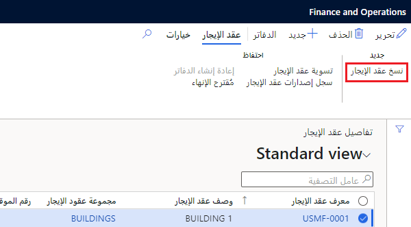

يتيح لك تأجير الأصول نسخ تفاصيل عقد الإيجار لإنشاء عقد إيجار جديد يحتوي على المعلومات نفسها. بعد ذلك، يمكنك تغيير حقول عقد الإيجار قبل إنشاء الجداول لعقد الإيجار المنسوخ.

اتبع الخطوات الآتية لنسخ عقد الإيجار:

1.  في صفحة **ملخص عقد الإيجار‬‏‫**، حدد عقد الإيجار الذي تريد نسخه. بعد ذلك، حدد **نسخ عقد الإيجار** في جزء الإجراءات.
2.  حدد **نسخ**. سيتم نسخ تفاصيل عقد الإيجار من عقد الإيجار المحدد إلى عقد إيجار جديد. بعد ذلك، يمكنك تحرير تفاصيل عقد الإيجار الجديد قبل حفظه وإنشاء جداول الإيجار.

