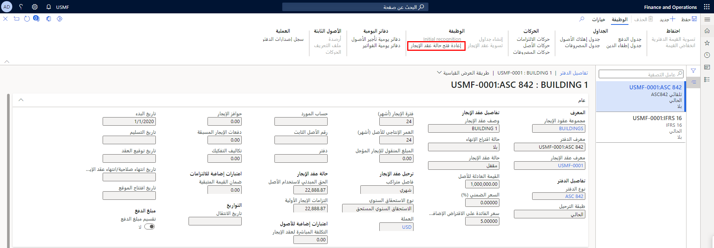

بالنسبة إلى الشركات التي تلتزم بمعيار ASC 842 أو IFRS 16، عند تعديل فترة الإيجار أو في حالة تمديد الإيجار، يلزم تعديل عقد الإيجار. 

اتبع الخطوات الآتية لتعديل عقد الإيجار:

1. انتقل إلى **تأجير الأصول > عقود الإيجار > عقود الإيجار الموجزة** وحدد عقد الإيجار الذي يتطلب التعديل.
2. في جزء الإجراءات، حدد **تعديل عقد الإيجار**. عند فتح عقد الإيجار، ستتلقى رسالة تفيد بأنه سيتم تحديث البيانات بعد تشغيل عملية إنشاء الجداول.

    

3. قم بإجراء التعديلات المطلوبة.
4. في جزء الإجراءات، حدد **إنشاء جداول**.

    

عند تشغيل وظيفة إنشاء الجداول، يعيد Finance حساب القيمة المعدلة في عقد الإيجار. لعرض الجداول المعدلة، انتقل إلى صفحة **ملخص الإيجار** لعقد الإيجار. في جزء **الجدول**، حدد الصفحة **جدول إطفاء الدين للالتزام (الضريبي)** لعرض نفقات الفوائد المحسوبة. لعرض الإهلاك الثابت المحسوب، افتح الصفحة **جدول إهلاك الأصول**. 

## إصدارات عقد الإيجار
إذا تم تعديل عقد الإيجار، فإنه يمكنك عرض الإصدارات المختلفة من عقد الإيجار والجداول التاريخية وتفاصيل الإيجار السابقة. 

ولعرض إصدارات عقد الإيجار، اتبع الخطوات الآتية:

1. في الصفحة ملخص **عقد الإيجار**، حدد عقد الإيجار، ثم في جزء الإجراءات، حدد **محفوظات إصدارات عقد الإيجار**.

    إذا تم تعديل عقد الإيجار المحدد، تعرض الصفحة **محفوظات إصدارات عقد الإيجار** الإصدارات المختلفة. تتم تسمية عقد الإيجار الأصلي بالعدد 1، ويكون للإصدارات اللاحقة ترتيب عددي تصاعدي.

    بالنسبة إلى أي إصدار عقد إيجار محدد، يمكنك عرض الأبعاد المالية وتفاصيل العقد والموقع وبنود جدول الدفع.
    
2. ولعرض الجداول التاريخية، افتح عقد الإيجار المعدَّل من الصفحة **ملخص عقد الإيجار** وحدد الدفتر المرغوب فيه، ثم حدد **محفوظات إصدار الدفتر** في جزء الإجراءات.
3. في صفحة **إصدار الكتاب**، حدد إصداراً وجدولاً زمنياً لعرضه.

## حالة دفتر الإيجار
بعد إغلاق دفتر الإيجار، قد تحتاج إلى ترحيل تسوية التي تمثل تسوية عقد الإيجار. لإجراء التسوية، ستحتاج إلى إعادة فتح الكتاب المقابل الذي تم إغلاقه، وبهذه الطريقة، لن تضطر إلى إنشاء عقد إيجار جديد عند تمديد العقد الحالي. يمكنك إعادة فتح دفتر إيجار مغلق باستخدام وظيفة **إعادة فتح حالة الإيجار** في صفحة **تفاصيل الكتاب** الخاصة بالكتاب. 

