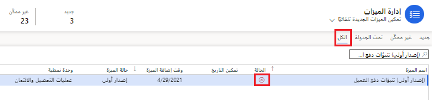

تشرح هذه الوحدة كيفية تشغيل ميزة **توقعات دفع العميل‬** وإعدادها بنجاح. من خلال تمكين هذه الميزة في مساحة عمل **إدارة الميزات**، ومن خلال إدخال إعدادات التكوين في صفحة **تكوين Finance Insights**، يمكنك عرض احتمال الدفع للحركات المفتوحة. 

لتمكين ميزة **توقعات دفع العميل‬** وإعدادها، اتبع الخطوات التالية: 

1. شغّل ميزة **توقعات دفع العميل‬**:
    1. افتح مساحة عمل **إدارة الميزات**.
    1. حدد **التحقق من وجود تحديثات**.
    1. حدد علامة التبويب **الكل** ثم ابحث عن **توقعات دفع العميل‬**.
    1. شغّل الميزة عن طريق تحديد **تمكين الآن**. إذا تم استكمال خطوات المتطلبات الأساسية‬، فسيتم تشغيل هذه الميزة الآن.

    إذا ظهرت دائرة مع علامة **X** حمراء تحت عمود **الحالة**، فهذا يشير إلى أنه يجب إعداد Finance Insights.
    > [!div class="mx-imgBorder"]
    > 

2. إعداد ميزة **معلومات دفع العميل‬**:

    1. انتقل إلى **عمليات التحصيل والائتمان‬ > الإعداد > Finance Insights > توقعات دفع العميل**.
    1. في الصفحة **تكوين Finance Insights**، حدد علامة التبويب **توقعات دفع العميل‬**.
    1. حدد **عرض حقول البيانات المستخدمة في نموذج التوقع‬** لفتح الصفحة **حقول البيانات لنموذج التوقع‬**. في هذه الصفحة، يمكنك عرض القائمة الافتراضية للحقول المستخدمة لإنشاء نموذج التوقع الذي يستخدم الذكاء الاصطناعي لتوقعات دفع العميل.
    
    لإنشاء نموذج توقع الدفع باستخدام الحقول الافتراضية التي يتم عرضها في **حقول البيانات المستخدمة في نموذج التوقع‬**، عيّن الخيار **تمكين الميزة** إلى **نعم** في الصفحة **توقعات دفع العميل‬**.
    
    - كي تعمل ميزة **توقعات دفع العميل** بشكل صحيح، يجب أن تنتشر حركات يزيد عددها عن 100 حركة بين الفترات **في الوقت المحدد‬** و **متأخرة** و **متأخرة جداً**. يجب أن تتضمن الحركات فواتير النص الحر وأوامر المبيعات ودفعات العملاء ويجب أن يكون تاريخها ضمن الأشهر الستة إلى التسعة الماضية.

    - كي يحدد النظام ما يجب أن يقع ضمن الفئة **متأخرة‏‎** في مقابل الفئة **متأخر‏‎‏‎ة جداً**، عليك أن تحدد مقدار الوقت الذي يمكن اعتبار أنه في الفئة **متأخرة‏‎‏‎ جداً** بعد تاريخ الاستحقاق. لتغيير **فترة الحركة المتأخرة جداً**، غيّر عدد الأيام ضمن القسم **فترة الحركة المتأخرة جداً** في الصفحة، ثم حدد **تحديث**. إذا تم تعديل هذا الإعداد بعد إنشاء نموذج التوقع الذي يستخدم الذكاء الاصطناعي، فسيتم إنشاء نموذج جديد وسيتم حذف النموذج القديم.

     - لكل فاتورة مفتوحة، يتوقع النظام احتمال الدفع في ثلاث فئات:
        - **في الوقت المحدد** – تتضمن هذه الفئة الدفعات التي من المتوقع أن يتم سدادها في تاريخ استحقاق الحركة أو قبله.
        - **متأخرة** – تتضمن هذه الفئة الدفعات التي من المتوقع أن يتم سدادها بعد تاريخ استحقاق الحركة ولكن قبل بدء فترة الحركة **متأخرة‏‎ جداً**.
        - **متأخرة جداً** – تتضمن هذه الفئة الدفعات التي من المتوقع أن يتم سدادها بعد بدء فترة الحركة‬ **متأخرة‏‎ جداً**.
    

3. لإنشاء نموذج التوقع، انتقل إلى أسفل صفحة **تكوين Finance Insights**، وضمن القسم **نموذج الذكاء الاصطناعي**، حدد **إنشاء نموذج التوقع**. يعرض قسم **نموذج التوقع** في صفحة **تكوين Finance Insights** حالة نموذج التوقع.

    في أي وقت يتم فيه إنشاء نموذج التوقع، يمكن تحديد **إعادة تعيين إنشاء النموذج** لإعادة تشغيل العملية.
    

تم الآن إعداد الميزة **توقعات دفع العميل**، وهي جاهزة للاستخدام.

