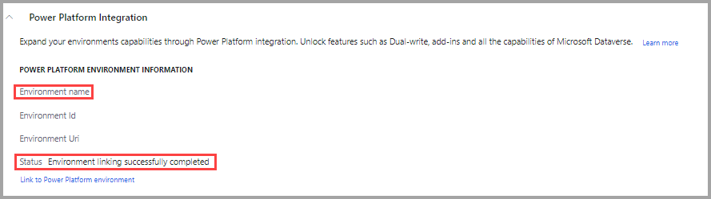
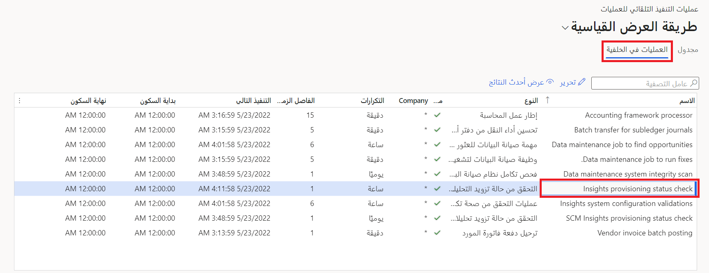

تركز هذه الوحدة على استكشاف خطوات إعداد Finance Insights بنجاح. يجمع Finance Insights بطريقة ديناميكية وظائف من Dynamics 365 Finance بواسطة أدوات مثل Dataverse وAzure وAI Builder لتوفير أدوات تنبؤ فعالة. 

يجب أن تكون بيئة Dynamics 365 Finance المستخدمة لإعداد Finance Insights من الإصدار 10.0.21 أو إصدار لاحق، ويجب أن تكون بيئة عالية التوافر، وتُعرف أيضاً باسم بيئة المستوى 2.

لاستخدام Finance Insights، تأكد من إعداد المكونات التالية:

1.  قم بإعداد Azure Active Directory (Azure AD) بحيث يمكن استخدامه مع Dataverse وتطبيقات Microsoft Power Platform:
    - تأكد من أن دور **مالك المشروع** أو دور **مدير البيئة** في Dynamics 365 Lifecycle Services معين لك. يمكنك عرض هذا الإعداد في Lifecycle Services في **مستخدمو المشروع**.
    - وتحتاج أيضاً إلى دور **مسؤول النظام** و **مخصص النظام** في مركز مسؤولي Microsoft Power Platform.
2.  قم بإعداد **تكامل Power Platform** في Lifecycle Services. يمكنك تحديد ما إذا تم إعداد تكامل Power Platform في البيئة عن طريق مراجعة الصفحة **تكامل Power Platform**.
    
    > [!div class="mx-imgBorder"]
        > 
     
    لمزيد من المعلومات، راجع [تمكين تكامل Power Platform](/dynamics365/fin-ops-core/dev-itpro/power-platform/enable-power-platform-integration/?azure-portal=true).

3.  قم بإعداد وتثبيت **الوظيفة الإضافية تصدير إلى Azure Data Lake**. الغرض من Azure Data Lake هو حفظ البيانات المطلوبة لإجراء توقعات لـ Finance Insights. إنه يستخدم عملية سلسة بحيث يمكنك نقل البيانات إلى تطبيقات متعددة. 

    لمزيد من المعلومات، راجع [تثبيت الوظيفة الإضافية تصدير إلى Azure Data Lake](/dynamics365/fin-ops-core/dev-itpro/data-entities/configure-export-data-lake/?azure-portal=true).

4.  بعد تثبيت **الوظيفة الإضافية تصدير إلى Azure Data Lake**، يمكنك تثبيت الوظيفة الإضافية Finance Insights:

    1. في Lifecycle Services، انتقل إلى صفحة **التفاصيل الكاملة** الخاصة بالبيئة.
    1. في قسم **الوظائف الإضافية للبيئة**، حدد **+ تثبيت وظيفة إضافية جديدة**.
    1. حدد الوظيفة الإضافية **Finance Insights**.
    1. وافق على الأحكان والشروط، ثم حدد **تثبيت**.
5. يمكنك تشغيل العملية **التحقق من حالة تزويد التحليلات‬** يدوياً لخفض مقدار الوقت المطلوب لتمكين Finance Insights.
    1. في Finance، انتقل إلى **إدارة النظام > الإعداد > أتمتة العمليات**.
    1. على علامة التبويب **العمليات في الخلفية‬**، ابحث عن **التحقق من حالة تزويد التحليلات‬** ثم حدد **تحرير**.
    1. عيّن حقل **التنفيذ التالي** إلى **30 دقيقة قبل الوقت الحالي**. يجب أن يؤدي هذا الإعداد إلى تشغيل العملية على الفور.

        > [!div class="mx-imgBorder"]
        > 

    إذا لم يتم تشغيل العملية **التحقق من حالة تزويد التحليلات**، فانتقل إلى **إدارة النظام > الاستعلامات > الوظائف الدفعية**. في الحقل **نظام التحقق من أتمتة العملية**، غيّر القيمة في **قيد الانتظار** لبدء العملية.

