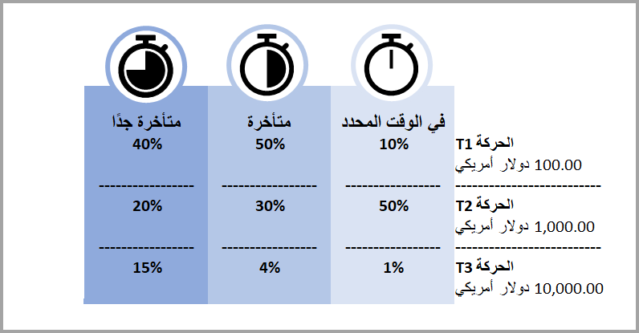
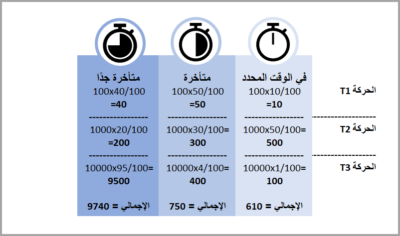

يمكنك عرض توقعات دفع العميل التي يتم إنشاؤها بواسطة النموذج في مساحة العمل **تحصيلات وائتمان العميل**. في الصفحة **تحصيلات وائتمان العميل‬‏‫**، يمكنك عرض التوقعات الذكية على إطارين متجانبين: 

- **توقعات الدفع للحركة**
- **توقعات دفع العميل**.

## توقعات الدفع للحركة
في صفحة **توقعات الدفع للحركة‬**، يمكنك عرض فواتير العميل واحتمال تسديد هذه الفواتير في الوقت المحدد. إذا كان احتمال تسديد الفاتورة أقل من 50 بالمئة، فستظهر دائرة حمراء إلى يسار النسبة المئوية الموجودة في **احتمالية الوقت المحدد‬**. 

في جزء **المعلومات المرتبطة‬** على الجانب الأيسر من صفحة **توقعات الدفع للحركة‬**، يمكنك عرض المزيد من التفاصيل حول حركات معينة. بعد تحديد حركة، يمكنك عرض علامات التبويب التالية: 

- **توقع الدفع** – إظهار احتمال تسديد هذه الفواتير **في الوقت المحدد** أو **متأخر** أو **متأخر‏‎ جداً** بالاستناد إلى نموذج التوقع. علاوةً على ذلك، يمكنك عرض الناحية **أهم العوامل‬**، التي تعرض العوامل الأكثر تأثيراً على التوقعات. تُعتبر أهم العوامل سمات الحركة المحددة و/أو العميل المحدد لهذه الحركة.
  
    > [!div class="mx-imgBorder"]
    > 

- **رؤى العميل** – تعرض إحصائيات الفواتير والدفعات والتحصيل للعميل للحركة المحددة.
- **محفوظات العميل** – تعرض محفوظات دفع العميل في الفئات **في الوقت المحدد** و **متأخر** و **متأخر‏‎ جداً**.
  
    > [!div class="mx-imgBorder"]
    > 

## توقعات دفع العميل
في صفحة **توقعات دفع العميل**، يمكنك عرض العملاء والرصيد الافتتاحي للعميل والمبلغ المتوقع أن يتم سداده في الفئة **في الوقت المحدد** أو **متأخر** أو **متأخر جداً**. إذا كان احتمال تسديد العميل في الوقت المحدد أقل من 50 بالمئة، فستظهر دائرة حمراء إلى جانب الاحتمال في عمود **الوقت المحدد**.
 
> [!div class="mx-imgBorder"]
> 

تعرض الصورة التالية مثالاً عن عميل لديه ثلاث حركات مفتوحة وكيفية توقع الدفعات.
 
> [!div class="mx-imgBorder"]
> 

في هذه الحالة، يتم توقع الدفعات لكل فئة، كما هو موضح في الرسم التالي.
 
> [!div class="mx-imgBorder"]
> 

بعد إنشاء نموذج **توقعات دفع العميل**، ستحصل على درجة دقة تشير إلى مدى دقة نموذجك. يمكنك عرض هذه الدرجة في **عمليات التحصيل والائتمان‬ > الإعداد > Finance Insights > توقعات دفع العميل**. 

إذا أردت تحسين دقة النموذج، فيمكنك تحديد **تحسين دقة النموذج**، مما يؤدي إلى فتح AI Builder. في AI Builder، يمكنك إضافة المزيد من الحقول أو إزالة حقول لتحسين دقة النموذج. عندما تقتنع بدرجة دقة النموذج، يمكنك نشر تغييراتك، التي سيتم التقاطها تلقائياً للتوقعات في Finance.
