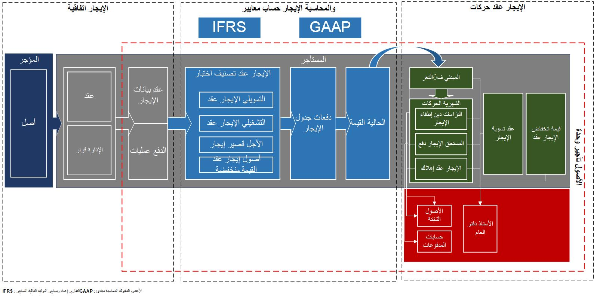

يوضح الرسم التخطيطي التالي عناصر إجراءات العمل لعقود الإيجار.

يحتوي الأصل المؤجر على المكونات التالية:

- **اتفاقية الإيجار** - المؤجر الذي يمتلك الأصل ويتفق مع المستأجر على التعاقد على الأصل لفترة محددة مقابل دفعات الإيجار السنوية. بالإضافة إلى العلاقة الرسمية بين المؤجر والمستأجر، تتضمن اتفاقية الإيجار قرارات إدارية، مثل إمكانية خيار الإيجار وانتقال الملكية. 

- **حساب التأجير والتصنيف حسب المعيار المحاسبي** - يحدد المعيار المحاسبي الذي سيتم تطبيقه في الحساب الأولي واللاحق واختبار التصنيف الذي يحدد نوع عقد الإيجار. أنواع الإيجار المتوفرة هي:

    - **تأجير تمويلي** - يتم تحويل المخاطر والمكافآت المتعلقة بالأصل المؤجر إلى المستأجر.

    - **عقد الإيجار التشغيلي** - تظل المخاطر والمكافآت المتعلقة بالأصل المؤجر على عاتق المؤجر.

- **الحدود** - تستخدم في اختبارات تصنيف التأجير لتحديد ما إذا كان سيتم تصنيف الأصل كأحد الأنواع التالية:

    - **فترة الإيجار** - النسبة المئوية للعمر الإنتاجي المطلوب استخدامها في اختبار التصنيف. سيصنف النظام عقد الإيجار على أنه تمويل إذا تم تعيين نوع الإيجار على "تلقائي"، وإذا كانت فترة الإيجار على مدى العمر الإنتاجي للأصل أكبر من النسبة المئوية المحددة في هذا التصنيف أو تعادلها.
    - **القيمة الحالية** - تشير إلى النسبة المئوية للقيمة العادلة للأصل التي سيتم استخدامها في اختبار التصنيف. سيصنف النظام عقد الإيجار كتمويل إذا تم تعيين نوع الإيجار على **تلقائي**، وإذا كانت القيمة الحالية لدفعات الإيجار المستقبلية التي تتجاوز القيمة العادلة للأصل أكبر من النسبة المئوية المحددة في هذا التصنيف أو تعادلها.
    - **عقد إيجار قصير الأجل** - إذا كانت فترة الإيجار أقل من القيمة المحددة أو ما يعادلها، فسيتم تصنيف عقد الإيجار كعقد إيجار قصير الأجل.
    - **عقد إيجار أصول منخفضة القيمة** - إذا كانت القيمة العادلة للأصل أقل من القيمة المحددة أو ما يعادلها، فسيتم تصنيف عقد الإيجار كعقد إيجار أصول منخفضة القيمة.
    - **تصنيف عقد الإيجار والحركات** - يعد تصنيف عقود الإيجار عملية آلية لتصنيف عقود الإيجار بناءً على الحدود المحددة في الدفاتر، جنباً إلى جنب مع معايير اختبار التصنيف الأخرى، لتحديد ما إذا كان عقد الإيجار هو عقد تأجير تمويلي، أو عقد إيجار تشغيلي، أو عقد إيجار قصير الأجل، أو عقد إيجار أصول منخفضة القيمة. 

