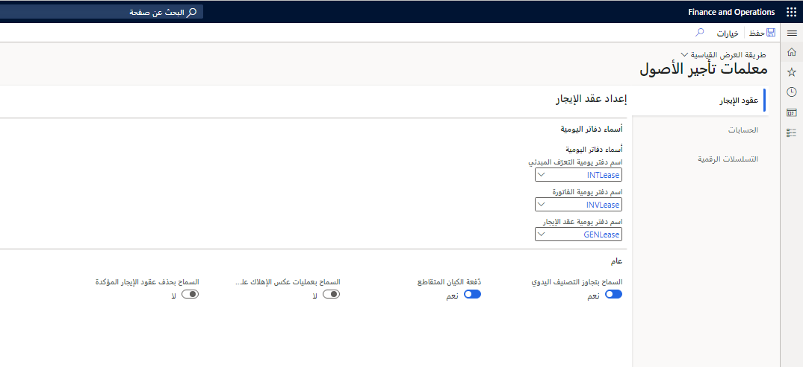

يجب إعداد تكوينات عديدة لضمان عمل وظيفة تأجير الأصول بالشكل المطلوب.
## معلمات تأجير الأصول‬
1.  انتقل إلى **تأجير الأصول > الإعداد > معلمات تأجير الأصول**.
2.  ضمن علامة التبويب **عقود الإيجار**، حدد علامة التبويب السريعة **عام**.

    - تحدد المعلمة **السماح بتجاوز التصنيف اليدوي** ما إذا كان من الممكن تجاوز تصنيف عقد الإيجار قبل تأكيد جدول الدفع.

    - وتقرر معلمة **الدفعة عبر الكيان** ما إذا كان يمكنك الترحيل إلى كيانات قانونية أخرى من الكيان القانوني الحالي. إذا تم تشغيل هذه المعلمة، يمكنك إنشاء إدخالات دفتر اليومية للكيانات القانونية التي يتوفر لديك حق الوصول إليها.

    - عيّن خيار **السماح بعمليات عكس الإهلاك على إصدار دفتر مغلق** إلى **نعم** للسماح بعكس حركات مصروفات الإهلاك. يمكن عكس حركات المصروفات، حتى عندما يكون إصدار الدفتر مغلقاً.

    - عيّن خيار **السماح بحذف عقود الإيجار المؤكدة** إلى **نعم** للسماح بحذف عقود الإيجار التي أكدت جداول الدفع. لا يمكن حذف عقود الإيجار عند اقتران الحركات المُرحلة أو غير المرحلة بها، بغض النظر عن إعداد هذا الخيار. لا يمكنك استعادة سجل عقد إيجار بعد حذفه. إذا قمت بتحميل سجلات لعقد إيجار محذوف، إما يدوياً أو من خلال كيانات البيانات، فسيتم التعامل مع المعلومات التي تم تحميلها على أنها جديدة، وليس كتحديث لعقد إيجار موجود. 

        > [!NOTE]
        > ونوصي بأن تحتفظ بتعيين الخيار **السماح بحذف عقود الإيجار المؤكدة** إلى القيمة **لا**. يتم استخدام تعيين هذا الخيار كوسيلة للتحقق من الصحة والتحكم في منع حدوث إهلاك عرضي لإصدار دفتر مغلق.

