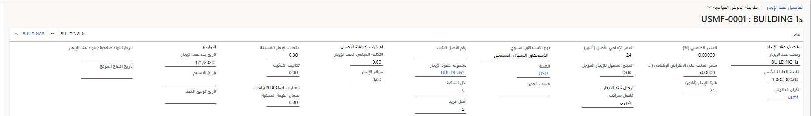

تتضمن عملية إنشاء عقد إيجار جديد إدخال المعلومات الخاصة بعقد الإيجار، ثم إنشاء جدول عقد إيجار. وبعد إعداد عقد الإيجار، قد تجد أنه من الأسهل نسخ المعلومات من عقد إيجار موجود، ثم تحرير تلك المعلومات، حسب الحاجة، لإنشاء عقد إيجار جديد.

اتبع هذه الخطوات لإنشاء عقد إيجار في "تأجير الأصول":

1.  انتقل إلى **تأجير الأصول > عقود الإيجار > ملخص عقد الإيجار**.
2.  في جزء "الإجراءات"، حدد **جديد**.
3.  في علامة التبويب السريعة **عام**، في الحقل **وصف عقد الإيجار**، أدخِل اسم عقد الإيجار.
4.  في الحقل **القيمة العادلة للأصل**، أدخِل القيمة العادلة، والتي يتم تضمينها عادةً في عقد الإيجار. وإذا كان العقد لا يحتوي على رقم القيمة العادلة، فأدخل قيمة عادلة لأصل قابل للمقارنة. 
5.  في الحقل **السعر الضمني (%)**، أدخِل السعر الضمني لعقد الإيجار. وهذه القيمة غير مطلوبة إذا لم يتم تحديد السعر في فترات الإيجار. وفي هذه الحالة، سيتم استخدام سعر الاقتراض لخصم دفعات الإيجار.
6.  في الحقل **سعر الفائدة على الاقتراض الإضافي (%)**، أدخِل سعر الفائدة على الاقتراض الإضافي لدين يتضمن مواصفات مشابهة للمخاطر والفترة، إذا كانت مؤسستك شركة مساهمة عامة. وإذا لم تكن مؤسستك شركة مساهمة عامة، فيمكنك إدخال سعر خالٍ من المخاطر لفترة مشابهة لعقد الإيجار.
7.  في الحقل **الفاصل الزمني المتراكم**، حدد عدد الفترات المتراكمة في السنة.
8.  في الحقل **العمر الإنتاجي للأصل (بالشهور)**، أدخِل الفترات المتبقية من العمر الإنتاجي من تاريخ بدء عقد الإيجار. ولاحظ أن هذا التاريخ ليس العمر الإنتاجي الأساسي.
9.  في الحقل **ترحيل الإيجار المؤجل**، أدخِل مبلغ ترحيل الإيجار المؤجل لعقود الإيجار التشغيلية التي تم تعديلها سابقاً. سيتم استخدام مبلغ ترحيل الإيجار المؤجل هذا لحساب التكلفة الثابتة خلال عقد الإيجار هذا. كما أن رصيد البدء للإيجار المؤجل سيتضمن هذا المبلغ.
10. في الحقل **نقل الملكية**، حدد **نعم** إذا كان عقد الإيجار ينقل الملكية في نهاية فترة الإيجار؛ وإلا فحدد **لا**.
11. في الحقل **أصل فريد**، بالنسبة إلى المبادئ المحاسبية المقبولة بصفة عامة في الولايات المتحدة فقط، حدد **نعم** إذا كان الأصل محل العقد متخصصاً جداً لدرجة أنه من غير المحتمل أن يكون مفيداً للمؤجر في نهاية فترة الإيجار. وسيتم بعد ذلك تصنيف عقد الإيجار على أنه مالي.
12. في الحقل **نوع الاستحقاق السنوي**، حدد نوع الاستحقاق السنوي. ويُستخدم هذا الحقل لتحديد ما إذا كان عقد الإيجار مستحقاً في بداية فترة الدفع أو في نهاية الفترة المستخدمة لخصم دفعات الإيجار.
13. في الحقل **تكلفة مباشرة لعقد الإيجار**، أدخِل التكاليف الإضافية للإيجار التي لم تكن سيتم تكبدها ما لم يتم تنفيذ عقد الإيجار. لا تُعد التكاليف المنسوبة بشكل مباشر أو غير مباشر للتفاوض بشأن عقد الإيجار وترتيبه (على سبيل المثال، التكاليف القانونية الخارجية لصياغة عقد إيجار أو التفاوض بشأنه أو توزيع التكاليف القانونية الداخلية) تكاليف مباشرة لعقد الإيجار. ولا تتم رسملة التكاليف غير المباشرة ولكن يتم احتسابها كتكاليف فترة الإيجار.
14. في الحقل **حوافز الإيجار**، أدخِل الدفعات التي يدفعها المؤجر للمستأجر كحافز لتوقيع عقد الإيجار. وسيتم طرح مبلغ الحوافز من أي حسابات خاصة بحق استخدام الأصل.
15. في الحقل **دفعات الإيجار**، أدخل الدفعات التي يتم تقديمها للمؤجر قبل تاريخ بدء الإيجار. وستتم إضافة هذه التكاليف إلى حق استخدام الأصل وليس إلى التزامات الإيجار.
16. في الحقل **تكاليف التفكيك**، أدخِل التكلفة التقديرية لتفكيك الأصل محل العقد وإزالته عند انتهاء فترة الإيجار. وستتم إضافة هذه التكلفة إلى حق استخدام الأصل. كما تنطبق هذه التكلفة فقط على المستخدمين الذين يعملون بموجب معايير IFRS 16. وإذا كنت تعمل بموجب المبادئ المحاسبية المقبولة بصفة عامة في الولايات المتحدة، فلا تقم بإدخال مبلغ في هذا الحقل. حيث إن ذلك سيؤدي إلى حساب قيمة حق استخدام الأصل بشكل غير صحيح.
17. في الحقل **ضمان القيمة المتبقية**، أدخِل أي مبلغ من القيمة المتبقية المضمونة المقرر دفعها من المستأجر إلى المؤجر في نهاية عقد الإيجار. إذا كان عقد الإيجار يحتوي على شرط يمنح المؤجر الحق في مطالبة المستأجر بشراء الأصل محل العقد بحلول نهاية فترة الإيجار، فيجب تضمين سعر الشراء المعلن في دفعات الإيجار. ويُعد سعر الشراء فعلياً ضماناً للقيمة المتبقية يجب على المستأجر دفعه (بعبارة أخرى، يكون دفع سعر الشراء خارج سيطرة المستأجر).

    

18. في علامات التبويب السريعة المتبقية، أدخِل المعلومات التي لديك بوصفها متعلقة بعقد الإيجار.

شاهد مقطع الفيديو الآتي لمعرفة كيفية إنشاء عقد إيجار للأصل.

 > [!VIDEO https://www.microsoft.com/videoplayer/embed/RWxQnd]
