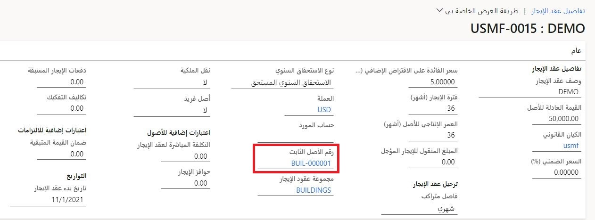

في إطار عملية إنشاء عقد إيجار جديد، يمكنك أيضاً إقران عقد الإيجار الجديد بأصل ثابت موجود. ومن خلال القيام بذلك، ستنتقل قيمة حق استخدام الأصل (ROU) عند الإقرار الأولي إلى تكلفة الاستحواذ على ذلك الأصل الثابت. 

قبل إقران أصل ثابت بعقد إيجار، عليك إنشاء السجل للأصل الثابت في الوحدة النمطية للأصول الثابتة. لمزيد من المعلومات، راجع [‏‫إعداد الأصول الثابتة وإنشاؤها](/learn/modules/manage-fixed-assets-dyn365-finance/3-setup/?azure-portal=true). عند إنشاء أصل ثابت، اتبع هذه الخطوات لإقران ذلك الأصل الثابت بعقد إيجار جديد في صفحة **ملخص عقد الإيجار**. 

1.  أضف عقد إيجار في **تأجير الأصول > عقود الإيجار > ملخص عقد الإيجار**. 
2.  في الصفحة **إضافة عقد إيجار**، في حقل **رقم الأصل الثابت**، حدد الأصل الذي لم يتم الاستحواذ عليه.
3.  قم بتعبئة جميع المعلومات الأخرى ذات الصلة في الصفحة **إضافة عقد إيجار**.
4.  حدد **إنشاء جداول** في أعلى الصفحة.
5.  حدد **الدفاتر**، ثم حدد الدفتر الذي تريد إنشاء جدول له.
6.  في جزء الإجراءات، حدد **جدول الدفع > تأكيد الجدول**.
7.  حدد **الإقرار الأولي** في جزء الإجراءات **الوظيفة**.
8.  حدد **دفتر يومية تأجير الأصول‬** في جزء الإجراءات **دفاتر اليومية**.
9.  حدد **تفاصيل دفتر اليومية**.
10. حدد **السطور** لعرض سطور إدخال دفتر اليومية.
11. **رحّل** دفتر اليومية.

 
لعرض جدول الحركة، انتقل إلى **الأصول الثابتة > الأصول الثابتة > الأصول الثابتة**، ثم حدد **التقييمات**. يجب أن ترى حركة الاستحواذ التي تم إنشاؤها بواسطة إدخال دفتر يومية الإقرار الأولي للأصل الثابت المحدد الذي تم استخدمه. ستتم مزامنة عملية تحديث سجل أصل من الأصول الثابتة من حركة في تأجير الأصول بشكل تلقائي بسبب **معرف الأصل‬** في حركة الإقرار الأولي. 

لاستخدام المزامنة بين الأصول الثابتة وتأجير الأصول، شغّل الميزة **تمرير مدة الخدمة من تأجير الأصول إلى الأصول الثابتة** في مساحة العمل **إدارة الميزات**. ستقوم هذه الميزة، عند تمكينها، بأتمتة عملية تمرير مدة خدمة أصل ثابت من تأجير الأصول إلى دفتر الأصول. 

عندما يتم ترحيل إدخال دفتر يومية الإقرار الأولي، يمكنك إهلاك الأصول الثابتة باستخدام طرق الإهلاك القياسية في الأصول الثابتة. عند إقران أصل ثابت بعقد إيجار، سيتم تحديث حقل **مدة الخدمة** في دفتر الأصول الثابتة تلقائياً للتوافق مع أصغر قيمة من أحد الكيانات التالية:

- العمر الإنتاجي للأصل
- فترة الإيجار من دفتر عقد الإيجار المقترن

علاوةً على ذلك، إذا تم تعيين الحقل **نقل الملكية** إلى **نعم** في دفتر عقد الإيجار، فإن القيمة في حقل **مدة الخدمة** ستكون دائماً عبارة عن العمر الإنتاجي للأصل بشكل افتراضي. تضمن هذه العملية تحديث **مدة الخدمة** في كل مرة يتم فيها تعديل عقد الإيجار بحيث يتم إهلاك حق استخدام الأصل على مدى عقد الإيجار.
 
سيظهر **معرف عقد الإيجار** المرتبط بأصل ثابت على الصفحتين **الأصول الثابتة** و **دفتر الأصول الثابتة**. إذا كان أحد الأصول الثابتة مرتبطاً بعقد إيجار، فسيظهر **معرف عقد الإيجار** و **وصف عقد الإيجار** في صفحة **الأصول الثابتة** على علامة التبويب السريعة **معلومات عقد الإيجار**. فيما يتعلق بدفاتر الأصول الثابتة ذات الصلة بدفاتر عقد الإيجار، ستعرض الحقول **معرف عقد الإيجار** و **وصف عقد الإيجار** و **نوع الدفتر** على علامة التبويب السريعة **معلومات عقد الإيجار** معلومات حول دفتر الأصل الثابت المحدد للإشارة إلى اقترانه بدفتر عقد إيجار.
