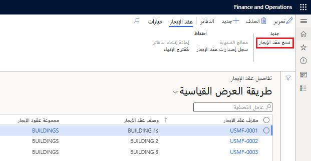

يتيح لك تأجير الأصول نسخ تفاصيل الإيجار لإنشاء عقد إيجار جديد يحتوي على المعلومات نفسها. ويمكنك بعد ذلك تغيير حقول التأجير قبل إنشاء الجداول لعقد الإيجار المنسوخ.

اتبع الخطوات الآتية لنسخ عقد الإيجار:

1.  في الصفحة **ملخص عقد الإيجار**، حدد عقد الإيجار المراد نسخه، ثم في جزء "الإجراءات"، حدد **نسخ عقد الإيجار**.
2.  حدد **نسخ**. يتم نسخ تفاصيل عقد الإيجار من عقد الإيجار المحدد إلى عقد إيجار جديد. ويمكنك بعد ذلك تحرير تفاصيل عقد الإيجار الجديد قبل حفظه وإنشاء جداول الإيجار.

