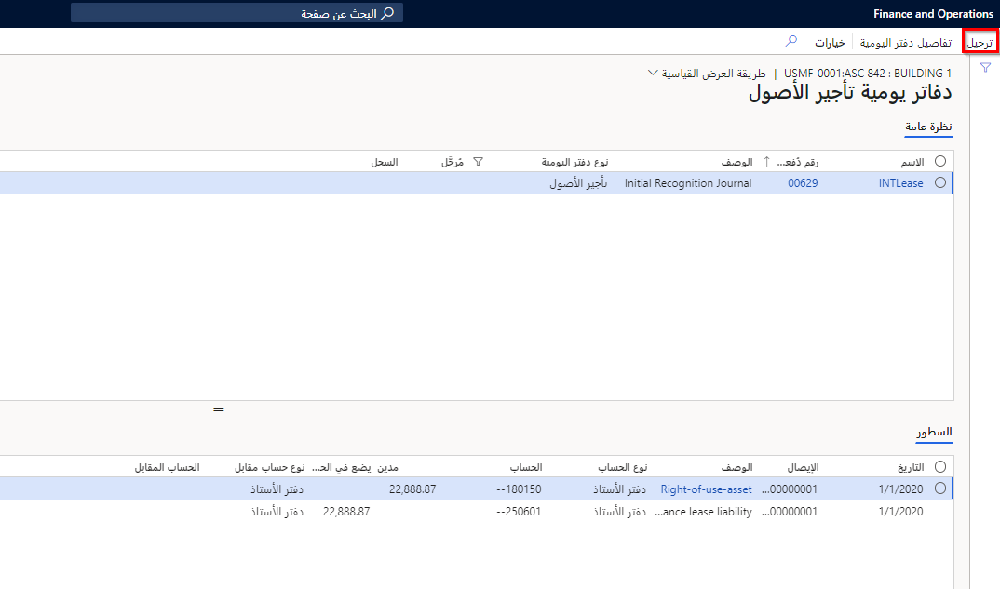

تكون كافة إدخالات دفتر اليومية التي تم إنشاؤها في تأجير الأصول موجودة في دفتر يومية **تأجير الأصول**. 

في الصفحة **تأجير الأصول > إدخالات دفتر اليومية > دفاتر يومية لتأجير الأصول**، يمكنك التصفية حسب حالة الترحيل وعرض إدخالات دفتر يومية محددة والإيصالات وترحيل إدخالات دفتر اليومية غير المرحلة. يمكن ترحيل دفاتر اليومية هذه يدوياً أو إنشاؤها وترحيلها من خلال **تأجير الأصول > دورياً > إنشاء دفتر يومية مجموعة**.
 
## دفتر يومية التعرّف المبدئي‬

يستخدم الإقرار الأولي للأصل المؤجر القيمة المحسوبة الحالية بحيث يمكن الإعلام عنها في الميزانية العمومية. تقوم هذه الحركة بالاشتراك في حساب الأصل الموجود على يمين الاستخدام والبيانات الدائنة لحساب الإيجار الخاص بعقد التشغيل كما يلي. 

يجب إنشاء دفتر يومية **التقييم الأولي** وترحيله قبل أية حركات مقابل الإيجار. قم بإنشاء دفتر اليومية بالخطوات التالية.

1.  انتقل إلى **تأجير الأصول > عقود الإيجار > ملخص الإيجار** وحدد عقد الإيجار الصحيح.
2.  حدد الرابط **دفاتر** في جزء الإجراءات. 
3.  حدد **الدفتر > الدالة > التعرف الأولي** الصحيح. ستتلقى رسالة تفيد بأنه قد تم إنشاء دفتر اليومية.
4.  حدد **دفاتر اليومية > دفاتر يومية لتأجير الأصول**.
5.  راجع التفاصيل الخاصة بدفتر اليومية. 
6.  في حالة صحة دفتر اليومية، حدد **ترحيل** في جزء الإجراءات.
 

