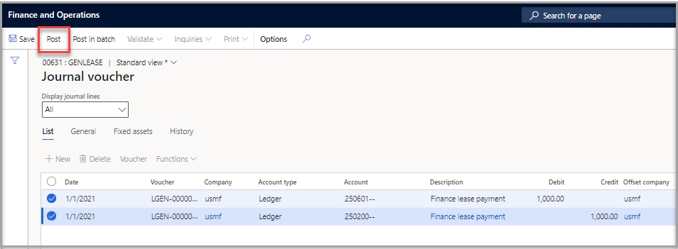

يمكنك إنشاء فواتير شهرية لتأجيرات فردية، أو يمكنك استخدام معالجة المجموعة لإنشائها للعديد من الإيجارات. بشكل افتراضي، تقوم بنود فاتورة المورد التي تم إنشاؤها باستخدام ملف تعريف ترحيل المورد من الصفحة **معلمات الحسابات الدائنة**.

لإنشاء إدخال دفعات الإيجار الفردي عند تشغيل معلمة **الدفع إلى المورد** في صفحة **إعداد دفتر الإيجار** وتعيين **معرف المورد** إلى **دفتر الإيجار**، اتبع الخطوات التالية:

1.  في الصفحة **ملخص عقد الإيجار**، حدد إيجار ثم حدد **الدفاتر > جدول الدفع**.
2.  حدد الدفع الذي يجب القيام به ثم حدد **إنشاء دفتر يومية**. ستتلقى رسالة تفيد بأنه قد تم إنشاء دفتر يومية في مقابل عملية الدفع المحددة.
3.  حدد الارتباط التشعبي لرقم دفتر اليومية لفتح دفتر اليومية.
4.  من علامة التبويب **البنود**، راجع إدخال دفتر اليومية قبل ترحيله إلى دفتر الأستاذ العام.
5.  حدد دفتر اليومية الصحيح، ثم حدد الفاتورة التي يجب دفعها.
6.  حدد **ترحيل**.

    

7.  بعد ترحيل الحركة، يمكنك عرض معلومات الحركة عن طريق تحديد **حركات الالتزامات** في **دفتر الإيجار**.

