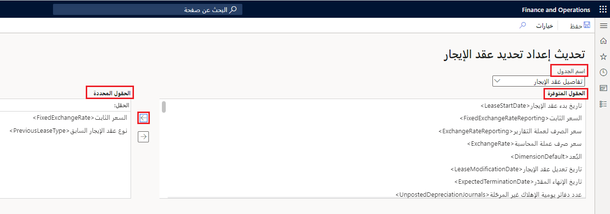

يسمح لك **إطار عمل استيراد عقد الإيجار** بتعديل عقود إيجار متعددة في خطوة واحدة، مما يؤدي إلى توفير الوقت وتقليل فرص حدوث أخطاء بشرية. بإمكان هذه القدرة توصيل Finance بكيانات بيانات خارجية لمساعدتك في تحميل البيانات بكفاءة. يمكنك استخدام عملية الاستيراد لتعديل عقد الإيجار أو تحديث المعلومات غير المالية أو إضافة عقود إيجار جديدة. يمكنك عرض بيانات الإيجار وتحريرها قبل استيرادها.

## إعداد استيراد الإيجار
اتبع الخطوات التالية لإنشاء الاستيراد:

1. قم بإنشاء قالب للاستيراد باستخدام مساحة عمل **إدارة البيانات**.
2. في مساحة عمل **إدارة البيانات**، صدّر كيانات البيانات **التقسيم المرحلي لعقد الإيجار** و **التقسيم المرحلي لعقد الدفع** و **التقسيم المرحلي للعقد التنفيذي**، ثم حدّث القالب.
3. انتقل إلى **تأجير الأصول > إطار عمل استيراد عقد الإيجار > استيراد الرأس**. 

   ستسرد هذه الصفحة كيانات البيانات الثلاثة.

4. لعرض البيانات المرحلية، قبل تشغيل العملية، حدد خيار **بيانات التشغيل المرحلي** في جزء الإجراءات.
5. من صفحة **البيانات المرحلية**، يمكنك اتخاذ الإجراءات التالية:

   - **مراجعة الاختلافات في البيانات** - عرض الاختلافات بين البيانات الموجودة حالياً في النظام والبيانات الموجودة في الجداول المرحلية. 
   - **التحقق من صحة بيانات الاستيراد** -يقوم النظام بتشغيل العديد من عمليات التحقق للتأكد من أنه سيتم استيراد السجل بنجاح.
   - **ترحيل سجلات عقد الإيجار** - لمعالجة عقد إيجار فردي، حدد **ترحيل سجلات عقد الإيجار** في صفحة **استيراد الرأس**. عند ترحيل عقد الإيجار، سيقوم النظام بتنفيذ الإجراء المحدد في الحقل **نوع العملية**.
   - **تشغيل تقارير المقارنة والفرق** - لمقارنة سجل إيجار فردي، حدد عقد إيجار ثم حدد **مقارنة**. يجب عليك إكمال هذه الخطوة لإنشاء تقرير **فروق** قبل ترحيل سجلات عقد الإيجار. 

## إعداد تحديث الحقول
قبل استخدام **إطار عمل استيراد عقد الإيجار**، تأكد من تعريف الحقول لعملية الاستيراد في القسم **تأجير الأصول > إطار عمل استيراد عقد الإيجار > الإعداد > تحديث الحقول**. تسمح لك هذه الصفحة بتحديد الحقل الذي ستقوم بتحديثه في الإيجار.
أسماء الجداول التي يمكنك تحديدها لعمليه الاستيراد هي:

- تفاصيل عقد الإيجار
- عقد جدول الدفع
- عقد تكلفة تنفيذ العقد

بعد تحديد اسم الجدول الذي ستقوم بتحديثه، سيتم عرض قائمة بالحقول المراد إضافتها إلى استيراد التحديث. حدد الحقل في قائمة **الحقول المتوفرة**، ثم حدد السهم الأيمن لإضافتها إلى قائمة **الحقول المحددة**.

