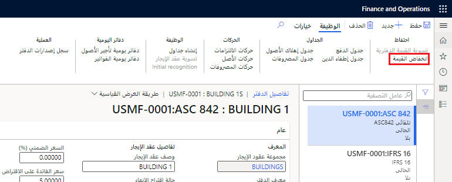

**حق استخدام** (ROU) الأصل هو حق المؤجر في استخدام الأصل خلال دورة حياة عقد الإيجار.  بالنسبة لشركات الإيجار التي يتم التعرف عليها في الميزانية العمومية من الشركة، يتم استهلاك حق استخدام الأصل، في أساس القسط الثابت، بالإهلاك لنفس المبلغ كل شهر. 

يؤثر إهلاك الإيجار على **كشف الأرباح والخسائر** من خلال خصم مصروفات الفوائد. وتتأثر الميزانية العمومية بقيد حساب حق استخدام الأصل المتراكم لعقود الإيجار المالية. بالنسبة لعقود الإيجار التشغيلية، سيُضاف الإهلاك إلى حساب مصروفات الإيجار. 

طوال مدة عقد إيجار الأصل ROU، إذا أصبح الأصل المؤجر ضعيفاً، يمكنك تسجيل الانخفاض في القيمة وتعديل جدول الإهلاك وفقاً لذلك. يمكنك أيضاً عرض رصيد الأصول الجديد والإدخال المالي قبل ترحيل الحركة. 

لتسجيل انخفاض القيمة، اتبع الخطوات التالية:

1. انتقل إلى صفحة **تأجير الأصول > عقود الإيجار > ملخص عقد الإيجار**.
2. حدد عقد الإيجار منخفض القيمة، ثم حدد **الدفاتر** في جزء الإجراءات.
3. في جزء الإجراءات، حدد **انخفاض القيمة**.

   
 

4. في مربع الحوار الذي يظهر، في الحقل **مبلغ انخفاض القيمة**، أدخل مقدار انخفاض قيمة الأصل. لتقليل حق استخدام الأصل، يجب إدخال قيمة موجبة.
5. في الحقل **تاريخ الحركة**، أدخل التاريخ الذي ينبغي فيه ترحيل إدخال انخفاض القيمة.
6. في الحقل **الفترات المتبقية**، أدخل العدد المتبقي من الشهور لاستهلاك.
7. قم بتشغيل **معلمة الترحيل** إذا كنت تريد أن يقوم النظام تلقائياً بترحيل إدخال دفتر يومية مصروفات انخفاض القيمة. إذا تركت هذه المعلمة متوقفة عن التشغيل، فسينشئ النظام الإدخال ولكن دون ترحيله. بعد ذلك، يمكنك ترحيل الإدخال من الصفحة **دفاتر يومية تأجير الأصول**.
8. قم بتعيين خيار **إغلاق الدفتر** إلى **نعم** لإغلاق دفتر الإيجار. لا يمكنك التراجع عن هذا الإجراء. لا يمكن ترحيل الإدخالات مقابل عقود الإيجار المغلقة، ولا يمكن تعديل عقود الإيجار المغلقة.
9. حدد **موافق** لإنشاء إدخال انخفاض القيمة أو ترحيله.
10. لعرض جدول إهلاك الأصول منخفضة القيمة، افتح جدول إهلاك الأصول لدفتر الإيجار هذا. سيتم الآن إهلاك الأصل على أساس القسط الثابت عن عدد الشهور التي قمت بإدخالها في الحقل **الفترات المتبقية**.
11. لعرض إدخال دفتر يومية مصروفات انخفاض القيمة، حدد **دفاتر يومية تأجير الأصول** في جزء الإجراءات الخاص بدفتر الإيجار منخفض القيمة. سيقوم النظام بإنشاء إدخال دفتر يومية يقوم بالاشتراك في حساب ترحيل مصروفات انخفاض القيمة والائتمان في حساب ترحيل أصل الإيجار.
12. لعرض قيمة الحمل الجديدة الخاصة بحق استخدام الأصل، حدد **حركات الأصول** في جزء الإجراءات الخاص بدفتر الإيجار.

