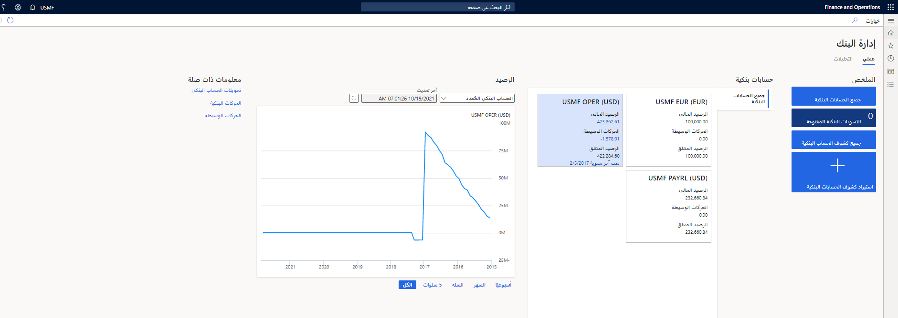

تعرض مساحة عمل **إدارة البنوك** المعلومات المتعلقة بالحسابات البنكية للشركات. تشتمل مساحة العمل هذه على طريقة عرض **ملخص** وصفحة **تحليلات**. تُظهر طريقة العرض **الملخص** الإطارات المتجانبة للملخص ومعلومات الحساب البنكي ومخطط الرصيد والمعلومات ذات الصلة. تستخدم صفحة **التحليلات** قدرات Microsoft Power BI لإظهار المرئيات المرتبطة بأرصدة الحسابات البنكية.
 

## طريقة عرض الملخص 

توفر الإطارات المتجانبة في قسم **الملخص** نظرة عامة على حساباتك البنكية وتوفر وصولاً سريعاً إلى الصفحات التي تستخدمها غالباً. معلومات التسوية البنكية خاصة بوظيفة التسوية البنكية المتقدمة. يتم تضمين المعلومات فقط للحسابات البنكية التي تم لها تعيين خيار **التسوية البنكية المتقدمة** إلى **نعم** في صفحة **الحسابات البنكية**. 

في قسم **الملخص**، يمكنك استيراد الملفات البنكية الإلكترونية للحسابات البنكية عبر جميع الكيانات القانونية.
 
## الحسابات البنكية 

يتم تمثيل كل حساب بنكي في الكيان القانوني ببطاقة في قسم **الحسابات البنكية**. يظهر الرصيد الحالي، ويمكنك الانتقال إلى أسفل للوصول إلى الحركات التي تشكل مبلغ رصيد الملخص. 

يتيح لك مبلغ **الحركات الوسيطة** التنقل لأسفل إلى الحركات التي تكون مبلغ الملخص هذا. الحركات الوسيطة هي أي حركات معلقة تم ترحيلها باستخدام وظيفة الوساطة، ولكن لم يتم مسحها بعد. مبلغ **الرصيد المعلق** هو الرصيد الحالي مطروحاً منه الحركات المؤقتة أو المعلقة.

تظهر البطاقة أيضاً آخر مرة تمت فيها تسوية الحساب البنكي. تظهر هذه المعلومات فقط إذا تم تمكين التسوية البنكية المتقدمة للحساب البنكي.

## الرصيد 

يعرض مخطط **الرصيد** إما معلومات الرصيد التاريخية للحساب المصرفي المحدد في قسم  **الحسابات البنكية** أو ملخص لمعلومات الرصيد التاريخية لجميع الحسابات البنكية في الكيان القانوني. تتوفر هذه المعلومات لفترات مختلفة: الأسبوع الحالي والشهر الحالي والعام الحالي وآخر خمس سنوات وجميع الفترات (التاريخ الكامل للحساب البنكي).

إذا كنت تعرض **مخطط الرصيد** لحساب بنكي واحد، فسيتم عرض الأرصدة التاريخية بعملة الحساب البنكي. إذا كنت تعرض المخطط لجميع الحسابات البنكية في الكيان القانوني، فسيتم عرض الأرصدة التاريخية بعملة المحاسبة.

تظهر معلومات حول وقت آخر تحديث للبيانات في الجزء العلوي من المخطط. يمكنك تحديث البيانات حسب الحاجة.

## المعلومات المرتبطة 

في قسم **المعلومات المرتبطة**، يمكنك فتح **دفتر اليومية العام** لإكمال التحويلات البنكية. يمكنك أيضاً فتح صفحتي **الحركات البنكية** و **الحركات الوسيطة** بسرعة.
 
## طريقة عرض التحليلات 

توفر صفحة **التحليلات** مقاييس مهمة حول الحسابات البنكية في الشركة الحالية. الرسوم المرئية التالية متوفرة في الصفحة:

- إجمالي الرصيد البنكي بعملة النظام.
- الرصيد حسب الكيان القانوني.
- الرصيد الحالي مقابل الرصيد المتوقع بعملة الحساب البنكي.
- الرصيد حسب الحساب البنكي.
- الرصيد حسب العملة.

يمكنك عرض التحليلات البنكية عبر جميع الشركات في مساحة عمل **نظرة عامة على النقد – جميع الشركات**.

شاهد هذا الفيديو لاستكشاف مساحة عمل **إدارة البنوك**
 > [!VIDEO https://www.microsoft.com/videoplayer/embed/RE3UMcm]