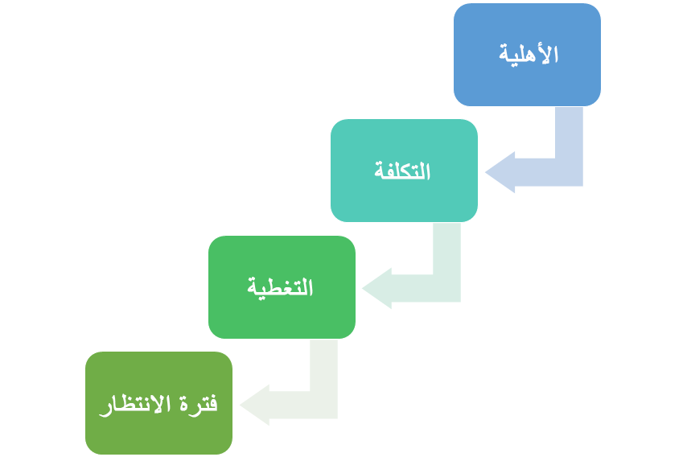
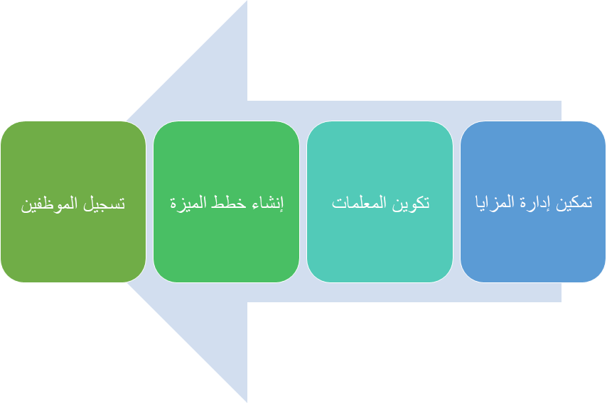

تتيح لك إدارة المزايا في Dynamics 365 Human Resources تقديم أنواع مختلفة من خطط المزايا للمساعدة في جذب قوة عاملة قوية والاحتفاظ بها.Benefits management in Dynamics 365 Human Resources lets you provide different types of benefit plans to help attract and retain a strong workforce.

> [!div class="mx-imgBorder"]
> 

من خلال المرونة التي توفرها إدارة المزايا، يمكنك تقديم وإدارة أي نوع تقريباً من المزايا التي يمكنك التفكير بها لموظفيك.With the flexibility that is provided by Benefits management, you can offer and manage almost any type of benefit that you can think of for your employees.

## الاعتباراتConsiderations

عند إعداد خطة المزايا، تحتاج إلى تقييم اعتبارات متعددة.When setting up a benefit plan, you need to assess multiple considerations. بعض هذه العوامل يفرضها القانون، والبعض الآخر تفرضه سياسات مؤسستك.Some of these factors are mandated by law, and others are mandated by your organization's policies.

> [!div class="mx-imgBorder"]
> 

اسأل نفسك الأسئلة التالية عند تقييم معايير إعداد خطة المزايا:Ask yourself the following questions when assessing the parameters for setting up the benefit plan:

- **الأهلية** - هل ستشمل موظفين بدوام كامل أو جزئي أو موظفين في مستويات وظيفية معينة؟**Eligibility** - Will you include full-time or part-time employees or employees at certain job levels? على سبيل المثال، الخطط الطبية متاحة بشكل عام فقط للموظفين بدوام كامل.For example, medical plans are generally available only to full-time employees.

- **التكلفة** - ما تكلفة المزايا لكل من الموظف وصاحب العمل؟**Cost** - What does the benefit cost for both employee and employer? على سبيل المثال، يدفع الموظفون وأصحاب العمل عادةً جزءاً من أقساط التأمين الطبي.For example, employees and employers usually pay a portion of medical insurance premiums.

- **التغطية** - هل ستغطي الميزة الموظف فقط أم ستغطي الموظف زائد واحد أو الموظف بالإضافة إلى الأسرة؟**Coverage** - Will the benefit cover only the employee, or will it cover the employee plus one or the employee plus family? على سبيل المثال، يمكن أن تغطي الخطط الطبية الموظف بالإضافة إلى الأسرة.For example, medical plans can cover the employee plus family.

- **فترة الانتظار** - هل تُفرض فترة انتظار تبلغ 30 أو 60 يوماً أو عدداً آخر من الأيام؟**Waiting period** - Is a waiting period of 30, 60, or other number of days imposed? على سبيل المثال، يمكن لمعظم الموظفين التسجيل في خطة طبية عند بدء العمل.For example, most employees can enroll in a medical plan when they start employment.

بالإضافة إلى ذلك، ستحتاج إلى التفكير فيما إذا كان بإمكان الموظفين التسجيل في أكثر من خطة واحدة من نفس النوع.In addition, you'll need to consider whether employees can enroll in more than one plan of the same type. على سبيل المثال، ربما لن يتمكن الموظفون لديك من التسجيل في أكثر من نوع واحد من التأمين الطبي، ولكن من المحتمل أن يسجلوا في خطط تأمين متعددة على الحياة.For example, your employees probably won't be able to enroll in more than one type of medical insurance, but they could possibly enroll in multiple life insurance plans.

## من يحصل على المزاياWho receives benefits

يمكن لجميع الموظفين تقريباً، وبعض من يعولونهم، الحصول على مزايا.Almost all employees, and some of their dependents, can receive benefits. يتم تقسيم المستلمين إلى فئتين:Recipients are divided into two categories:

- **المعال** - مشمول بالخطة (على سبيل المثال، تأمين الأسنان أو الرؤية أو التأمين الطبي).**Dependent** - Covered by the plan (for example, dental, vision, or medical insurance).

- **المستفيد** - يتلقى عائداً من الخطة، على الرغم من عدم تغطيتها بشكل مباشر (على سبيل المثال، التأمين على الحياة).**Beneficiary** - Receives a payout from the plan, even though they're not directly covered (for example, life insurance).

أمثلة لمن قد يكون قادراً على تلقي المزايا بموجب خططك:Examples of who might be able to receive benefits under your plans:

- الموظفون النشطون بدوام كاملActive full-time employees

- معالو الموظفينDependents of employees

- الموظفون المتقاعدونRetired employees

- معالو الموظفين المتقاعدينDependents of retired employees

- الموظفون بدوام جزئيPart-time employees

- معالو الموظفين بدوام جزئيDependents of part-time employees

- الموظفون المعاقونDisabled employees

- معالو الموظفين المعاقينDependents of disabled employees

- المتبقون من الموظفين المتوفينSurvivors of deceased employees

- الموظفون الذين أنهوا عملهمEmployees who have terminated employment

- معالو الموظفين الذين أنهوا عملهمDependents of employees who have terminated employment

- الموظفون الذين تم فصلهم مؤقتاً عن العمل (على سبيل المثال، في إجازة عائلية)Employees who are temporarily separated from employment (for example, on family leave)

- معالو الموظفين الذين تم فصلهم مؤقتاً عن العملDependents of employees who are temporarily separated from employment

تعتمد أهلية المزايا وتواريخ البدء على نوع العامل، كما هو موضح في الجدول التالي.Benefits eligibility and start dates depend on the type of worker, as described in the following table.

| نوع العاملWorker type | الوصف Description | التواريخ المستخدمة للأهليةDates used for eligibility |
|---|---|---|
| العامل الحاليExisting worker | موظف قبل فترة خطة المزايا.Employed before the benefit plan period. على سبيل المثال، إذا كانت فترة خطة المزايا هي 1/1 /2021 - 12/31/2021، فإن تاريخ بدء الموظف سيكون قبل 1/1/2021.For example, if the benefit plan period is 1/1/2021-12/31/2021, the employee's start date would be before 1/1/2021. | تتم قراءة تعويضات العمال وتفاصيل التوظيف ومعلومات الوظيفة اعتباراً من بداية فترة الخطة.Worker compensation, employment details, and position information are read as of the beginning of the plan period. |
| التوظيف الجديدNew hire | تم التعاقد معه خلال فترة خطة المزايا.Hired during the benefit plan period. في هذه الحالة، سيتم تعيين الموظف بين 1/1/2021 واليوم.In this case, the employee would be hired between 1/1/2021 and today. | تتم قراءة تفاصيل الوظيفة ومعلومات المنصب اعتباراً من اليوم.Employment details and position information are read as of today. |
| التوظيف المستقبليFuture hire | سيتم التوظيف في المستقبل.Hired in the future. في هذه الحالة، سيتم تعيين الموظف بين اليوم و12/31/2021.In this case, the employee would be hired between today and 12/31/2021. | تتم قراءة تعويضات العمال وتفاصيل التوظيف ومعلومات الوظيفة اعتباراً من تاريخ البدء في المستقبل.Worker compensation, employment details, and position information are read as of a future-dated start date. |

## ميزتان لمساحات العمل في Human ResourcesTwo benefits workspaces in Human Resources

بشكل افتراضي، يتضمن Dynamics 365 Human Resources مساحة عمل **مزايا** قديمة.By default, Dynamics 365 Human Resources includes a legacy **Benefits** workspace. غالباً ما تتطلب الشركات نظاماً أكثر مرونة مع عملية تسجيل مفتوحة سلسة ودعماً للأحداث المؤهلة والمعدلات المعقدة.Companies often require a more flexible system with a smooth open enrollment process and support for qualifying events and complex rates.

توفر مساحة عمل **إدارة المزايا** الخيارات التالية:The **Benefits management** workspace provides the following options:

- تسجيل مفتوحOpen enrollment

- مستويات الأسعار (على سبيل المثال، أسعار مختلفة حسب العمر أو الراتب)Rate tiers (for example, different rates by age or salary)

- أحداث الحياة المؤهلة (على سبيل المثال، تبني طفل أو الزواج)Qualifying life events (for example, adopting a child or getting married)

## عملية إعداد خطة المزاياProcess for setting up a benefit plan

توضح لقطة الشاشة التالية خطوات إعداد وإنشاء خطط المزايا.The following screenshot shows the steps for setting up and creating benefit plans.

> [!div class="mx-imgBorder"]
> 
